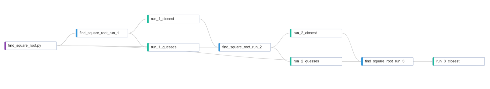
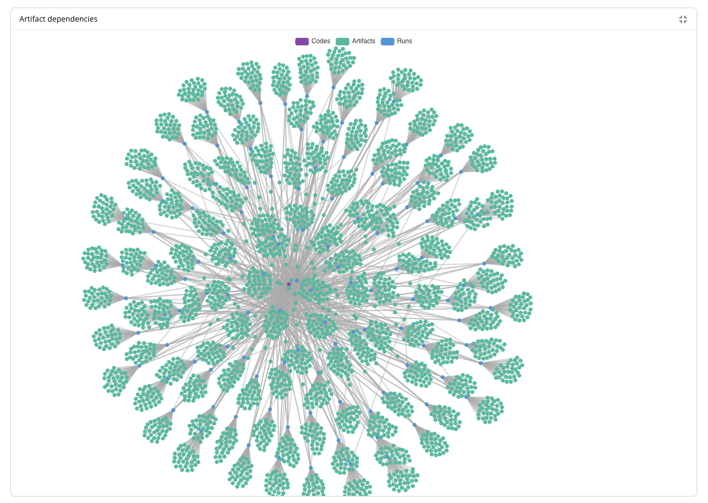

# Obtaining data

If a simulation or processing step needs to read output (or input) data from an existing run in Simvue
and the data isn't already available then it will be first necessary to download the required data.

In order to download artifacts we first need to create an instance of the Simvue `Client` class:
```python
from simvue import Client
client = Client()
```
As with the `Run` class, there must either be a valid `.simvue.ini` file in the user's home directory, a `simvue.ini` file in
the current directory or the required environment variables must be defined.

## Obtaining a named artifact

The method `get_artifact` can be used to download an artifact and return its content. For example, if a run contains
an artifact which is a NumPy array, you can retrieve it as follows:
```python
my_array = client.get_artifact(run_identifier, my_numpy_array_name)
```
In this case the variable `my_array` would contain the array originally uploaded.

If an artifact was created with `#!python allow_pickle=True` then this option should also when calling `get_artifact`, e.g.
```python
my_object = client.get_artifact(my_run, my_object, allow_pickle=True)
```

!!! warning

    Why does `allow_pickle` need to be explicitly set? It is possible for pickle data to execute arbitrary code during unpickling, and as such it is not considered to be secure.

## Downloading a named artifact to a file

The method `get_artifact_as_file` can be used to download a single named artifact from an existing run. For example:
```python
client.get_artifact_as_file(run_identifier, artifact_name, path='/tmp')
```
will download `artifact_name` from run `run_name` into `/tmp`.
If a path is not provided the file will be downloaded into the current working directory.

## Downloading multiple artifacts

The method `get_artifacts_as_files` can be used to download multiple artifacts from an existing run. For example:
```python
client.get_artifacts_as_files(run_name, path='/tmp')
```
will download all artifacts from run `run_name` into `/tmp`.

!!! note

    If any artifacts already exist in the appropriate location they will not be re-downloaded.

A category can be specified in order to restrict which files are
downloaded, for example:
```python
client.get_artifacts_as_files(
    run_identifier,
    path='/tmp',
    category='output'
)
```
There are additional optional arguments for further restricting what files are downloaded:

* `startswith`: only files which begin with the specified text,
* `contains`: only files which contain the specified text,
* `endswith`: only files which end with the specified text.

These can be combined with specification of a `category`. For example, to download all input files starting with `system/`:
```python
client.get_artifacts_as_files(
    run_identifier,
    category='input',
    startswith='system/'
)
```

## Data Lineage and Dependencies
Simvue keeps track of how the artifacts stored within different runs are linked together, so that the lineage and dependencies of different artifacts and runs can be tracked. This is done automatically by using the checksum of artifacts stored by different runs. You can view the lineage or dependencies of any artifact within the Simvue UI, by opening the Artifacts tab of a run, selecting one of the artifacts, and selecting the relevant option in the Actions dropdown on the right.

For example, say we have a script which is attempting to find the square root of a number. This script starts with an array of evenly spaced `guesses`, which it then squares and subtracts the target number from to calculate the error. The guess which has the minimum error is recorded as the `closest`, and the `guesses` and `closest` are then stored as outputs of the run. A new run is then started, using the outputs of the previous run to choose a smaller range of `guesses` (with the range defined by the guess values from the previous run which were on either side of the closest guess), and it continually repeats this process until an accurate answer is reached. If we look at the data lineage for the result from the third run, we can see how the other runs' artifacts fed into the result:


You can also view the dependencies of any of your artifacts, including the code which was used to run the simulation (if stored as an artifact). In the case where we have a large number of different runs which all use the same code, where each run produces a number of different output artifacts, we can easily visualise how these are all linked together. Hovering over any of these bubbles will show us the name of the run or artifact.


## Simple example

Here is a simple example where we download all output artifacts from `run1` and use them as input into `run2`.
```python
from simvue import Client, Run

# Download output files from previous run
client = Client()
client.get_artifacts_as_files('run1', category='output', path='data')

# Create a new run
with Run() as run:
    run.init('run2')
    run.save_directory('data', category='input')
    ...
```
It's important to note that the `save_directory` step will not upload and store the same files again if they already exist in Simvue.
Instead they will automatically be registered as being associated with `run2` but will not be re-uploaded.

??? further-docs "Further Documentation"

    - [^^The get_artifact() method^^](/reference/client#get_artifact)

    - [^^The get_artifact_as_file() method^^](/reference/client#get_artifact_as_file)

    - [^^The get_artifacts_as_files() method^^](/reference/client#get_artifacts_as_files)

    - [^^Example of retrieving artifacts in the Tutorial^^](/tutorial_basic/analysis/#retrieving-artifacts)