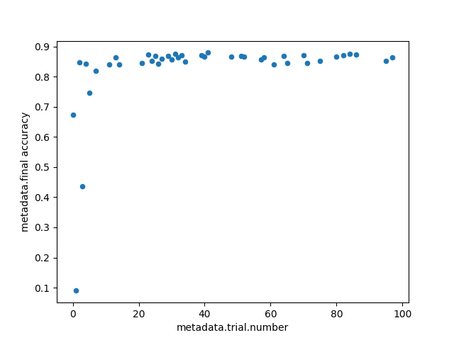
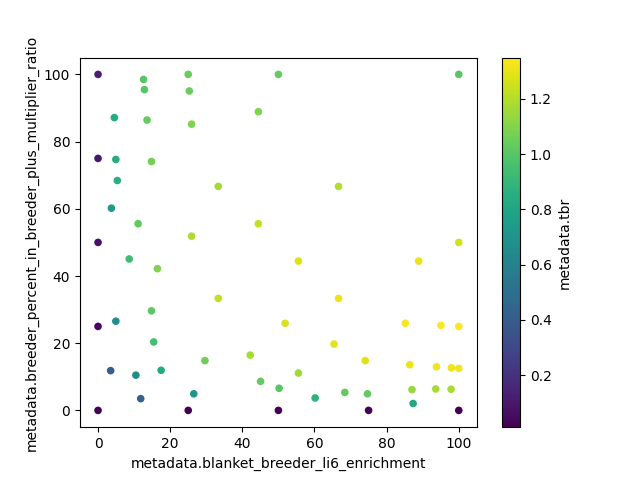
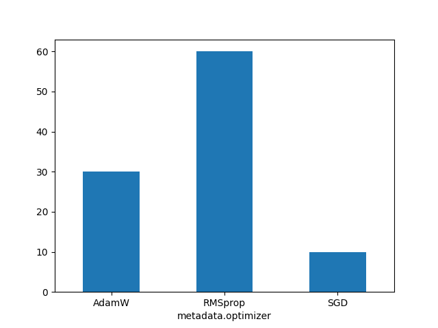

# Metadata

The `get_runs` method of the `Client` class has an optional argument `format` which enables the format of the
data retrieved to be specified. There are two options:

* `dict`: a dictionary (the default),
* `dataframe`: a Pandas dataframe.

The dataframe format makes it easy to create plots using the `plot` method in Pandas or using Matplotlib directly.
`pandas.DataFrame.columns` can be used to get a list of the columns, for example:
```
df = client.get_runs(['/fusion/neutronics/adaptive/run4'],
                     metadata=True,
                     format='dataframe')
print(df.columns)
```
Below we go through some example plots.

## Basic scatter plot from metadata
Here is a simple example of a scatter plot using metadata from multiple runs. We plot `final accuracy` vs
`trial.number` for all runs in the specified folder (`/optuna/tests/binary-model` in this case).
```
df = client.get_runs(['/optuna/tests/binary-model'],
                     metadata=True,
                     format='dataframe')
plot = df.plot(kind='scatter',
               x='metadata.trial.number',
               y='metadata.final accuracy')
```
This results in the following plot:


## Scatter plot with coloured markers
We can easily extend a scatter plot by using the value of another metadata attribute to colour the markers. For example:
```
df = client.get_runs(['/fusion/neutronics/adaptive/run4'],
                     metadata=True,
                     format='dataframe')
plot = df.plot(kind='scatter',
               x='metadata.blanket_breeder_li6_enrichment',
               y='metadata.breeder_percent_in_breeder_plus_multiplier_ratio',
               c='metadata.tbr')
```
This results in the following plot:


## Bar chart
In this example we create a bar chart showing how many runs are associated with each possible
value of a specified metadata attribute, in this case `optimizer`:
```
df = client.get_runs(['/optuna/tests/binary-model'],
                     metadata=True,
                     format='dataframe')

plot = df.groupby('metadata.optimizer')['name'].nunique().plot(kind='bar', rot=0)
```
which gives:


## Box plot
Box and whisker plots can be easily created. In this example we show a metadata attribute `final accuracy`
grouped by another attribute, `n_layers`:
```
df = client.get_runs(['/optuna/tests/binary-model'],
                     metadata=True,
                     format='dataframe')

plot = df.boxplot(column=['metadata.final accuracy'], by=['metadata.n_layers'])
```
This results in the following plot:


