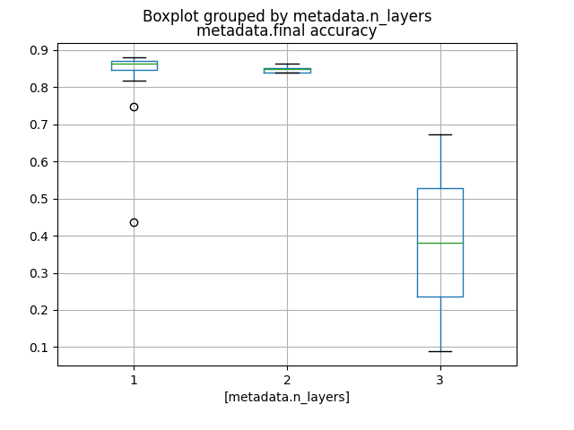
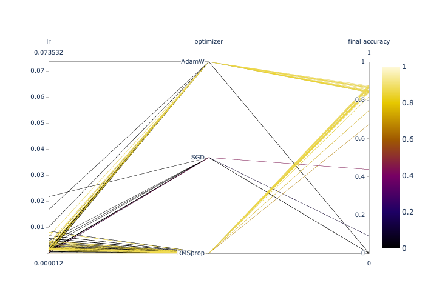

# Metadata

The `get_runs` method of the `Client` class has an optional argument `format` which enables the format of the
data retrieved to be specified. There are two options:

* `dict`: a dictionary (the default),
* `dataframe`: a Pandas dataframe.

The dataframe format makes it easy to create plots using the `plot` method in Pandas or using Matplotlib directly.
`pandas.DataFrame.columns` can be used to get a list of the columns, for example:
```
df = client.get_runs(['/fusion/neutronics/adaptive/run4'],
                     metadata=True,
                     format='dataframe')
print(df.columns)
```
Below we go through some example plots.

## Basic scatter plot from metadata
Here is a simple example of a scatter plot using metadata from multiple runs. We plot `final accuracy` vs
`trial.number` for all runs in the specified folder (`/optuna/tests/binary-model` in this case).
```
df = client.get_runs(['/optuna/tests/binary-model'],
                     metadata=True,
                     format='dataframe')
plot = df.plot(kind='scatter',
               x='metadata.trial.number',
               y='metadata.final accuracy')
```
This results in the following plot:


## Scatter plot with coloured markers
We can easily extend a scatter plot by using the value of another metadata attribute to colour the markers. For example:
```
df = client.get_runs(['/fusion/neutronics/adaptive/run4'],
                     metadata=True,
                     format='dataframe')
plot = df.plot(kind='scatter',
               x='metadata.blanket_breeder_li6_enrichment',
               y='metadata.breeder_percent_in_breeder_plus_multiplier_ratio',
               c='metadata.tbr')
```
gives:


## Bar chart
In this example we create a bar chart showing how many runs are associated with each possible
value of a specified metadata attribute, in this case `optimizer`:
```
df = client.get_runs(['/optuna/tests/binary-model'],
                     metadata=True,
                     format='dataframe')

plot = df.groupby('metadata.optimizer')['name'].nunique().plot(kind='bar', rot=0)
```
This gives:


## Box plot
Box and whisker plots can be easily created. In this example we show a metadata attribute `final accuracy`
grouped by another attribute, `n_layers`:
```
df = client.get_runs(['/optuna/tests/binary-model'],
                     metadata=True,
                     format='dataframe')

plot = df.boxplot(column=['metadata.final accuracy'], by=['metadata.n_layers'])
```
This results in the following plot:


## Parallel coordinates plot
While parallel coordinates plots can be made directly from a dataframe
(see e.g. [here](https://pandas.pydata.org/docs/reference/api/pandas.plotting.parallel_coordinates.html)) this has some
limitations, such as common y-axis limits across all variables. An alternative is to use [Plotly](https://plotly.com/python/parallel-coordinates-plot/)
where it's possible to have much more control. Handling categorical values requires (see [some additional work](https://stackoverflow.com/a/64146570))
as is illustrated in the
example:
```
import plotly.graph_objects as go
import pandas as pd
from simvue import Client

client = Client()
df = client.get_runs(['/optuna/tests/binary-model'],
                     metadata=True,
                     format='dataframe')

group_vars = df['metadata.optimizer'].unique()
dfg = pd.DataFrame({'metadata.optimizer': df['metadata.optimizer'].unique()})
dfg['dummy'] = dfg.index
df = pd.merge(df, dfg, on='metadata.optimizer', how='left')

fig = go.Figure(
    data=go.Parcoords(
        line=dict(
            color=df["metadata.final accuracy"],
            colorscale="Electric",
            showscale=True,
            cmin=0,
            cmax=1,
        ),
        dimensions=list(
            [
                dict(label="lr", values=df["metadata.lr"]),
                dict(
                    label="optimizer",
                    range=[0, df["dummy"].max()],
                    tickvals=df["dummy"],
                    ticktext=dfg["metadata.optimizer"],
                    values=df["dummy"],
                ),
                dict(
                    range=[0, 1],
                    label="final accuracy",
                    values=df["metadata.final accuracy"],
                ),
            ]
        ),
    )
)

fig.write_image("output.png")
```
which gives

