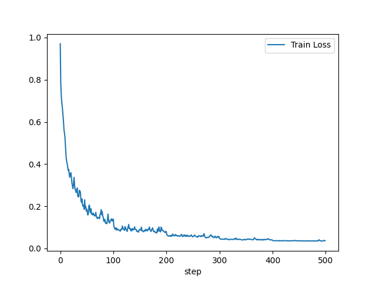
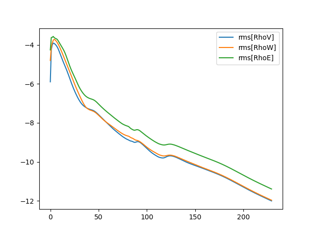
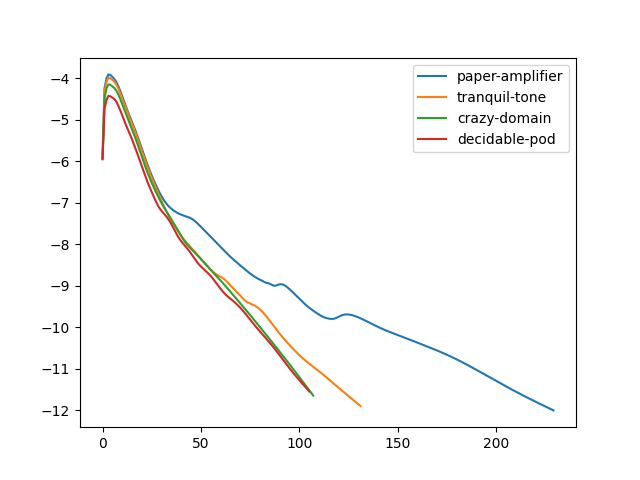

# Metrics

!!! warning

    The metrics API is in active development and is likely to change.

Methods are available in the `Client` class for retrieving metrics. For all of the examples below an instance of the `Client`
class needs to be created first:
```
from simvue import Client
client = Client()
```

## Summaries
The method `get_metrics_summaries` returns basic statistics such as average, min, max and latest values when
provided with a run name and metric name:
```
client.get_metrics_summaries(run, metric)
```
Example response:
```
{
    "latest":0.0366741130749,
    "avg":0.0973743406633,
    "min":0.0348126348521,
    "max":0.970791599485
}
```

## Basic usage

For basic line plots the method `plot_metrics` can be used. If more control is needed or more complex plots are needed
there are also methods for obtaining dataframes which can be used with Matplotlib (described below).

The `plot_metrics` class is used as follows:
```
plot = client.plot_metrics(runs, metrics, xaxis)
```
where:

* `runs`: list of run names,
* `metrics`: list of metrics names,
* `xaxis`: either `step` or `time`.

To save the plot in a file:
```
plot.savefig('plot.png')
```

## Advanced usage

### Metrics from a single run

To obtain time series metrics from a single run use the `get_metrics` method. For example, suppose we want to plot
a metric `Train Loss` versus `step` for a run called `first-fno-8`. We can first retrieve the metrics in the form
of a dataframe:
```
df = client.get_metrics('first-fno-8', 'Train Loss', 'step', format='dataframe')
```
which we can then plot easily:
```
fig = df.plot(kind='line', x='step', y='Train Loss').get_figure()
fig.savefig('plot.png')
```
giving the following plot:



### Multiple metrics from a single run

We can use the `get_metrics_multiple` method to create a single dataframe containing multiple metrics from a single
(or multiple) runs.

For example, here we retrieve metrics named `rms[RhoV]`, `rms[RhoW]` and `rms[RhoE]` from a run named `paper-amplifier`:
```
df = client.get_metrics_multiple(['paper-amplifier'],
                                 ['rms[RhoV]', 'rms[RhoW]', 'rms[RhoE]'],
                                 'step',
                                 format='dataframe')
```
We cam then use Matplotlib to plot all 3 metrics on a single plot:
```
import matplotlib.pyplot as plt

plt.plot(df[('paper-amplifier', 'rms[RhoV]', 'step')],
         df[('paper-amplifier', 'rms[RhoV]', 'value')],
         label='rms[RhoV]')
plt.plot(df[('paper-amplifier', 'rms[RhoW]', 'step')],
         df[('paper-amplifier', 'rms[RhoW]', 'value')],
         label='rms[RhoW]')
plt.plot(df[('paper-amplifier', 'rms[RhoE]', 'step')],
         df[('paper-amplifier', 'rms[RhoE]', 'value')],
         label='rms[RhoE]')
plt.legend()
plt.savefig('plot.png')
```
giving the following plot:


### Multiple runs

Here we again use `get_metrics_multiple` but this time use it to obtain a single metric from multiple runs and make a comparison plot. Firstly
we create a dataframe:
```
df = client.get_metrics_multiple(['paper-amplifier',
                                  'tranquil-tone',
                                  'crazy-domain',
                                  'decidable-pod'],
                                 ['rms[RhoV]'],
                                 'step',
                                 format='dataframe')
```
while we can then plot with Matplotlib:
```
import matplotlib.pyplot as plt

plt.plot(df[('paper-amplifier', 'rms[RhoV]', 'step')],
         df[('paper-amplifier', 'rms[RhoV]', 'value')],
         label='paper-amplifier')
plt.plot(df[('tranquil-tone', 'rms[RhoV]', 'step')],
         df[('tranquil-tone', 'rms[RhoV]', 'value')],
         label='tranquil-tone')
plt.plot(df[('crazy-domain', 'rms[RhoV]', 'step')],
         df[('crazy-domain', 'rms[RhoV]', 'value')],
         label='crazy-domain')
plt.plot(df[('decidable-pod', 'rms[RhoV]', 'step')],
         df[('decidable-pod', 'rms[RhoV]', 'value')],
         label='decidable-pod')
plt.legend()
plt.savefig('plot.png')
```
giving the following plot:


