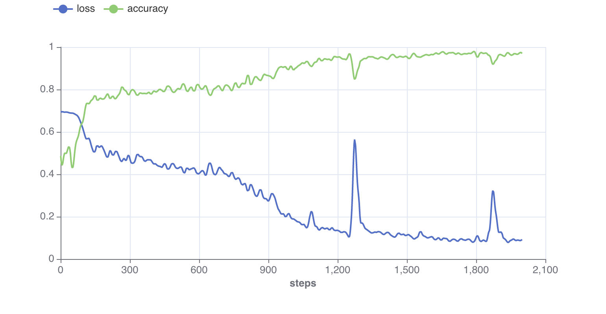
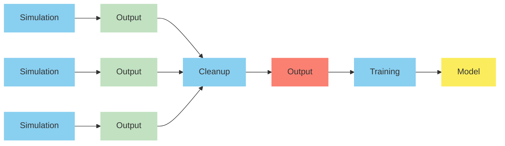
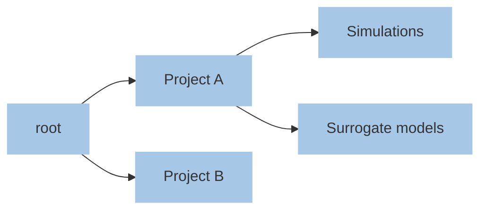

# Concepts

Before using Simvue it is important to understand some of the core concepts.

## Run

A run represents the execution of an application, such as a simulation, processing task or AI/ML training.
Each run has associated information such as a name, description, 
metadata (key-value pairs) and tags (list of short labels). Metadata values are integers, floating point numbers or strings,
and would typically be input or output parameters associated with a run. Runs can be filtered using both metadata and tags.

## Metrics

Metrics are floating point measurements which are collected repeatedly over time during the execution of a run. They can be
visualised in the Simvue web UI or used to notify users in the event of problems (see alerts below).

<figure markdown>
  { width="1000" }
</figure>

## Artifacts

An artifact is any ASCII or binary object used as input to a run or generated by a run. Most simulations are likely to have
both input and output artifacts, but artifacts can also be saved at any point during the execution of a run.

Simvue keeps track of the connections between simulations via artifacts, i.e. it maintains a *digital thread*. A simple example
is the situation where one simulation uses as input the output generated by another simulation.

## Events

An event is a timestamped text record. Examples include exceptions, errors and other useful log messages.

## Folder

Simvue has an arbitrary hierarchical structure of folders allowing users to group runs in different ways. Each folder can have a variety of information associated with it, such as metadata and tags.

For example, a user could make use of folders to separate different
projects they are working on. In this scenario the hierarchical nature of folders means that different activities within each project
can be associated with different folders within the main project folder.

## Alerts
The metrics being collected during the lifetime of a run can have important implications, for example: is it even worth continuning
running the simulation? Alerts automatically calculate averages of a specified metric over a specified window and frequency, and
checks if this value falls outside of the specified criteria. Users can choose to be notified by email in the event of an alert being
triggered.
