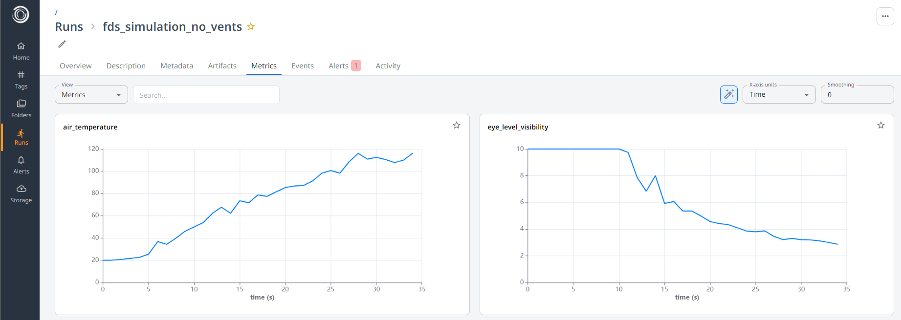
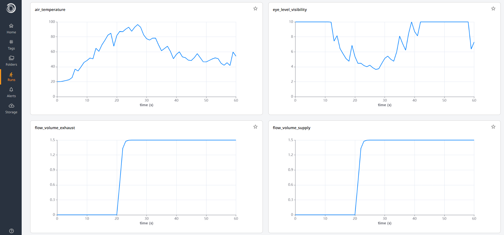
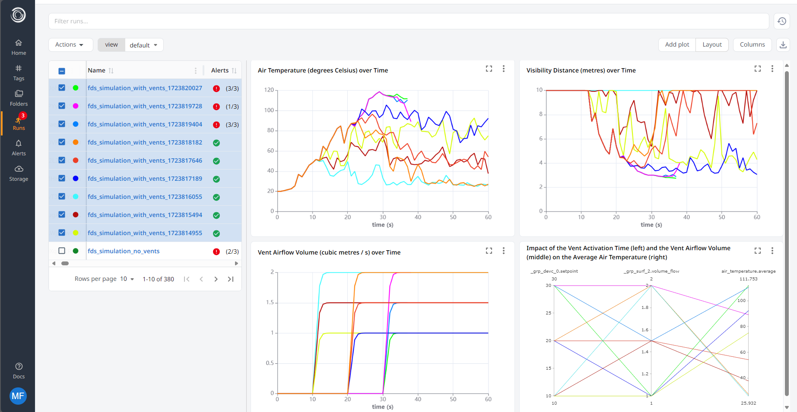

# FDS

FDS (Fire Dynamics Simulator) is an open source simulation code for low-speed flows, with an emphasis on smoke and heat transport from fires. This example demonstrates how you can use the built in FDSRun connector to get Simvue to track Fire Dynamics Simulator (FDS) simulations.

## Specifying the Problem

In our example, we will imagine that we are studying a room of dimensions 3m x 4m x 3m. In the centre of the room there will be a fire fuelled by propane, and there will be two air vents on the walls of the room to pump in clean air, and remove smoke. We want to analyse the volume of air which will be required to be pumped through these vents to keep the room safe for a firefighter to enter and extinguish the fire. For our purposes, we will say that the room is sufficiently safe if the air temperature inside the room is below 100 degrees Celsius, and that there is at least 3 metres of visibility inside the room.

## Setup

The easiest way to run this example is to use the provided Docker container:

### Install Docker

You will need to install the Docker CLI tool to be able to use the Docker container for this tutorial. [^^Full instructions for installing Docker can be found here^^](https://docs.docker.com/engine/install/). If you are running Ubuntu (either on a full Linux system or via WSL on Windows), you should be able to do:

```sh
sudo apt-get update && sudo apt-get install docker.io
```

To check that this worked, run `docker` - you should see a list of help for the commands.

!!! tip
    If you wish to run this on a Windows computer (without using Docker Desktop) via Windows Subsystem for Linux, [^^follow this guide on setting up Docker with WSL.^^](https://dev.to/bowmanjd/install-docker-on-windows-wsl-without-docker-desktop-34m9)

### Pull Docker image

Next we need to pull the container, which is stored in the Simvue repository's registry:

```sh
sudo docker pull ghcr.io/simvue-io/fds_example:latest
```

This may take some time to download. Once complete, if you run `sudo docker images`, you should see an image with the name `ghcr.io/simvue-io/fds_example` listed.

### Run Docker container

Firstly, add Docker as a valid user of the X windows server, so that we can view results using Paraview:

```sh
xhost +local:docker
```

Then you can run the container:

```sh
sudo docker run -e DISPLAY=${DISPLAY} -e QT_X11_NO_MITSHM=1 -v /tmp/.X11-unix:/tmp/.X11-unix -it ghcr.io/simvue-io/fds_example:latest
```

To test that the graphics packages are working correctly, run the command `smokeview initial.smv` within the container. After a few seconds, this should open up a graphical user interface window for the Smokeview visualization tool. You should be able to see the room which we described above.

!!! tip
    If you are using WSL and you do not see Smokeview open correctly, it may be because your WSL is not set up correctly. To check this, exit the docker container by pressing <kbd>ctrl</kbd> + <kbd>D</kbd>, and then run the following commands:
    ```
    sudo apt-get install -y x11-apps
    xeyes
    ```
    This should open a small graphical display window, with a pair of eyes which follow your mouse around the screen. If you do not see this, [^^follow this guide to get graphical apps working on WSL^^](https://learn.microsoft.com/en-us/windows/wsl/tutorials/gui-apps), and [^^look through these debugging tips for WSL^^](https://github.com/microsoft/wslg/wiki/Diagnosing-%22cannot-open-display%22-type-issues-with-WSLg).

### Update Simvue Config File

Finally we need to update the config file inside the Docker container to use your credentials. Login to the web UI, go to the **Runs** page and click **Create new run**. You should then see the credentials which you need to enter into the `simvue.toml` file. Simply open the existing file using `nano simvue.ini`, and replace the contents with the information from the web UI.

!!! note
    If you restart the docker container at any point, you will need to repeat this step as your changes will not be saved

## Using Simvue with FDS

To easily use Simvue to track your FDS simulations, a connector for the Simvue `Run` class has been created, called `FDSRun`. By default, this class will do the following:

- Upload your FDS input file as an input artifact
- Upload information from the FDS input file as metadata.
- Track the `.out` file, uploading data produced as metrics
- Track any variable values which are being output to a CSV file after each step, logging them as Metrics
- Add the current Time Step and Simulation Time to the Events log
- Upload selected results files as Output artifacts

!!! further-docs
    For information on how to install and use the FDSRun connector, [^^see the full documentation here.^^](/integrations/fds)

### Creating the FDS input file

!!! Run in Docker container
    Note that the full input file is provided inside the Docker container for you - run `cat input_no_vents.fds` to view it.
For our first simulation, we will start with a simple 3m x 4m x 3m room without any vents, to see how the fire proceeds without any intervention. Firstly we will create our FDS input file - these always start with a `&HEAD` line which determines the name of the simulation, and ends with a `&TAIL` command:

```
&HEAD CHID='no_vents', TITLE='no_vents' /
...
&TAIL /
```

Next we define the mesh for our room, which is simply a cuboid defined by the coordinates of the bottom left and top right corners in the format `XB = x1,x2,y1,y2,z1,z2`. We also define how many squares to break our mesh into in each dimension, in this case 10 per metre (so `IJK = 30, 40, 30`):

```
&MESH XB= 0, 3, 0, 4, 0, 3, IJK= 30, 40, 30 /
```

We then define the fire which we want to create - we must define the type of reactant fuel which we want to use, in our case propane, and the location and size of the fire (using the same format which we used to define the room on the step before):

```
# Define the type of fuel for the fire
&REAC ID = 'propane reaction',
SOOT_YIELD=0.03,
CO_YIELD=0.05,
FUEL='PROPANE'/

# Create an obstruction which will function as the fire, HRRPUA = Heat Release Rate per Unit Area
&OBST XB= 1.3, 1.7, 1.8, 2.2, 0, 0.5, COLOR='RED', SURF_ID='fire1' /
&SURF ID='fire1', HRRPUA=150 /
```

We can then define the types of outputs which we want FDS to produce - these will be tracked automatically by Simvue. In our case, we will define some 2D slices at the position `y=2` which show us the air velocity and temperature:

```
&SLCF PBY = 2, QUANTITY='VELOCITY', VECTOR=.TRUE./
&SLCF PBY = 2, QUANTITY='TEMPERATURE'/
```

We will also imagine that we are standing by the (closed) door which is located in the centre of the front wall (that is, at position x=0, y=1.5). From this position, which is where a firefighter would enter the room, we want to measure the air temperature and visibility at roughly eye level (we will take this to be 1.5m):

```
&DEVC XB=1.5,1.5,0,0,1.5,1.5, QUANTITY='VISIBILITY', ID='eye_level_visibility' /
&DEVC XYZ=1.5,0,1.5, QUANTITY='TEMPERATURE', ID='air_temperature' /
```

??? example "Example FDS Input File"

    Here is the full example input file for FDS - this can be viewed or edited in the Docker container using `nano input_no_vents.i`:
    ```
    # Define name of simulation, which will be the prefix of all output files
    &HEAD CHID='no_vents', TITLE='no_vents' /

    &MISC MAXIMUM_VISIBILITY=10. /

    # Define the room as a 3m x 4m x 3m cube
    &MESH XB= 0, 3, 0, 4, 0, 3, IJK= 30, 40, 30 /

    # Simulate the fire for 60 seconds, output results every second
    &TIME T_END=60. /
    &DUMP NFRAMES=60 /

    # Define the type of fuel for the fire
    &REAC ID = 'propane reaction',
    SOOT_YIELD=0.03,
    CO_YIELD=0.05,
    FUEL='PROPANE'/

    # Create an obstruction which will function as the fire, HRRPUA = Heat Release Rate per Unit Area
    &OBST XB= 1.3, 1.7, 1.8, 2.2, 0, 0.5, COLOR='RED', SURF_ID='fire1' /
    &SURF ID='fire1', HRRPUA=150 /

    # Define slice outputs - generates a 2D slice at y=2, showing the air velocity, temperature and volume of soot
    &SLCF PBY = 2, QUANTITY='VELOCITY', VECTOR=.TRUE./
    &SLCF PBY = 2, QUANTITY='TEMPERATURE'/

    # Define device outputs - outputs the flows through the vents, temperature and visibility to a CSV file every second
    &DEVC XB=1.5,1.5,0,0,1.5,1.5, QUANTITY='VISIBILITY', ID='eye_level_visibility' /
    &DEVC XYZ=1.5,0,1.5, QUANTITY='TEMPERATURE', ID='air_temperature' /
    &TAIL /
    ```

### Creating the Simvue monitoring script

!!! Run in Docker container
    Note that the full input file is provided inside the Docker container for you - run `cat run_simulation_no_vents.py` to view it.

We then want to create our Python script which initializes the `FDSRun` connector class. This class can be used as a context manager in the same way as the default Simvue `Run` class. It also has all of the same methods available as the Simvue `Run` class, allowing the user to upload any tags, metadata, artifacts etc which they want to store in addition to the items stored by default by the `FDSRun` class.

In our case, we will want to set up some alerts for if the air temperature at the door reaches above 100 degrees Celsius, or if the visibility at eye level falls below three metres, as these values would mean that the room is too dangerous for a firefighter to enter. In this case our simulation has failed and there is no point in continuing, and so we can terminate the simulation early.

Once we have setup our run, we must call the `launch()` method to start our FDS simulation, which takes the following parameters:

- `fds_input_file_path`: Path to the FDS input file
- `workdir_path`: Path to the directory where results will be stored
- `upload_files`: A list of results file names to be uploaded as Output artifacts - optional, will upload all results files if not specified
- `ulimit`: Value to set the stack size to - for Linux, this should be kept at the default value of 'unlimited'
- `fds_env_vars`: A dictionary of any environment variables to pass to the FDS application on startup

??? example "Example Simvue Monitoring Script"
    Here is an example Simvue monitoring script - it uses our `FDSRun` connector class as a context manager, initializes the run, sets up the alerts for temperature and visibility, and then calls `launch()` to perform and track the simulation.
    ```py
    import os
    import shutil
    from simvue_fds.connector import FDSRun

    # Delete old results directory, if present
    if os.path.exists("/workdir/results_no_vents"):
        shutil.rmtree("/workdir/results_no_vents")

    with FDSRun() as run:
        run.init(f"fds_simulation_no_vents")

        run.update_tags(["fds", "no_vents"])

        run.create_metric_threshold_alert(
            name="temperature_above_100_degrees",
            metric="air_temperature",
            frequency=1,
            rule="is above",
            threshold=100,
            trigger_abort=True
        )

        run.create_metric_threshold_alert(
            name="visibility_below_three_metres",
            metric="eye_level_visibility",
            frequency=1,
            rule="is below",
            threshold=3,
            trigger_abort=True
        )

        run.launch(
            fds_input_file_path = "/workdir/input_no_vents.fds",
            workdir_path = f"results_no_vents",
            clean_workdir = True
        )

    ```

### Running the Simulation

To run our initial simulation of the fire in the room without any vents, run the following command in the docker container:

```
python run_simulation_no_vents.py
```

Once the simulation has started, log into the web UI and open the run called `fds_simulation_no_vents`. You should be able to see the following:

- The input file has been uploaded as an Artifact
- Information from the input file has been uploaded as Metadata
- A number of Metrics are being recorded and updated live, including the visibility and temperature
- The Events log is being updated with the step which the simulation is currently on

Looking specifically at the Metrics, we can see that the air temperature is rising and the visibility is falling as the fire fills the room with heat and smoke. Set the graphs to display units of time by clicking selecting 'Time' in the 'X-axis units' dropdown in the top right. We can then see that after approximately 30 seconds of the fire burning, the temperature is above 100 degrees and the visibility is dropping below 3 metres.

<figure markdown>
  { width="1000" }
</figure>

Shortly after this, we should see that in the Alerts tab that both of the alerts which we defined are triggered. Once this happens, the simulation should automatically abort, with the message `[simvue] Run was aborted` printed to the terminal. This is important since we knew that the simulation had failed and there was no point in continuing, saving computational time and cost, as well as reducing our impact on the environment through reduced energy consumption.

To see the full results of our simulation, we can use Smokeview. On the command line of the docker container, type the following command:

```
smokeview results_no_vents/no_vents.smv
```

This should open the smokeview GUI, as shown below. To visualise the results:

1. Right click the window and select `Options > Max frame rate > 8 FPS`.
2. Right click the window and select `Load/Unload > 3D Smoke > Temperature` - you should now be able to see the flames.
3. Right click the window and select `Load/Unload > 3D Smoke > Soot Density` - you should now be able to see the smoke.
4. Left click and drag to rotate the room, to see the smoke from other angles.

<video controls>
<source src="../images/smokeview_no_vents.mp4" type="video/mp4">
</video>
This shows that without any vents in the room, the room rapidly fills with smoke. To combat this, we will now add some vents which pump fresh air into the bottom of room, and remove warm air and soot from near the ceiling of the room.

### Updating the FDS input file

!!! Run in Docker container
    Note that the updated input file is provided inside the Docker container for you - run `cat input_with_vents.fds` to view it.

To make the room safe for firefighters to enter, we will now add two vents - one to the base of the left wall, which will pump fresh air into the room, and one at the top of the right wall, which will extract soot and hot air. We will imagine that these vents are activated by a smoke alarm, which will be triggered 20 seconds after the fire begins.

We create the two vents with the following lines in the FDS file:

```
# Create a supply vent, which will add room temperature air into the room
&VENT XB=0,0,1,3,0.2,0.6, SURF_ID='supply', DEVC_ID='timer'/
&SURF ID='supply', VOLUME_FLOW=-1.5, COLOR='GREEN' /

# Create a exhaust vent, which will remove air and smoke from the room
&VENT XB=3,3,1.5,2.5,2.6,3, SURF_ID='exhaust', DEVC_ID='timer'/
&SURF ID='exhaust', VOLUME_FLOW=1.5, COLOR='BLUE' /

# Add a timer device for supply and exhaust, activates the vents after 20 seconds
&DEVC ID='timer', QUANTITY='TIME', XYZ = 1,1,1, SETPOINT=20, INITIAL_STATE=.FALSE. /
```

We will also add two extra metrics to be measured, which is the volume of air (in metres cubed) being passed through each vent per second:

```
&DEVC XB=0,0,1,3,0.2,0.6, QUANTITY='VOLUME FLOW', ID='flow_volume_supply' /
&DEVC XB=3,3,1.5,2.5,2.6,3, QUANTITY='VOLUME FLOW', ID='flow_volume_exhaust' /
```

### Running the Updated Simulation

To run our simulation of the fire in the room with the new vents, run the following command in the docker container:

```
python run_simulation_vents.py
```

Once the simulation has started, log into the web UI and open the run called `fds_simulation_vents`. This should look similar to the previous run, but with two extra metrics which show the volume of air passing through each vent. Once again, the temperature should begin to rise and the visibility should fall as the room fills with smoke. However, at the 20 second mark, the metrics showing the volume of air through the vents should increase sharply, and after a few more seconds this should begin to reduce the temperature and improve the visibility as the smoke in the room starts to clear. The alerts should no longer be triggered, and the full 60 seconds of simulation should be completed without interruption. All of the results files produced by FDS should then automatically be uploaded as output artifacts.

<figure markdown>
  { width="1000" }
</figure>

Once completed, you can then view the results in Smokeview by running the following command:

```
smokeview results_with_vents/supply_exhaust_vents.smv
```

This should open the GUI. To visualise the results:

1. Right click the window and select `Options > Max frame rate > 8 FPS`.
2. Right click the window and select `Load/Unload > 3D Smoke > Temperature` - you should now be able to see the flames.
3. Right click the window and select `Load/Unload > 3D Smoke > Soot Density` - you should now be able to see the smoke.
4. Right click the window and select `Load/Unload > Vector Slice > U Velocity > Y=2` - you can now see the flow of air in the room, where the flow changes after 20 seconds to show more air being pumped into the room in the bottom left, and removed from the top right.

<video controls>
<source src="../images/smokeview_with_vents.mp4" type="video/mp4">
</video>

### Comparing Simulations

We can then use the above Python script to run a number of different scenarios, where we vary the time at which the vents are activated and the volume of air through them to determine the optimal setup. Feel free to try this yourself - edit the FDS input file using `nano input_with_vents.fds`, and change the following lines:

To change the time at which the vents are activated, edit the `SETPOINT` parameter on the line which defines the timer:

```
# Add a timer device for supply and exhaust, activates the vents after 20 seconds
&DEVC ID='timer', QUANTITY='TIME', XYZ = 1,1,1, SETPOINT=**YOUR TIME HERE**, INITIAL_STATE=.FALSE. /
```

To change the volume of air entering the room through the supply vent (in cubic metres per second), edit the `VOLUME_FLOW` parameter on the line which defines the supply vent:

```
# Create a supply vent, which will add room temperature air into the room
&VENT XB=0,0,1,3,0.2,0.6, SURF_ID='supply', DEVC_ID='timer'/
&SURF ID='supply', VOLUME_FLOW=**YOUR VALUE HERE**, COLOR='GREEN' /
```

To change the volume of air leaving the room through the exhaust vent (in cubic metres per second), edit the `VOLUME_FLOW` parameter on the line which defines the exhaust vent:

```
# Create a exhaust vent, which will remove air and smoke from the room
&VENT XB=3,3,1.5,2.5,2.6,3, SURF_ID='exhaust', DEVC_ID='timer'/
&SURF ID='exhaust', VOLUME_FLOW=**YOUR VALUE HERE**, COLOR='BLUE' /
```

Once you have finished updating the file, save the file by pressing <kbd>ctrl</kbd> + <kbd>O</kbd> and then <kbd>Enter</kbd>, and exit the file editor using <kbd>ctrl</kbd> + <kbd>X</kbd>

You can then run the simulation with your new parameters by running:

```
python run_simulation_vents.py
```

Once complete, you can create custom plots to compare any number of runs together. Open the Simvue UI, and select all of the simulations which you have run. Then click on the icon with the 'Zig-Zag' icons in the top right of the page to create a new plot, and click 'Add Plot'.

As an example, we ran the following set of simulations:

1. Vary the vent activation time between:
    - 10s
    - 20s
    - 30s
2. For each of the vent activation times, vary the volume of air through the vents between:
    - 1 $m^3/s$
    - 1.5 $m^3/s$
    - 2 $m^3/s$

We then created the custom plots showing the following:

1. Line plot of air temperature at the door over time
2. Line plot of visibility at the door over time
3. Line plot of vent activation over time
4. A parallel coordinates plot showing the link between vent activation time, vent air flow volume, and the average air temperature at the door

<figure markdown>
  { width="1000" }
</figure>

From these graphs, we can easily see the following:

1. If vents are not activated before 30 seconds, the air temperature inside the room will have risen above 100 degrees. All of the simulations with vent activation times of 30 seconds (pink, green and blue lines) triggered the alerts and were terminated early, increasing sustainability and reducing cost.
2. Vent airflow volumes of 2 cubic metres per second were most effective at clearing the room of smoke and heat. The air temperature returned to around 25 degrees after the 60 seconds of simulation, regardless of whether the vents were activated at 10 seconds or 20 seconds (aqua line and orange line respectively).
3. The smallest volume of air which could be passed through the vents while keeping the temperature below 100 degrees and the visibility above 3 metres was by activating the vents at 20 seconds, and passing through one metre cubed per second of air (dark blue line). However this did have small peaks above 100 degrees, and the visibility distance was at a low of 3.06m after 60 seconds. To be safer, the vent could be activated at 10 seconds while keeping the volume of air at 1 metres cubed per second (neon yellow line), which produced lower temperatures and higher visibilities.

