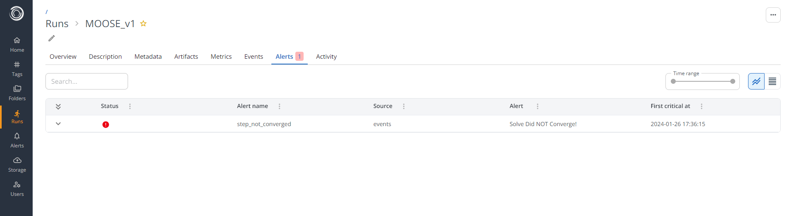
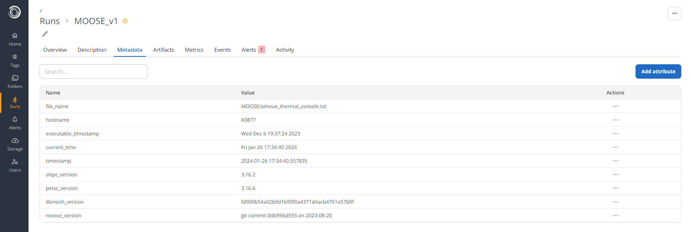
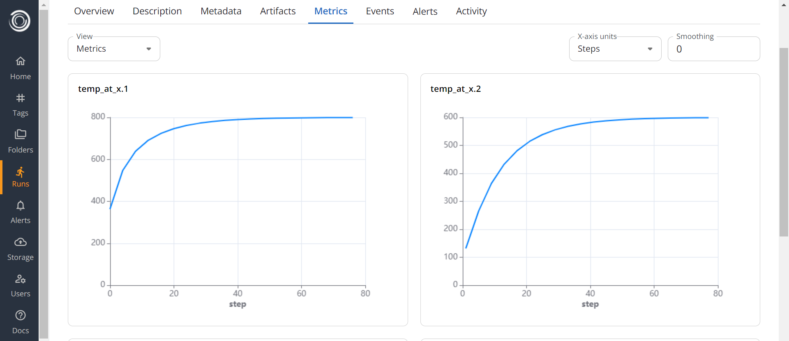
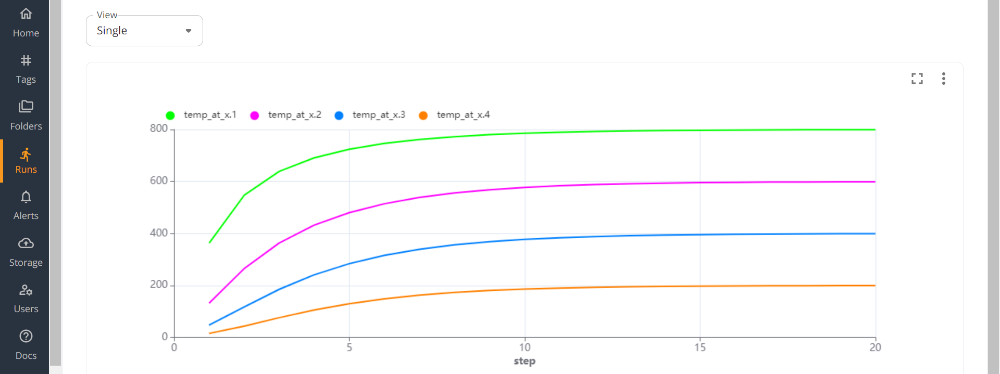

# MOOSE
MOOSE (Multiphysics Object-Oriented Simulation Environment) is an open-source, parallel finite element framework for solving various Physics problems using finite element analysis. In this example we will define a simple problem, briefly discuss how to set up the MOOSE input file to solve this problem, and use the Simvue Multiparser to track the progress of the simulation.

## Setup
Firstly, install the Simvue Python client by [^^following the installation instructions found in the tutorial.^^](/tutorial/introduction#setup).

You will also need to install MOOSE: [^^see installation instructions here^^](https://mooseframework.inl.gov/getting_started/installation/index.html)

If you would like to see the solution generated by the MOOSE script, you will also want CAD software to view the output. Paraview is an open source program which can be used, [^^which can be downloaded here^^](https://www.paraview.org/download/).

## Defining the problem
For the purposes of this example, we will consider a very simple problem. Let us consider a simplified heat diffusion problem, where we have a long rod of metal which is initially held at different temperatures at both ends. We will then allow the heat to diffuse from one side of the material to the other over time, and are looking for the amount of time which it takes to reach a steady state. This is governed by the heat equation:
$$
\frac{\partial T}{\partial t} = \alpha \nabla^2 T
$$
Where $\alpha$ is the thermal diffusivity of the material.

## Creating the MOOSE input file
MOOSE uses a custom input file to define and run a simulation. While this is not a tutorial on how to use MOOSE, we will provide a brief description of how we setup the problem stated above in MOOSE. If you are completely new to MOOSE, [^^you can find tutorials on how to use MOOSE here^^](https://mooseframework.inl.gov/getting_started/examples_and_tutorials/index.html). If you are experienced at MOOSE and have your own MOOSE files which you are trying to use you may not need to read through the following steps, but pay attention to the [outputs block](#specify-outputs). See the full file we will be using in the [final step of this section](#run-the-simulation).

Create a file called `simvue_thermal.i`, and follow the following steps:

### Create the mesh
Firstly, we need to create a mesh which will represent our sheet of metal. Say that we want to make a 3D rod which has a square cross section, and has dimensins 5m x 1m x 1m. To do this, we will use the `GeneratedMesh` to create a uniform rectangular mesh, with the following properties:
```
[Mesh]
  [generated]
    type = GeneratedMeshGenerator
    dim = 3
    nx = 20
    ny = 20
    nz = 20
    xmax = 5
    ymax = 1
    zmax = 1
  []
[]
```

### Define variables and kernels
Next we need to define the variable which we wish to study, and the Kernels in the problem. The Kernels essentially represent each of the terms in the partial differential equation which we are solving, and use solvers which are built into MOOSE. We define our variable as the temperature, $T$:
```
[Variables]
  [T]
  []
[]
```
We can then add the Kernel which represents our time derivative $\frac{\partial T}{\partial t}$, for which we choose [the ADTimeDerivative kernel](https://mooseframework.inl.gov/source/kernels/ADTimeDerivative.html):
```
[Kernels]
  [time-derivative]
    type = ADTimeDerivative
    variable = T
  []
```
Next, we add a kernel which can solve the diffusivity term, $\alpha \nabla^2 T$. For this we use [the ADMatDiffusion kernel](https://mooseframework.inl.gov/source/kernels/ADMatDiffusion.html), which accepts the diffusivity parameter $\alpha$ as a material property.
```
[Kernels]
  [time-derivative]
    type = ADTimeDerivative
    variable = T
  []
  [diffusion-kernel]
    type = ADMatDiffusion    
    variable = T
    diffusivity = diffusivity-property
  []
[]
[Materials]
  [mat-diffusivity]
    type = ADGenericConstantMaterial
    prop_names = 'diffusivity-property'
    prop_values = '0.98'
  []
[]
```

### Define boundary conditions
Next we must define our boundary conditions, which define the initial state that the system is in. In our case, we will say that the left side of the sheet is kept 'hot' at 1000 degrees, while the right side is kept 'cold' at 0 degrees:
```
[BCs]
  [hot]
    type = DirichletBC
    variable = T
    boundary = left
    value = 1000
  []
  [cold]
    type = DirichletBC
    variable = T
    boundary = right
    value = 0
  []
[]
```

### Specify Problem and Executioner
Next we define the type of problem which we are solving, which in our case is just a standard Finite Element problem, and we can define the executioner for this MOOSE file. This tells the solver whether the problem is static or transient. If it is transient, it defines how long the simulation runs for, and in which time steps. In our case, let us define this as a transient problem for 10 seconds, with time steps every 0.1 seconds:
```
[Problem]
  type = FEProblem
[]
[Executioner]
  type = Transient
  end_time = 10
  dt = 1
  solve_type = NEWTON
[] 
```

### Specify Outputs
Finally, we need to specify the types of outputs which we want our simulation to create. This is important, since we are going to use the Simvue Multiparser to track our simulation, which reads from any provided file to find useful Metrics and Events. Initially, lets say that we want to create an Exodus file (which can be viewed in CAD software like Paraview), and we want to direct the console output to a file:
```
[Outputs]
  file_base = ./results/
  [exodus]
    type = Exodus
  []
  [console]
    type = Console
    output_file = true
  []
[]
```

### Run the Simulation
To check that the input file is configured correctly, run the file and check the output in Paraview. The full file is given below:
```
[Mesh]
  [generated]
    type = GeneratedMeshGenerator
    dim = 3
    nx = 20
    ny = 20
    nz = 20
    xmax = 5
    ymax = 1
    zmax = 1
  []
[]
[Variables]
  [T]
  []
[]
[Kernels]
  [time-derivative]
    type = ADTimeDerivative
    variable = T
  []
  [diffusion-kernel]
    type = ADMatDiffusion    
    variable = T
    diffusivity = diffusivity-property
  []
[]
[Materials]
  [mat-diffusivity]
    type = ADGenericConstantMaterial
    prop_names = 'diffusivity-property'
    prop_values = '0.98'
  []
[]
[BCs]
  [hot]
    type = DirichletBC
    variable = T
    boundary = left
    value = 1000
  []
  [cold]
    type = DirichletBC
    variable = T
    boundary = right
    value = 0
  []
[]
[Problem]
  type = FEProblem
[]
[Executioner]
  type = Transient
  end_time = 10
  dt = 1
  solve_type = NEWTON
[]
[Outputs]
  file_base = ./results/
  [exodus]
    type = Exodus
  []
  [console]
    type = Console
    output_file = true
  []
[]
```
This should be in your `simvue_thermal.i` file. Next, locate where your MOOSE application file is, and run the following command:
```cmd
/path/to/MOOSE/application/file -i /path/to/simvue_thermal.i --color off
```
You should see some debug being printed to the console, and the simulation should finish in a few seconds. It should produce two output files: `simvue_thermal_exodus.e` and `simvue_thermal_console.txt`. You can open the Exodus file in your CAD software, if using paraview this is done using the command `paraview simvue_thermal_exodus.e`. Once Paraview is opened, follow these steps to see the heat diffuse across the bar:

- In the Properties panel in the left hand side, in the Variables tab, tick the box next to $T$. Press Apply
- In the second bar of icons at the top of the window, click the 'vtkBlockColours' dropdown and change this to $T$
- Next to this dropdown, find the button with an arrow and the letter 't'. Click this to rescale the data range over all timestamps
- Press the green play button in the top bar of the window

You should see something like this:
<figure markdown>
  { width="1000" }
</figure>

So that works as expected! We see heat diffuse from the hot side of the bar towards the cold side, and the simulation is tending towards a steady state solution where there is a common temperature gradient across the bar.

## Tracking the Console Log with Simvue
As the simulation which we ran in the previous step was progressing, you should have seen a series of messages being printed to the log. These have also been stored in a log file, called `simvue_thermal_console.txt`. If we look at the most recent lines in this file by running `tail simvue_thermal_console.txt -n 100` in the terminal, we should see something like this:
```
...
Time Step 10, time = 10, dt = 1
 0 Nonlinear |R| = 4.974806e-01
      0 Linear |R| = 4.974806e-01
      1 Linear |R| = 4.951657e-01
      ...
 1 Nonlinear |R| = 4.817842e-06
      0 Linear |R| = 4.817842e-06
      1 Linear |R| = 3.563368e-06
      ...
 2 Nonlinear |R| = 4.023366e-11
 Solve Converged!
Finished Executing
```
For each time step, MOOSE is attempting to minimise the error function as far as possible, until it is within some acceptable parameters which indicates that the solver has converged to some acceptable value. Now this console log contains a lot of information, including the values of this error function in every iteration, which makes it quite difficult for the user to read at a glance. Lets say that we wanted to add a trimmed down version of this log to the Events log of a Simvue run, so that we can monitor it effectively.

### Initializing the Simvue Run
To do this, we will need to install the modules `simvue` and `multiparser`, either with a virtual environment manager such as Poetry, or by doing `pip install <module name>`. We then create a python file called `moose_monitoring.py`, and import those modules:
```py
import simvue
import multiparser
```
The next thing which we need to do is initialize a Simvue run. To do this, we first need to import the Run() object from the simvue module, and then we call the run.init() method to set up the run:
```py
import time
import shutil

shutil.rmtree('./MOOSE/results')

run_name = 'thermal-diffusion-monitoring-%d' % time.time()

with simvue.Run() as run:
  run.init(
    name=run_name,
    description="A simulation to model the diffusion of heat across a metal bar",
    folder='/moose'
    )
```
In the case above, we have specified a name for the run (with a timestamp), and that the run should be placed in a folder called `/moose` so that we can group all of our runs together. We also remove any existing results from previous runs, so that logs and results from previous runs aren't automatically added to new ones.

### Initializing the File Monitor
Next, we can create our File Monitor object, which is the class which will track our output file for us. For now we won't pass in any arguments to the file monitor, as we will add these later. 
```py
with multiparser.FileMonitor() as file_monitor:
  pass
```

We then need to define which way the file monitor should keep track of the files. There are two main options:

- `FileMonitor.track()`: The contents of the whole file are read at once. This should be used for cases where the full output is written in one go, when the file is created.
- `FileMonitor.tail()`: The initial contents of the file are read, and then any additional lines added after this point are read on a line by line bases. This is useful for live updating files, such as log files, where new lines are being appended to the end of the file during execution of the program.

For our console output file, new lines are being constantly appended to the file as the simulation progresses, and we want an event to be logged as soon as one of these lines is written. Therefore we will chose the `tail()` method of file tracking. To allow this function to start tracking our file, we need to provide it with three main arguments:

- `path_glob_exprs`: This specifies the path at which to look for the files which we want monitored. This can be provided in the form of an absolute or relative path to a single file, a list of absolute or relative paths, or globular expressions for locating desired files. In our case, we will simply pass in the relative path to our console output file as a string, `MOOSE/results/simvue_thermal_console.txt`.
- `tracked_values`: This is a list of values to look out for in the tracked file. These can be provided as literal strings, or regular expressions. When one of these values is seen in the file, a callback to a user defined function is triggered (in our case to add an event to Simvue, which we will see later).
- `labels`: Labels to assign to each of the tracked values. If one of the tracked values above is found in the file, the callback function will be passed a dictionary of key value pairs, where the key is the label given here, and the value is the value from the file which is matching the tracked value.

If we [take a look at the console output](#tracking-the-console-log-with-simvue), we can see that most of the log is taken up by values of the error function at each step, which makes the log difficult to read and which aren't particularly informative for the user. The more useful information contained within the log is which step the simulation is on, and whether that step did or did not converge. So we can set the FileMonitor to look out for these phrases: 

- For the time step, we can use a simple regular expression which matches the phrase 'Time Step' and then the rest of the characters on that line as follows: `r"Time Step (.*)"`. We must compile this expression using `re.compile()` before passing to Multiparser. 
- For whether the solve converged at that step, we can look out for the literal phrases `" Solve Converged!"` and `" Solve Did NOT Converge!"` (note the space at the front). 

So we pass these in as the `tracked_values`, along with some appropriate labels. We then run the `file_monitor`, so that when this Python script is executed it begins tracking our file:
```py
with multiparser.FileMonitor() as file_monitor:
  file_monitor.tail(
    path_glob_exprs = "MOOSE/results/simvue_thermal_console.txt", 
    tracked_values = [re.compile(r"Time Step (.*)"), " Solve Converged!", " Solve Did NOT Converge!"], 
    labels = ["time_step", "converged", "non_converged"]
  )
  file_monitor.run()
```

### Adding a Callback Function

This code will now recognise when it sees one of our tracked phrases in the MOOSE log, and can trigger a callback function when this happens. We next need to define what we want that callback function to do. In our case, we simply want it to add the seen phrase to the Simvue Events log, which we can do using the `run.log_event()` method. Above where we have instantiated the File Monitor, create a new function called `per_event`, which accepts the dictionary which will be returned from the file monitor:
```py
def per_event(log_data):
  if any(key in ("time_step", "converged", "non_converged") for key in log_data.keys()):
    run.log_event(list(log_data.values())[0])
```

We then need to pass this function to our FileMonitor instance. Where we instantiate our `file_monitor` object:
```py
with multiparser.FileMonitor(
    per_thread_callback=per_event, 
) as file_monitor:
```

The `file_monitor` will now execute that function every time it recognises one of our tracked phrases in the MOOSE log.

### Testing our Events Log
Now we can test whether our code is working! Firstly, delete the existing `simvue_thermal_console.txt` file, so that the FileMonitor doesn't add logs from the previous run to our next run. In reality, you would want to create new directories to contain logs and results for each simulation you perform to avoid this issue, but for testing purposes we don't need to keep any of our old logs or results. 

Then we can start our file monitoring script by running `python MOOSE/moose_monitoring.py`, and we can run our MOOSE simulation by running `/path/to/MOOSE/application/file -i MOOSE/simvue_thermal.i --color off`.

If you then log into the Simvue UI, you should see that a new run has been created in the `/moose` folder, with the expected `thermal-diffusion-monitoring` name. If you open this run and go to the Events tab, you should see that the Events log is updating live as the simulation progresses:

### Alerts for Non-Converged Runs
With the MOOSE script which we ran above, all of the steps converged to a result successfully. However if we allowed the simulation to continue for a longer time, then as the system reached a steady state where the temperature gradient was uniform across the bar, the steps would begin to fail to converge. When this happens, MOOSE will incrementally decrease the time delta which is used betrween steps, to attempt to find a converging solution. It will continue to do this until it either finds a converging solution, or the time delta is below some minimum specified within MOOSE. This process can continue for a very long time, and even if it does eventually find a time delta with a converging solution, the simulation is not giving us any further useful information (since the system is pretty much in a steady state already). So instead of waiting for MOOSE to do this process, we may want to trigger an alert as soon as there is a non converged step, and stop execution of the MOOSE simulation.

As an example, take your MOOSE script, and change the details in the Executioner block to have `end_time = 50`. If you were to run the simulation now, you would see that you get non convergence at around step 40. Waiting for the simulation to fully complete will take around 6 minutes on a standard office laptop, but most of this time was taken up by the code reducing the time step and retrying.

Let us create a Simvue alert for this case. After we have defined our run, let us add an alert which is looking for the phrase " Solve Did NOT Converge!" in our Events log:
```py
import time

with simvue.Run() as run:
  run.init(
    name='thermal-diffusion-monitoring-%d' % time.time(),
    folder='/moose'
    )
  run.add_alert(
    name='step_not_converged',
    source='events',
    frequency=1,
    pattern=' Solve Did NOT Converge!',
    notification='email'
    )
```
Now that this alert is set up, it will send us an alert if a step has failed to converge, and so can act as a trigger for a user to manually come back and check how the simulation is doing. They can then determine if it is worth continuing with the simulation, or whether the job should be terminated to save computational time and cost. If we run our monitoring script, and then run our MOOSE script with `end_time = 50`, we should see a new run appear in the Simvue UI. After around 1 minute, the Alerts tab should show that a step has failed to converge:
<figure markdown>
  { width="1000" }
</figure>

You should also receive an email, since you set that as your notification policy above. Note that this only took around one minute, whereas waiting for the MOOSE simulation to fully complete would take around 6 minutes. However in both situations the result is the same, with an almost perfectly linear distribution of heat across the length of the bar.

# TODO: add section about using simvue processes and automatically stopping failed sims

### Adding Metadata to the Simvue Run
To allow us to keep track of how a particular run has been performed, we may want to add metadata to the Simvue run. As an example, in the console log, important information about the MOOSE environment and simulation parameters are included at the very top. This can be seen by running `head simvue_thermal_console.txt -n 40`:
```
Framework Information:
MOOSE Version:           git commit 0db956d593 on 2023-08-20
LibMesh Version:         fd900b54a02b9d1b99f0a4371d4acb4761e57b0f
PETSc Version:           3.16.6
SLEPc Version:           3.16.2
Current Time:            Fri Jan 26 15:27:26 2024
Executable Timestamp:    Wed Dec  6 19:37:24 2023
...
```
Lets say that we want to add information about the Framework which MOOSE is running on to the metadata of the Simvue run. To do this, we can add a custom parser for Multiparser to use.

Firstly, we need to consider whether we would want to use the `tail()` or `track()` method. Since the MOOSE log file is initialized by printing all of this configuration information at once, we can just read it from the file at once, and so will use `track()`. 

We then want to build our own custom parser function on top of the file parser built into Multiparser. We can import the existing parser, and use it as a decorator to our custom function:
```py
import multiparser.parsing.file as mp_file_parser

@mp_file_parser.file_parser
def moose_header_parser(input_file, **_):
  return
```
This means that all of the metadata which is produced by the Multiparser by default, such as the filename and timestamp, are also returned by our custom parser. Our custom parser then takes an input file path, and an unknown number of other arguments. We then need to open and read the information from the file as a list of lines, filter out any blank lines which may exist, and then slice the list so that only the framework information which we want to consider is included:
```py
@mp_file_parser.file_parser
def moose_header_parser(input_file, **_):
    with open(input_file) as file:
        file_lines = file.readlines()
    file_lines = list(filter(None, file_lines))
    header_lines = file_lines[1:7]
```
We then need to take these lines, which will look something like `PETSc Version:           3.16.6`, and convert them to a dictionary of key:value pairs. To do this, we will simply split the string at the first colon, so that anything to the left of the colon is the key, and anything to the right of the colon is the value. We can then do some formatting to the key to make it more Pythonic, and strip the value of any whitespace:
```py
    ...
    header_data = {}
    for line in header_lines:
        key, value = line.split(":", 1)
        key = key.replace(" ","_").lower()
        value = value.strip()
        header_data[key] = value
```
Finally, we must return a pair of arguments: the first argument is a dictionary of metadata, and the second argument is the dictionary of data which the parser has found in the file. In our case, we return an empty dictionary for the metadata which allows the default parser to add its metadata, and return our `header_data` dictionary as the parsed data:
```py
    @mp_file_parser.file_parser
    def moose_header_parser(input_file, **_):
        with open(input_file) as file:
            file_lines = file.readlines()
        file_lines = list(filter(None, file_lines))
        header_lines = file_lines[1:7]
        header_data = {}
        for line in header_lines:
            key, value = line.split(":", 1)
            key = key.replace(" ","_").lower()
            value = value.strip()
            header_data[key] = value

        return {}, header_data
```

then where we instantiate our `file_monitor` object, we can tell the file monitor to track the console file again, but using the custom parser. We can also set different callbacks for each file we are tracking - so we remove `per_thread_callback` from the function arguments, and instead define it in each call to `tail()` and `track()`. 

To add metadata to a Simvue run, we simply need to pass our dictionary of metadata to the `run.update_metadata()` method. In our case we will do this using a lambda function, where we combine the `header_data` produced by our custom parser, and `metadata` produced by the default parser, into a single dictionary and pass it to the method:
```py
with multiparser.FileMonitor() as file_monitor:
  file_monitor.tail(
    path_glob_exprs = "MOOSE/results/simvue_thermal_console.txt", 
    tracked_values = [re.compile(r"Time Step (.*)"), " Solve Converged!", " Solve Did NOT Converge!"], 
    labels = ["time_step", "converged", "non_converged"],
    callback = per_event
  )
  file_monitor.track(
    path_glob_exprs = "MOOSE/results/simvue_thermal_console.txt", 
    callback = lambda header_data, metadata: run.update_metadata({**header_data, **metadata}), 
    parser_func = moose_header_parser, 
    static = True
  )
  file_monitor.run()
```
Note that in our call to `.track()`, we specify `static = True`. This means that once the file has been read once by this call, it won't be read again. This is what we want, since this metadata at the top of the file will not change as the simulation proceeds.

Now, let's run our script again to see if the metadata loads correctly. Running `python MOOSE/moose_monitoring.py` should now also start our MOOSE process automatically due to the step above. Looking in the Metadata tab of the run in the UI, we should now see all of the information from the header, and the metadata which Multiparser collects:
<figure markdown>
  { width="1000" }
</figure>

## Tracking Metrics
In this section, we will update our MOOSE file to allow us to track the temperature of given points in the metal rod over time. We will then parse the output files which this produces to extract the data, and add it as a Metric to our Simvue run. 

### Updating our MOOSE file
Firstly, we need to update our MOOSE input file to allow us to take measurements of the temperature at different points along the bar. To do this, we will add a new block called `VectorPostProcessors`, which allows us to specify positions in the system as (x,y,z) coordinates, along with a function which we want to calculate at each time in the simulation at these points. In our case, we will evaluate the temperature at the centre of the bar for different x positions, `x=1`, `x=2`, `x=3`, and `x=4`.

Add the following block to your MOOSE input file:
```
[VectorPostprocessors]
  [temps]
    type = PointValueSampler
    variable = 'T'
    points = '1 0.5 0.5  2 0.5 0.5  3 0.5 0.5  4 0.5 0.5'
    sort_by = 'x'
  []
[]
```

We then also need to specify the format which we would like our outputs to be in. In our case we will use CSV files, where a new CSV file will be created for each timestep containing the value of the temperature at each point. So can add a new section to the `Outputs` block:

```
[csv]
  type = CSV
[]
```

And finally we will change the end time for the simulation to 20 seconds, so that the simulation can complete again without hitting non-convergence errors.
```
[Executioner]
  type = Transient
  end_time = 20
  dt = 1
  solve_type = NEWTON
[]
```

If we run this simulation now, we should see a number of CSV files being created as the simulation proceeds, with names such as `simvue_thermal_csv_temps_0001.csv`. These files each contain data similar to the following:
```
T,id,x,y,z
363.08473814564,0,1,0.5,0.5
131.60241338385,1,2,0.5,0.5
47.071880853614,2,3,0.5,0.5
15.103433376863,3,4,0.5,0.5
```

### Parsing values and adding Metrics
To be able to extract the data from these CSVs for adding to the Simvue run, we will again need to use Multiparser. Since all of the data is written to the file at once when it is created, we can use the `track()` method, similarly to how we used it for the Metadata above. 

Firstly we want to create our callback function, which will run each time a new CSV file is found. This function will be executed once for each line in the CSV file, and can expect a dictionary of key value pairs similar to the following:
```json
{
  "T": 363.08473814564,
  "id": 0,
  "x": 1,
  "y": 0.5,
  "z": 0.5,
}
```
We want to create a separate metric for each `x` position, which tracks the temperature at this point over time. We will use the `log_metrics` method to do this, which expects a dictionary of key value pairs, where the key is the metric name (which we will set as something like `temp_at_x.1` for `x=1`, `temp_at_x.2` for `x=2`, etc). We will create a callback method called `per_metric()` and add the following code:

```py
def per_metric(csv_data, sim_metadata):
  run.log_metrics(
    {
      f"temp_at_x.{csv_data['x']}": csv_data['T']
    }
  )
```

We can then add our call to the `track()` method. We can use a globular expression here to search for any CSV files which match our naming convention, and set it to call our callback function when one is found:

```py
with multiparser.FileMonitor() as file_monitor:
  ...
  file_monitor.track(
    path_glob_exprs = "MOOSE/results/simvue_thermal_csv_temps_*.csv", 
    callback = per_metric,
    static=True
  )
  file_monitor.run()
```

If we run our Python script now, we should see that our metrics are being updated live as the run progresses in the UI! However, you may notice something strange - the `step` parameter in the graphs looks odd, and does not correspond to the step which we are at in our simulation:
<figure markdown>
  { width="1000" }
</figure>

This is because the callback function is called multiple times for each CSV file, and therefore the `log_metrics()` method is called multiple times for each step of the simulation. Each time this method is called it increments the `step` parameter by one, meaning that this parameter will not represent the step the simulation is on. 

To solve this, we can note that the names of the CSV files contain the step at which the temperature was evaluated, eg `simvue_thermal_csv_temps_0001.csv` represents the temperature data at the first step in the simulation. So to our callback function, we will add a line to extract this data from the file name, and then manually set the `step` parameter to this value. The filename is included in the metadata dictionary which is passed to the callback function (along with the timestamp, which we can also add to the metric if we wish):

```py
def per_metric(csv_data, sim_metadata):
  step_num = sim_metadata['file_name'].split('_')[-1].split('.')[0]
  run.log_metrics(
    {
      f"temp_at_x.{csv_data['x']}": csv_data['T']
    },
    step = int(step_num),
    timestamp = sim_metadata['timestamp']
  )
```

If we now run our Python script, we should see that the run UI shows all of the metrics updating live again, but with the step parameter correctly corresponding to the step in the simulation which the temperature was measured at. 

We can also now plot all of these metrics on the same graph to compare them - on the left hand side of the Metrics tab, click on the 'View' dropdown and select 'Single'. you can then click the three dots on the right hand side, and select 'Edit'. This should bring up a popup window which allows you to configure a custom graph. Go to data and select each of our metrics, and then click off of the popup to see the graph:
<figure markdown>
  { width="1000" }
</figure>

### Adding Alerts
From the graph above, we can see that the temperatures converge to a steady state rather quickly, with each position reaching within 5 degrees of its final value after step 15. In an earlier step of this tutorial, we saw how we could stop the run after we got our first non-convergence error, which occured around step 36. However we can improve this even further, using an alert to tell us when the temperature at a point has been within a certain range of its expected final value.

Firstly, lets update our MOOSE input file so that we have a few more data points ot play with. In the executioner block, change the time step to be `0.05`:
```
[Executioner]
  type = Transient
  end_time = 20
  dt = 0.05
  solve_type = NEWTON
[]
```

We can then add a new alert to our run: Let us use it to track the temperature at `x=3`, and alert us when the value is within 10 degrees of the expected final value (400K). To do this we will use a range based alert, with a low threshold of 390, and a high threshold of 410. After the alert which we have added to monitor non convergence, we can add the following:
```py
run.add_alert(
  name='temperature_steady_state',
  source='metrics',
  metric='temp_at_x.3'
  rule='is inside range',
  range_low=390,
  range_high=410,
  frequency=1,
  window=1,
  )
```

!!! note

  The rest of the things in this section use Client methods which are still in a merge request

This will trigger an alert when the temperature has been within the given range for more than 1 minute. When this alert fires, we will want to stop the execution of the script. To monitor the status of this alert, we will use the `Client` class from the Simvue client. This class allows you to retrieve a number of different aspects of ongoing or past runs, including metrics, events, artifacts and alerts.

To be able to regularly monitor the status of our alert as the run proceeds, we will create a new Python script. This script will then create a CSV file which contains the status of the alert at regular time intervals, which can be monitored using Multiparser. Create a new file called `moose_alerter.py`, and use the `argparse` Python module to create a script which accepts the name of the run to monitor, the time interval between checks of the alert status, and the maximum time which the script will run for:

```py
import argparse

parser = argparse.ArgumentParser(description='Monitor alerts from a Simvue run.')
parser.add_argument(
  'run_name', 
  type=str,
  help='The name of the run to monitor alerts for.'
  )
parser.add_argument(
  'time_interval', 
  type=int,
  help='The interval between queries to the alert status, in seconds.'
  )
parser.add_argument(
  'max_time', 
  type=int,
  help='The maximum time which this script will run for.'
  )
args = parser.parse_args()
```
We then want the script to create a new CSV file, which contains the time interval at which the alert was queried, and the names of any alerts which were firing at that time. Import the `csv` module at the top of the script, and then do:
```py
with open('MOOSE/results/alert_status.csv', 'w', newline='') as csvfile: 
    csvwriter = csv.writer(csvfile) 
    csvwriter.writerow(['time', 'firing_alerts'])
```
We then want to create a loop which performs the check for firing alerts, appends a line to the CSV file, and then waits for the given time interval. The methods which we will need from the Client class are `get_run_id_from_name()` and `get_alerts()`, which returns a list of the names of firing alerts:
```py
time_elapsed = 0
client = simvue.Client()
run_id = client.get_run_id_from_name(args.run_name)

while time_elapsed < args.max_time:
    alerts = client.get_alerts(run_id)
    with open('MOOSE/results/alert_status.csv', 'a', newline='') as csvfile: 
        csvwriter = csv.writer(csvfile) 
        csvwriter.writerow([time_elapsed, alerts])
    
    time.sleep(args.time_interval)
    time_elapsed += args.time_interval
```
Next we will add this new script as a process to our main Simvue run. In `moose_multiparser.py`, we can add a new process under where we defined our alert:
```py
run.add_process('alert_monitor', "python3", "MOOSE/moose_analysis.py", run_name, "10", "1000")
```
We can then add a new call to `tail()` within our file monitor, to check the latest additions to the CSV file created as the simulation proceeds:
```py
with multiparser.FileMonitor() as file_monitor:
  ...
  file_monitor.tail(
    path_glob_exprs = "MOOSE/results/alert_status.csv", 
    callback = per_alert,
  )
  file_monitor.run()
```
We can then define our callback function - if our alert called `temperature_steady_state` is firing, we will want to stop execution of the simulation. To do this, we can use the `kill_all_processes()` method of our run to stop the MOOSE simulation and analysis script, and we can set the trigger which will stop the file monitoring processes. We could also add a tag to the run which indicates it is in (or near) a steady temperature state:
```py
def per_alert(data, metadata):
  if 'temperature_steady_state' in list(data['firing_alerts']):
    run.update_tags(['temperature_steady_state',])
    run.kill_all_processes()
    trigger.set()
```
If we run our `moose_multiparser.py` script now, we should see that the simulation is terminated after around 15 seconds inside the simulation (150 steps). This is opposed to waiting until 36 seconds (360 steps) when our non converging alert would have kicked in, cutting our computation time by over half.

## Conclusion
In this tutorial, we have covered how to:
- Setup and run a simple MOOSE simulation
- Add processes to Simvue to control code which runs as part of a simulation
- Use Multiparser to track log files and results from simulations
- Use callbacks to add Events and Metrics to a run
- Use custom parsers to retrieve and store relevant information from arbitrary files
- Add alerts based on Metrics and Events
- Retrieve alert values from the server, and abort simulation runs based on Alert values

