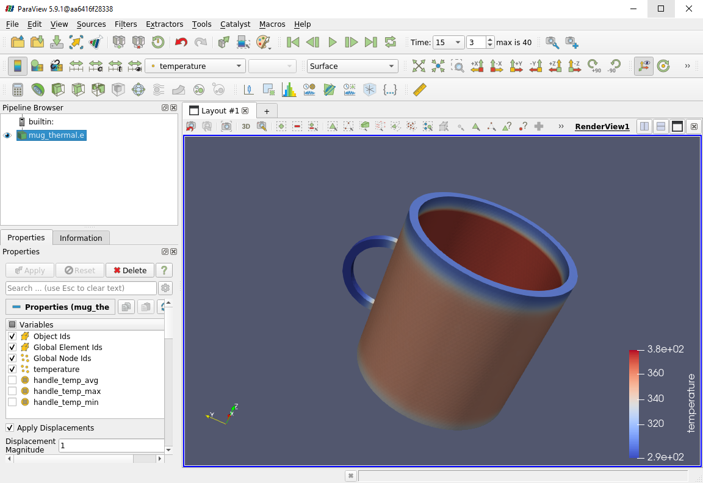
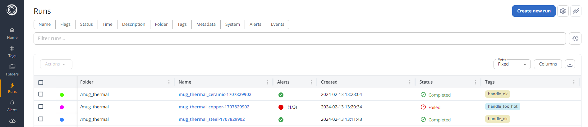
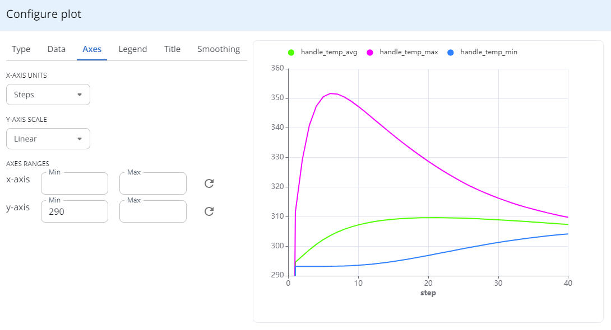
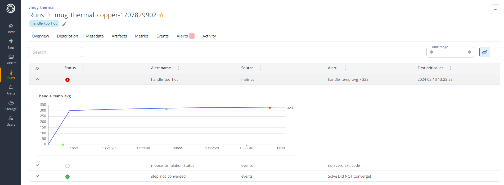
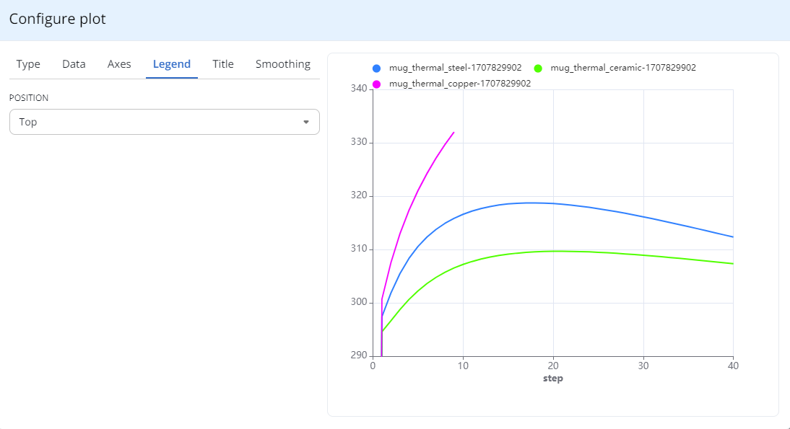

# MOOSE
This example demonstrates how you can use Simvue to track MOOSE simulations. In particular, it will show how you can:

- Extract data from files produced during the execution of MOOSE in real time
- Record Metadata, Metrics and Events based on data from these files
- Trigger Alerts based on Metric values
- Abort simulation runs based on firing alerts
- Save Artifacts

## Specifying the Problem
In our example, we will imagine that we are a coffee cup manufacturer, looking to design a new cup which we want to put onto the market. While we have decided on the shape and thickness of the mug, we aren't sure whether to make the mug out of Copper, Steel or Ceramic. The main factor which will influence our decision is how hot the handle of the mug gets - if it gets too hot, the customer won't be able to pick it up!

To model this scenario, we will model the fluid inside the cup as having an exponentially decaying temperature from 90 degrees Celsius to room temperature (20 degrees Celsius), and we will use MOOSE to simulate the conductive heat through the walls and handle of the mug over time. We will also get MOOSE to output the maximum, minimum and average temperature of the handle at every time step, so that we can monitor it effectively. We will say that if the average temperature of the handle goes above 50 degrees, then it will be too hot to hold, and the simulation can be aborted to save computational time.

## Setup
The easiest way to run this example is to use the provided Docker container:
### Install Docker
You will need to install the Docker CLI tool to be able to use the Docker container for this tutorial. [^^Full instructions for installing Docker can be found here^^](https://docs.docker.com/engine/install/). If you are running Ubuntu (either on a full Linux system or via WSL on Windows), you should be able to do:
```
sudo apt-get update && sudo apt-get install docker.io
```
To check that this worked, run `docker` - you should see a list of help for the commands.

!!! tip
    If you wish to run this on a Windows computer (without using Docker Desktop) via Windows Subsystem for Linux, [^^follow this guide on setting up Docker with WSL.^^](https://dev.to/bowmanjd/install-docker-on-windows-wsl-without-docker-desktop-34m9)

### Pull Docker image
Next we need to pull the container, which is stored in the Simvue repository's registry:
```
sudo docker pull ghcr.io/simvue-io/moose_example:latest
```
This may take some time to download. Once complete, if you run `sudo docker images`, you should see an image with the name `ghcr.io/simvue-io/moose_example` listed.

### Run Docker container
Firstly, add Docker as a valid user of the X windows server, so that we can view results using Paraview:
```
xhost +local:docker
```
Then you can run the container:
```
sudo docker run -e DISPLAY=${DISPLAY} -e QT_X11_NO_MITSHM=1 -v /tmp/.X11-unix:/tmp/.X11-unix -it ghcr.io/simvue-io/moose_example:latest
```
If this is running correctly, you should see your command prompt change to something like:
```
dev:~/simvue-moose$
```
To test that the graphics packages are working correctly, run the command `paraview` within the container. After a few seconds, this should open up a graphical user interface window for the Paraview visualization tool.

!!! tip
    If you are using WSL and you do not see Paraview open correctly, it may be because your WSL is not set up correctly. To check this, exit the docker container by pressing <kbd>ctrl</kbd> + <kbd>D</kbd>, and then run the following commands:
    ```
    sudo apt-get install -y x11-apps
    xeyes
    ```
    This should open a small graphical display window, with a pair of eyes which follow your mouse around the screen. If you do not see this, [^^follow this guide to get graphical apps working on WSL^^](https://learn.microsoft.com/en-us/windows/wsl/tutorials/gui-apps), and [^^look through these debugging tips for WSL^^](https://github.com/microsoft/wslg/wiki/Diagnosing-%22cannot-open-display%22-type-issues-with-WSLg).

### Update Simvue Config File
Finally we need to update the config file inside the Docker container to use your credentials. Login to the web UI, go to the **Runs** page and click **Create new run**. You should then see the credentials which you need to enter into the `simvue.ini` file. Simply open the existing file using `nano simvue.ini`, and replace the contents with the information from the web UI.

!!! note
    If you restart the docker container at any point, you will need to repeat this step as your changes will not be saved

!!! warning
    Currently this tutorial will only work on the Dev02 Simvue server as it relies on methods implemented in the `dev` branch.

## Using Simvue with MOOSE
To be able to use Simvue with a program not written in Python such as MOOSE, we can instead parse log and results files produced by the simulation for useful information, and use Simvue to store and track this information. 

!!! further-docs "Further Documentation"

    The method of tracking log and results files using Simvue which is demonstrated here is introducted in more detail in the second tutorial - [^^see here for a step by step guide on using Simvue with MOOSE^^](/tutorial_advanced/introduction)

Firstly we will create our MOOSE input file, which in our case uses the mesh for a coffee cup stored in the file `cup.e`, and defines the heat conduction kernels and functions to use to simulate the flow of heat through the cup. We define the boundary conditions for the system, eg the background temperature and the maximum temperature inside the mug, as well as some properties about the material such as the thermal conductivity and heat capacity. The log is sent to a file for storage, and results of the minimum, maximum and average temperature of the handle are stored in a CSV file after each time step.

??? example "Example MOOSE Input File"

    Here is an example input file for MOOSE - this is for the steel coffee cup, and can be viewed or edited in the Docker container using `nano /example/steel_mug.i`:
    ```
    [Mesh]
    file = 'cup.e'
    []
    
    [Variables]
    [temperature]
        family = LAGRANGE
        order = FIRST
        initial_condition = 293.15 # Start at room temperature
    []
    []
    
    [Kernels]
    [heat-conduction]
        type = ADHeatConduction
        variable = temperature
    []
    [heat-conduction-dt]
        type = ADHeatConductionTimeDerivative
        variable = temperature
    []
    []
    
    [Functions]
    [temp-func]
        type = ParsedFunction
        value = 'ambient + (temp_zero*exp(-t*constant))'
        vars = 'ambient temp_zero constant'
        vals = '293.15 90.0 0.01'
    []
    []
    
    [BCs]
    [convective]
        type = ADConvectiveHeatFluxBC
        variable = temperature
        boundary = 'convective'
        T_infinity = '293.15'
        heat_transfer_coefficient = 7.8
    []
    [fixed-temp]
        type = ADFunctionDirichletBC
        variable = temperature
        function = 'temp-func'
        boundary = 'fixed-temp'
    []
    []
    
    [Materials]
    [steel-density]
        type = ADGenericConstantMaterial
        prop_names = 'density'
        prop_values = '7800'
    []
    [steel-conduction]   
        type = ADHeatConductionMaterial
        specific_heat = 420.0
        thermal_conductivity = 45.0
    []
    []

    [Postprocessors]
    [handle_temp_max]
        type = ElementExtremeValue
        value_type = max
        variable = 'temperature'
        block = 'handle'
    []
    [handle_temp_min]
        type = ElementExtremeValue
        value_type = min
        variable = 'temperature'
        block = 'handle'
    []
    [handle_temp_avg]
        type = ElementAverageValue
        variable = 'temperature'
        block = 'handle'
    []
    []

    [Executioner]
    type = Transient
    solve_type = 'NEWTON'
    petsc_options = '-snes_ksp_ew'
    petsc_options_iname = '-pc_type -sub_pc_type -pc_asm_overlap -ksp_gmres_restart'
    petsc_options_value = 'asm lu 1 101'
    line_search = 'none' 
    nl_abs_tol = 1e-9
    nl_rel_tol = 1e-8
    l_tol = 1e-6
    start_time = 0
    dt = 5
    end_time = 200
    []

    [Outputs]
    file_base = ./example/results/steel/mug_thermal
    [exodus]
        type = Exodus
    []
    [console]
        type = Console
        output_file = true
    []
    [csv]
        type = CSV
    []
    []
    ```


We then want to create our Python script which runs the MOOSE simulations for each type of material, as well as setting up the tracking and monitoring of the simulations using Simvue. We can add the MOOSE simulation as a process within the Simvue run, which means that the simulation can be automatically started and stopped by Simvue based on certain triggers. We then set up Simvue to track the log and results files using Multiparser, and we define what we want to happen when these files are updated - for example, we could add useful lines from the MOOSE log to the Simvue Events log, or add the results after each time step from the CSV to relevant Metrics in the run.

??? example "Example Simvue Monitoring Script"
    Here is an example Simvue monitoring script - for each material, it starts the simulation as a Simvue process, defines some alerts, adds information from the header of the log as metadata to the run, adds relevant lines from the log as Events to allow the user to track progress, and adds temperatures of the handle after each step to the run as Metrics. It also periodically checks whether the alerts which we defined are firing, and if so terminates the simulation to save on computing time.
    ```py
    import simvue
    import multiparser
    import multiparser.parsing.file as mp_file_parser
    import multiparser.parsing.tail as mp_tail_parser
    import time
    import shutil
    import os
    import re
    import multiprocessing
    import shutil

    trigger = multiprocessing.Event()

    @mp_file_parser.file_parser
    def moose_header_parser(input_file, **_):
        """Parses the header from the MOOSE log, so that it can be stored as metadata in the Simvue run"""
        # Open the log file, and read lines 1-7 (which contains information about the MOOSE version used etc)
        with open(input_file) as file:
            file_lines = file.readlines()
        file_lines = list(filter(None, file_lines))
        header_lines = file_lines[1:7]

        # Add the data from each line of the header into a dictionary as a key/value pair
        header_data = {}
        for line in header_lines:
            key, value = line.split(":", 1)
            key = key.replace(" ","_").lower()
            value = value.strip()
            header_data[key] = value

        return {}, header_data

    def per_event(log_data, metadata, run, results_path):
        """Monitor each line in the MOOSE log, and add relevant information to the Simvue Events log."""

        # Look for relevant keys in the dictionary of data which we are passed in, and log the event with Simvue
        if any(key in ("time_step", "converged", "non_converged") for key in log_data.keys()):
            try:
                run.log_event(list(log_data.values())[0])
            except RuntimeError as e:
                print(e)

            # If run has failed to converge, save outputs, close the run as Failed, terminate multiparser
            if "non_converged" in log_data.keys():
                run.kill_all_processes()
                run.update_tags(["not_converged"])
                run.save(os.path.join(results_path, "mug_thermal.e"), "output")
                run.set_status('failed')
                trigger.set()
                print("Simulation Terminated due to Non Convergence!")
        
        # If simulation has completed successfully, save outputs, close the run, terminate multiparser
        elif "finished" in log_data.keys():
            time.sleep(1) # To allow other processes to complete
            run.update_tags(["handle_ok"])
            run.save(os.path.join(results_path, "mug_thermal.e"), "output")
            trigger.set()

    def per_metric(csv_data, sim_metadata, run, client, run_id, results_path):
        """Monitor each line in the results CSV file, and add data from it to Simvue Metrics."""

        metric_time = csv_data.pop('time')

        # If the time is zero (initial reading), then set the temperature of all mug components to room temp (293.15)
        # MOOSE correctly uses this within the simulation, but for some reason still writes temperatures of 0K as the initial point in the CSV
        if metric_time == 0:
            csv_data = {key: 293.15 for key in csv_data.keys()}

        # Log all results for this timestep as Metrics
        run.log_metrics(
            csv_data,
            time = metric_time,
            timestamp = sim_metadata['timestamp']
        )

        # Get status of 'handle too hot' alert, if it is firing then can terminate simulation
        if 'handle_too_hot' in client.get_alerts(run_id):
            print("Handle is too hot!")
            run.update_tags(['handle_too_hot',])
            run.save(os.path.join(results_path, "mug_thermal.e"), "output")
            run.kill_all_processes()
            run.set_status('failed')
            trigger.set()  


    def monitor_moose_simulation(run_name, moose_file, results_dir):
        """Begin and monitor the MOOSE simulation for the given material, tracking progress and results with Simvue"""

        # Reset the status of the trigger, so that the run does not terminate immediately due to the previous run setting the trigger
        trigger.clear()

        # Remove any old results
        if os.path.exists(results_dir):
            shutil.rmtree(results_dir)

        # Create the Simvue run
        with simvue.Run() as run:
            run.init(
                name=run_name,
                description="A simulation to model the transfer of heat through a coffee cup filled with hot liquid.",
                folder='/mug_thermal'
            )

            # Add the MOOSE simulation as a process, so that Simvue can abort it if alerts begin to fire
            run.add_process(
                identifier='moose_simulation',
                executable='app/moose_tutorial-opt',
                i=moose_file,
                color="off",
                )
            
            # Add alerts which we want to keep track of, so that we can terminate the simulation early if they fire
            run.add_alert(
                name='step_not_converged',
                source='events',
                frequency=1,
                pattern=' Solve Did NOT Converge!',
                notification='email'
                )
            run.add_alert(
                name='handle_too_hot',
                source='metrics',
                metric='handle_temp_avg',
                rule='is above',
                threshold=323.15,
                frequency=1,
                window=1,
                ) 
            
            # Save the MOOSE input file for this run to the Simvue server
            run.save(moose_file, "input")   

            # Create a Client instance for keeping track of which alerts are firing
            client = simvue.Client()
            run_id = client.get_run_id_from_name(run_name)

            # Start an instance of the file monitor, to keep track of log and results files from MOOSE
            with multiparser.FileMonitor(
                termination_trigger=trigger, 
            ) as file_monitor:
                # Monitor each line added to the MOOSE log file as the simulation proceeds and look out for certain phrases to upload to Simvue
                file_monitor.tail(
                    path_glob_exprs = os.path.join(results_dir, "mug_thermal.txt"), 
                    callback= lambda data, meta, run=run, results_path=results_dir: per_event(data, meta, run, results_path),
                    tracked_values = [re.compile(r"Time Step.*"), " Solve Converged!", " Solve Did NOT Converge!", "Finished Executing"], 
                    labels = ["time_step", "converged", "non_converged", "finished"]
                )
                
                # Read the initial information within the log file when it is first created, to parse the header information
                file_monitor.track(
                    path_glob_exprs = os.path.join(results_dir, "mug_thermal.txt"), 
                    callback = lambda header_data, metadata: run.update_metadata({**header_data, **metadata}), 
                    parser_func = moose_header_parser, 
                    static = True
                )

                # Monitor each line added to the MOOSE results file as the simulation proceeds, and upload results to Simvue
                file_monitor.tail(
                    path_glob_exprs =  os.path.join(results_dir, "mug_thermal.csv"),
                    parser_func=mp_tail_parser.record_csv,
                    callback= lambda csv_data, sim_metadata, run=run, client=client, run_id=run_id, results_path=results_dir: per_metric(csv_data, sim_metadata, run, client, run_id, results_path),
                )
                file_monitor.run()


    script_dir = os.path.dirname(__file__)

    # Our three sets of inputs, to run simulations for Copper, Steel and Ceramic mugs
    material_inputs = {
        'steel': {
            'run_name': 'mug_thermal_steel-%d' % time.time(),
            'moose_file': os.path.join(script_dir, 'steel_mug.i'),
            'results_dir': os.path.join(script_dir, 'results', 'steel')
        },
        'copper': {
            'run_name': 'mug_thermal_copper-%d' % time.time(),
            'moose_file': os.path.join(script_dir, 'copper_mug.i'),
            'results_dir': os.path.join(script_dir, 'results', 'copper')
        },
        'ceramic': {
            'run_name': 'mug_thermal_ceramic-%d' % time.time(),
            'moose_file': os.path.join(script_dir, 'ceramic_mug.i'),
            'results_dir': os.path.join(script_dir, 'results', 'ceramic')
        }
    }

    outputs = {}

    # Run the MOOSE simulation and monitor it for all materials above
    for material_type, inputs in material_inputs.items():
        print("Starting MOOSE Simulation of mug made from", material_type)
        monitor_moose_simulation(**inputs)

    print("All simulations complete!")
    ```

## Running the Simulations
To run the simulations in the Docker container, run the following command:
```
python example/moose_monitoring.py
```
These simulations will take around 20 minutes to complete - look out for the message `All simulations complete!` printed to the command line to indicate when it is complete.

## Results
Once our simulations have completed, you can view the results using Paraview. To do this, for example for the Ceramic mug, you can run `paraview example/results/ceramic/mug_thermal.e`. Then to view the results, do the following steps:

- In the Properties panel in the left hand side, in the Variables tab, tick the box next to `temperature`. Press Apply
- In the second bar of icons at the top of the window, click the 'vtkBlockColours' dropdown and change this to `temperature`
- Next to this dropdown, find the button with an arrow and the letter 't'. Click this to rescale the data range over all timestamps
- Press the green play button in the top bar of the window

You should see the heat flowing from the inside of the cup to the outside and handle over time, and then the whole cup cooling down as the 'fluid' inside cools. It should look something like this:
<figure markdown>
  { width="1000" }
</figure>

If you log into the Simvue UI and look in the Runs tab, you should see that three runs have been completed. The runs for mugs made from ceramic and steel completed successfully, with no alerts fired. However the mug made of copper failed to complete, with one of the alerts firing and a 'handle_too_hot' tag associated with it.
<figure markdown>
  { width="1000" }
</figure>

if we click on the run for the Ceramic mug, we can go through each of the tabs at the top to check that all of the information from the run has been stored as expected. For example:

- Description says 'A simulation to model the transfer of heat through a coffee cup filled with hot liquid.'
- Metadata contains the information we parsed from the MOOSE header, such as the MOOSE version, libmesh version etc
- Artifacts contains the MOOSE file in the Inputs folder, and the `mug_thermal.e` exodus file for viewing in Paraview in the Outputs folder
- Metrics contains three graphs, for the maximum, minimum and average temperatures of the handle
- Events contains each step which was performed, and whether the step converged successfully
- Alerts contains the alerts we defined for the temperature of the handle and for non converging errors, and the alerts are all normal

We can also create a custom plot of our three temperature metrics against each other. Go back to the Metrics page, and in the top left click `View > Single`. You can then press the three dots on the right, and click `Edit`, which will bring up a popup box similar to the one shown below. Change the following settings:

- In Data, check `handle_temp_avg`, `handle_temp_max`, and `handle_temp_min`
- In Axes, change `Steps` to `Time`
- In Axes > Ranges, change the y axis minimum to 290

You should see something like this:
<figure markdown>
  { width="1000" }
</figure>

During execution of the simulation, you may have noticed that the Copper mug simulation finished sooner than the others. This is because the handle got too hot, the alert fired, and the simulation was stopped early since there was no point continuing. If you open the run for the copper mug and go to the Alerts page, you can see a graph of the sampled values of the average handle temperature metric. It should show that the handle just breached our threshold of 50 degrees Celsius, and so the alert was triggered:
<figure markdown>
  { width="1000" }
</figure>

We can also plot the metrics from multiple runs all at once, to easily compare the temperatures which each of the different mugs reached. Firstly, Go to the Runs page of the UI and select the check box next to all three of our runs for our different materials. Next, click on the `Show Plots` button in the top right of the page (zig zag lines), which will open a window on the side of the page, where you can press `Add Plot`. You will see that this opens a similar popup to the one we used to create our custom graph above. We will then follow a similar process to before:

- In Type, select `Time Series`
- In Data, select `handle_temp_avg`
- In Axes, change `Steps` to `Time`, and set the minimum y axis limit to be 290
- In Legend, select `Top`

The graph plotted should look look something like this:
<figure markdown>
  { width="1000" }
</figure>

This allows us to see that, as we may have expected, the Ceramic mug was better at insulating the heat than the Steel and Copper ones. 

This is of course a relatively simple example, but could be extended to make it more complicated. For example, say we introduced a lid to the mug, and had the heat from the fluid only leave through the walls of the container. How would this change the graphs above? 

We could then also monitor how long the temperature remained within a given range using another alert (say between 50 and 70 degrees, so that it is hot but drinkable). Would the copper mug also let the drink go cold too quickly? Would the ceramic mug be too insulating, and the drink would remain too hot for too long? These are the kinds of questions which Simvue makes much easier to keep track of and solve.