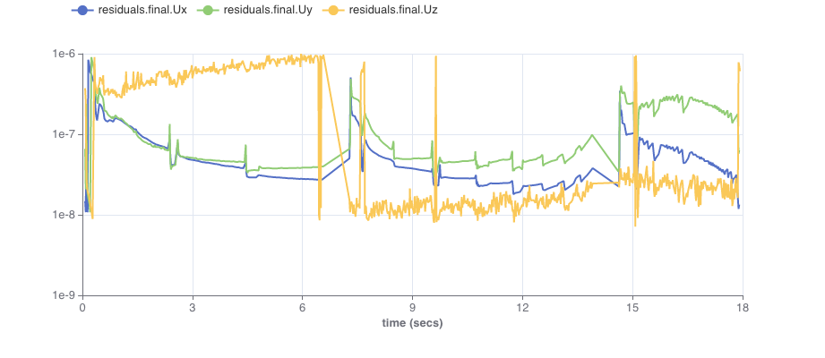

# OpenFOAM

## Introduction
Here we demonstrate using OpenFOAM with Simvue. In this example we will assume OpenFOAM 10 has been pre-installed on a machine - if you do not have this, [^^follow these instructions for installing OpenFOAM 10 on Ubuntu^^](https://openfoam.org/download/10-ubuntu/).

!!! note

    If using the OpenFOAM Docker image, note that it doesn't contain `pip`, making it difficult to install Simvue or any other Python modules. In this
    case a custom container image can be created using the following `Dockerfile`:
    ```
    FROM openfoam/openfoam10-paraview56
    USER root
    RUN apt-get update && \
        apt-get install -y python3-pip && \
        pip3 install simvue
    ```

## Setup
Copy one of the tutorials into an appropriate directory, e.g.
```
cp -r /opt/openfoam10/tutorials/incompressible/pimpleFoam/laminar/movingCone .
cd movingCone
```

## Integration with Simvue
Instead of trying to integrate Simvue directly into OpenFOAM, which would probably be a complex task, we note that we can obtain
useful information from log files. With this example the log file `log.pimpleFoam` has records like this:
```
PIMPLE: Iteration 1
DICPCG:  Solving for cellMotionUx, Initial residual = 8.36859e-06, Final residual = 5.97076e-09, No Iterations 13
GAMG:  Solving for pcorr, Initial residual = 1, Final residual = 0.0184091, No Iterations 4
time step continuity errors : sum local = 4.34044e-08, global = -8.66891e-10, cumulative = -5.4724e-06
DILUPBiCGStab:  Solving for Ux, Initial residual = 0.276202, Final residual = 0.000756309, No Iterations 1
DILUPBiCGStab:  Solving for Uy, Initial residual = 0.280113, Final residual = 0.000598637, No Iterations 1
DILUPBiCGStab:  Solving for Uz, Initial residual = 0.300927, Final residual = 0.000204136, No Iterations 1
GAMG:  Solving for p, Initial residual = 0.0223411, Final residual = 5.04668e-07, No Iterations 13
time step continuity errors : sum local = 2.62626e-08, global = 6.67421e-09, cumulative = -5.46573e-06
PIMPLE: Iteration 2
DILUPBiCGStab:  Solving for Ux, Initial residual = 0.0525839, Final residual = 1.07732e-08, No Iterations 2
DILUPBiCGStab:  Solving for Uy, Initial residual = 0.0375652, Final residual = 2.06829e-08, No Iterations 2
DILUPBiCGStab:  Solving for Uz, Initial residual = 0.0160839, Final residual = 2.6048e-07, No Iterations 1
GAMG:  Solving for p, Initial residual = 0.122032, Final residual = 8.54167e-07, No Iterations 13
time step continuity errors : sum local = 4.65559e-09, global = -1.05257e-09, cumulative = -5.46678e-06
ExecutionTime = 0.08856 s  ClockTime = 0 s
```
We can use this to obtain useful metrics, in this case the residuals.
In order to collect these metrics
 we modify the script `Allrun` so that in parallel to `pimpleFoam` it runs a Python script which collects metrics from
`log.pimpleFoam` and sends them to Simvue.

Download the Simvue Python script for OpenFOAM:
```
wget https://raw.githubusercontent.com/simvue-io/client/main/examples/simvue_openfoam.py
```

Modify `Allrun` by making the following highlighted changes:
``` sh hl_lines="23 23 25 25 27 27"
#!/bin/sh
cd ${0%/*} || exit 1    # Run from this directory

# Source tutorial run functions
. $WM_PROJECT_DIR/bin/tools/RunFunctions

application=$(getApplication)

mapTimes="0.0015 0.003"

# Iterate the string variable using for loop
for mapTime in $mapTimes; do

    runApplication -a blockMesh -dict blockMeshDict_$mapTime
    rm -rf constant/meshToMesh_$mapTime
    mkdir constant/meshToMesh_$mapTime
    mv constant/polyMesh constant/meshToMesh_$mapTime

done

runApplication -a blockMesh

python3 simvue_openfoam.py log.pimpleFoam &

rm -f .finished
runApplication $application
touch .finished

#------------------------------------------------------------------------------
```
We use a file `.finished` to tell the Python script that the application has finished executing, so that it knows
when to close the simulation run and send any remaining metrics.

## Running OpenFOAM
OpenFOAM can then be run as normal:
```
./Allrun
```

While the simulation is running we can visualize the residuals in the UI in order to understand how well it is converging, for example:

<figure markdown>
  { width="1000" }
</figure>


## Next steps

Above we only used Simvue to collect metrics. The Python script could easily be extended to do more than this, for example:

* Extract metadata from input/output files,
* Save input and output files.

