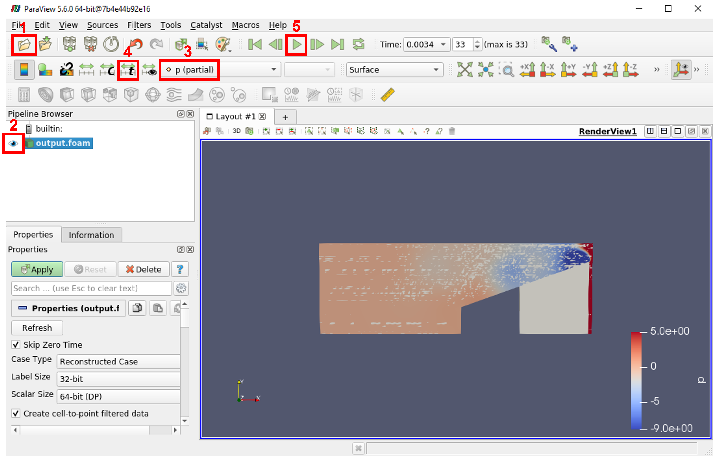

#  OpenFOAM

OpenFOAM (Open Field Operation and Manipulation) is an open-source Computational Fluid Dynamics (CFD) software package used to solve complex fluid flows involving chemical reactions, turbulence, heat transfer, solid mechanics, and electromagnetics. It is widely used in academia and industry for research and engineering applications. Here we will demonstrate how Openfoam simulations can be easily tracked using the OpenfoamRun integration into Simvue.

## Setup

The easiest way to run this example is to use the provided Docker container:

### Install Docker

You will need to install the Docker CLI tool to be able to use the Docker container for this tutorial. [^^Full instructions for installing Docker can be found here^^](https://docs.docker.com/engine/install/). If you are running Ubuntu (either on a full Linux system or via WSL on Windows), you should be able to do:

```sh
sudo apt-get update && sudo apt-get install docker.io
```

To check that this worked, run `docker` - you should see a list of help for the commands.

!!! tip
    If you wish to run this on a Windows computer (without using Docker Desktop) via Windows Subsystem for Linux, [^^follow this guide on setting up Docker with WSL.^^](https://dev.to/bowmanjd/install-docker-on-windows-wsl-without-docker-desktop-34m9)

### Pull Docker image

Next we need to pull the container, which is stored in the Simvue repository's registry:

```sh
sudo docker pull ghcr.io/simvue-io/openfoam_example:latest
```

This may take some time to download. Once complete, if you run `sudo docker images`, you should see an image with the name `ghcr.io/simvue-io/openfoam_example` listed.

### Run Docker container

Firstly, add Docker as a valid user of the X windows server, so that we can view results using Paraview:

```sh
xhost +local:docker
```

Then you can run the container:

```sh
sudo docker run -e DISPLAY=${DISPLAY} -e QT_X11_NO_MITSHM=1 -v /tmp/.X11-unix:/tmp/.X11-unix -it ghcr.io/simvue-io/openfoam_example:latest
```

Finally, enable the virtual environment so that we can run our scripts:

```
source venv/bin/activate
```

To test that the graphics packages are working correctly, run the command `paraview` within the container. After a few seconds, this should open up a graphical user interface window for the Paraview visualization tool.

!!! tip
    If you are using WSL and you do not see Paraview open correctly, it may be because your WSL is not set up correctly. To check this, exit the docker container by pressing <kbd>ctrl</kbd> + <kbd>D</kbd>, and then run the following commands:
    ```
    sudo apt-get install -y x11-apps
    xeyes
    ```
    This should open a small graphical display window, with a pair of eyes which follow your mouse around the screen. If you do not see this, [^^follow this guide to get graphical apps working on WSL^^](https://learn.microsoft.com/en-us/windows/wsl/tutorials/gui-apps), and [^^look through these debugging tips for WSL^^](https://github.com/microsoft/wslg/wiki/Diagnosing-%22cannot-open-display%22-type-issues-with-WSLg).

### Update Simvue Config File

Finally we need to update the config file inside the Docker container to use your credentials. Login to the web UI, go to the **Runs** page and click **Create new run**. You should then see the credentials which you need to enter into the `simvue.toml` file. Simply open the existing file using `nano simvue.toml`, and replace the contents with the information from the web UI.

!!! note
    If you restart the docker container at any point, you will need to repeat this step as your changes will not be saved

## Integration with Simvue

Using the provided `OpenfoamRun` connector, we can easily add Simvue tracking to an OpenFOAM run. This works by tracking the log files which are produced during execution of an OpenFOAM simulation.
With this example the log file `log.pimpleFoam` has records like this:

```log
PIMPLE: Iteration 1
DICPCG:  Solving for cellMotionUx, Initial residual = 8.36859e-06, Final residual = 5.97076e-09, No Iterations 13
GAMG:  Solving for pcorr, Initial residual = 1, Final residual = 0.0184091, No Iterations 4
time step continuity errors : sum local = 4.34044e-08, global = -8.66891e-10, cumulative = -5.4724e-06
DILUPBiCGStab:  Solving for Ux, Initial residual = 0.276202, Final residual = 0.000756309, No Iterations 1
DILUPBiCGStab:  Solving for Uy, Initial residual = 0.280113, Final residual = 0.000598637, No Iterations 1
DILUPBiCGStab:  Solving for Uz, Initial residual = 0.300927, Final residual = 0.000204136, No Iterations 1
GAMG:  Solving for p, Initial residual = 0.0223411, Final residual = 5.04668e-07, No Iterations 13
time step continuity errors : sum local = 2.62626e-08, global = 6.67421e-09, cumulative = -5.46573e-06
PIMPLE: Iteration 2
DILUPBiCGStab:  Solving for Ux, Initial residual = 0.0525839, Final residual = 1.07732e-08, No Iterations 2
DILUPBiCGStab:  Solving for Uy, Initial residual = 0.0375652, Final residual = 2.06829e-08, No Iterations 2
DILUPBiCGStab:  Solving for Uz, Initial residual = 0.0160839, Final residual = 2.6048e-07, No Iterations 1
GAMG:  Solving for p, Initial residual = 0.122032, Final residual = 8.54167e-07, No Iterations 13
time step continuity errors : sum local = 4.65559e-09, global = -1.05257e-09, cumulative = -5.46678e-06
ExecutionTime = 0.08856 s  ClockTime = 0 s
```

To automatically track these, we can use the `OpenfoamRun` class from `simvue-integrations`.

!!! further-docs
    For information on how to install and use the `OpenfoamRun` connector, [^^see the full documentation here.^^](/integrations/openfoam)

To initialize it, we simply need to provide the class with the directory where the OpenFOAM case is defined, adding any extra information as we wish before/after calling the `launch()` method:

```py
from simvue_integrations.connectors.openfoam import OpenfoamRun

with OpenfoamRun() as run:
    # Initialize your Simvue run as normal
    run.init(
        name="testing_openfoam_connector",
    )

    # Can add anything to the Simvue run which you want before / after the MOOSE simulation
    run.update_metadata({"simulation": "movingCone"})
    run.log_event("Openfoam simulation: movingCone") 

    # Call this to begin your MOOSE simulation
    run.launch(
        openfoam_case_dir='/home/openfoam/movingCone',
    )

    # Again can add any custom data to the Simvue run
    run.log_event("Simulation is finished!")
    run.update_tags(["finished"])
```

To run our simulation in the docker container, simply activate the virtual environment and run the script:

```
source venv/bin/activate
python example.py
```

By using the OpenfoamRun class:

- Information from the header of the log file, such as the build of OpenFOAM being used, is uploaded as metadata
- All inputs in the System and Constants folders, as well as the Allrun file, are uploaded as artifacts
- Messages from all log files created before the solver begins are recorded as events
- Residuals from the simulation are being plotted in real time in the Metrics tab of the run UI, as seen below

<figure markdown>
  { width="1000" }
</figure>

This should take approximately a minute to produce a solution. To view the solution in Paraview, type the following in your docker terminal:

```
cd movingCone
touch output.foam
paraview
```

Then follow the following steps in the Paraview GUI (see the image below for the corresponding buttons):

1. Select the 'Open' icon, and open the 'output.foam' file
2. Press the 'eye' icon next to 'output.foam' in the Pipeline Browser
3. Click on the dropdown, and select 'p'
4. Press the arrow icon with the 't' next to it to rescale the data across all timesteps
5. Press the play icon to run the simulation

<figure markdown>
  { width="1000" }
</figure>
