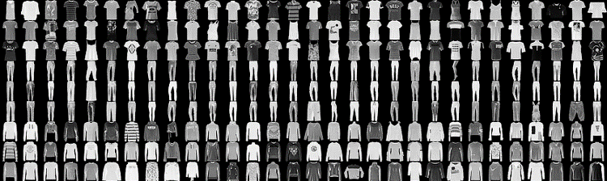
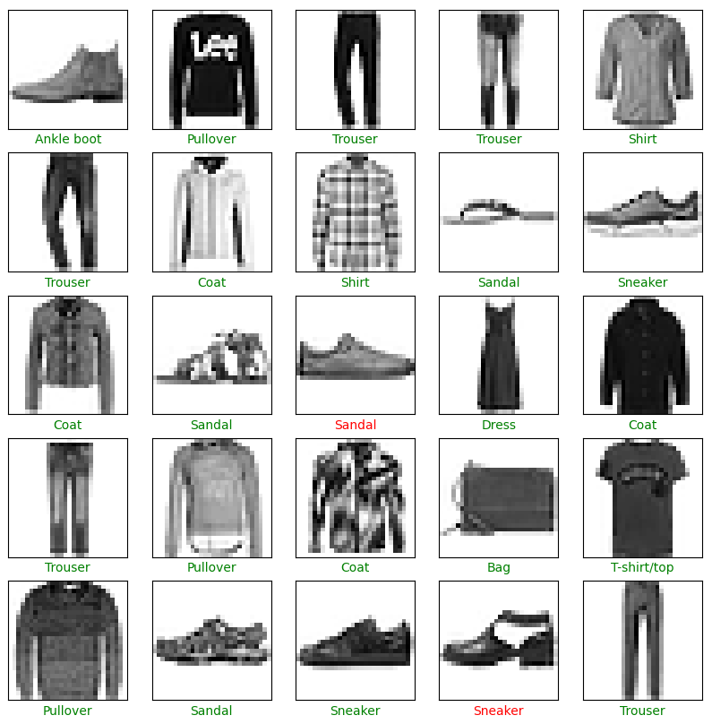
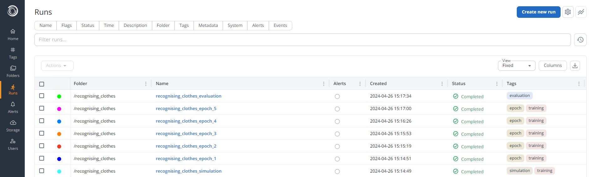
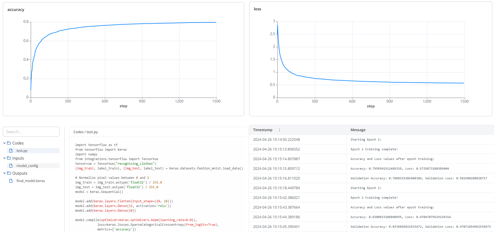
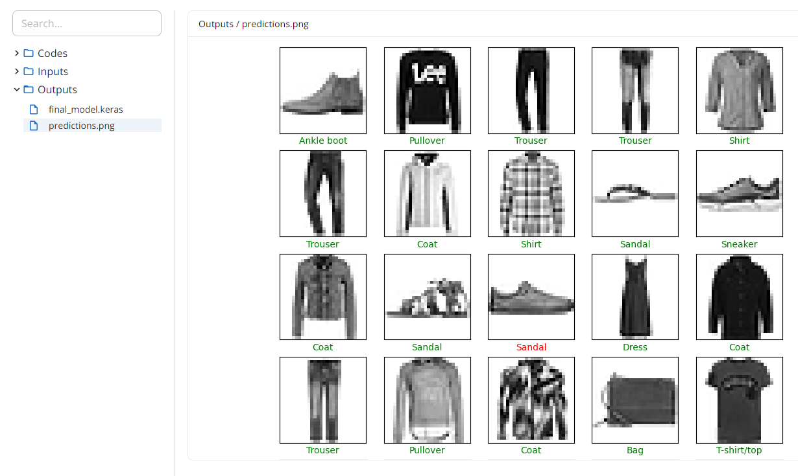

# Tensorflow
This example demonstrates how you can use Simvue to track the training and optimisation of Tensorflow machine learning models.

## Specifying the Problem
Let us say that we want to build a machine learning algorithm using Tensorflow, which can recognise images of different pieces of clothing. The dataset which we will use is the [^^fashion-mnist dataset^^](https://github.com/zalandoresearch/fashion-mnist), which consists of 60,000 training images and 10,000 validation images of different items of clothing, examples of which are seen below:
<figure markdown>
  { width="1000" }
</figure>

!!! info
    This tutorial is based on the Tensorflow tutorials - if you would like to learn more about using Tensorflow to build a neural network, [^^see this tutorial for building a basic classifier with Keras^^](https://www.tensorflow.org/tutorials/keras/classification). If you would like to learn more about using the Keras Tuner to improve your models, [^^you can view a Tuner tutorial here^^](https://www.tensorflow.org/tutorials/keras/keras_tuner).

## Building the Machine Learning Model
We first need to build our machine learning model. To do this, we start by importing and processing the dataset into the training and test batches:
```py
import tensorflow as tf
from tensorflow import keras
import numpy
import matplotlib.pyplot as plt

(img_train, label_train), (img_test, label_test) = keras.datasets.fashion_mnist.load_data()

# Normalize pixel values between 0 and 1
img_train = img_train.astype('float32') / 255.0
img_test = img_test.astype('float32') / 255.0
```

We can then create a basic Sequential model, made up of a `Flatten` layer and two `Dense` layers:
```py
model = keras.Sequential()

model.add(keras.layers.Flatten(input_shape=(28, 28)))
model.add(keras.layers.Dense(32 activation='relu'))
model.add(keras.layers.Dense(10))

model.compile(optimizer=keras.optimizers.Adam(learning_rate=0.01),
            loss=keras.losses.SparseCategoricalCrossentropy(from_logits=True),
            metrics=['accuracy'])
```

Next, we need to train the model. To do this, we call the `fit()` method on the model, providing our set of images to train with. We will specify that we wish to train over 5 epochs, and we will use a 20% of our training set of images for validating the model's accuracy and loss:
```py
model.fit(
    img_train,
    label_train,
    epochs=5,
    validation_split=0.2
)
```

Once training is complete, we can validate our model with the `evaluate()` method, using the test images to get a final value of the accuracy and loss of the model:
```py
results = model.evaluate(
    img_test,
    label_test
)
print(f"Validation results: Accuracy: {results[1]}. Loss: {results[0]}.")
```

And finally we can predict the results of the first 10 validation images, and compare them to the correct labels:
```py
# Map the label numbers to their corresponding human readable strings:
class_names = ['T-shirt/top', 'Trouser', 'Pullover', 'Dress', 'Coat', 'Sandal', 'Shirt', 'Sneaker', 'Bag', 'Ankle boot']

predictions = model.predict(img_test[:25])
overall_guess = numpy.argmax(predictions, axis=1)

# Change colours of labels based on whether prediction is correct / incorrect
correct_colour = ["green" if guess == label_test[i] else "red" for i, guess in enumerate(overall_guess)]

# Plot images, with the results from the neural network for each
plt.figure(figsize=(10,10))
for i in range(25):
    plt.subplot(5,5,i+1)
    plt.xticks([])
    plt.yticks([])
    plt.grid(False)
    plt.imshow(img_test[i], cmap=plt.cm.binary)
    plt.xlabel(class_names[overall_guess[i]], color=correct_colour[i])
plt.show()
```
If we run this code, we should see that the model is fitted with 5 epochs, with results printed to the command line during each. A final result for the accuracy and loss is then printed (typically around 85% accuracy), and then thwe first 25 images and their corresponding guesses are displayed as shown below:
<figure markdown>
  { width="1000" }
</figure>

This is great, but has the following issues:

- All of the information which is automatically printed to the command line, as well as the model itself, is lost once the program is complete.
- If you had scheduled this to run as a job on a cluster, you may not be able to access the command line output, and so may not see much of this information.
- Knowing the best values to select for model hyperparameters is difficult, usually requiring a lot of trial and error of different model configurations.
- Keeping track of different model configurations you have tried, the validation and accuracy results of each, and the model produced, is difficult.
- If each training epoch took hours instead of seconds, we would want to be able to easily monitor how the training is progressing to avoid wasting time on a machine learning model which is not improving.
- It would be good if you could be sent alerts when a model has stopped improving, so that you can check on its performance and stop it early without manually monitoring the command line output.

These can all be addressed by using Simvue!

## Adding Basic Simvue Integration
To add Simvue integration to this model, we will use the `TensorVue` callback class. If you are not familiar with Tensorflow Callbacks, you can [^^view the Callbacks documentation here.^^](https://www.tensorflow.org/api_docs/python/tf/keras/callbacks/Callback). In the simplest example, all we need to do to add Simvue functionality is import the TensorVue class:
```py
from integrations.tensorflow import TensorVue
```
Initialize it with a name for our current project:
```py
tensorvue = TensorVue("recognising_clothes")
```

And add this instance to a list of callbacks provided to the `fit()` and `evaluate()` methods:
```py
model.fit(
    img_train,
    label_train,
    epochs=5,
    validation_split=0.2,
    callbacks=[tensorvue,]
)

results = model.evaluate(
    img_test,
    label_test,
    callbacks=[tensorvue,]
)
```

That's it! If you now run your Python script again and log into the Simvue UI, you should see that runs are being automatically created as the training proceeds. Once the training is complete, you should see the following runs:
<figure markdown>
  { width="1000" }
</figure>

There are three main types of runs here:

1. Simulation run: This keeps track of the overall model training during the execution of the `fit()` method. It presents a summary of the results after each training epoch.
2. Epoch runs: This keeps track of the results of the training performed during each epoch.
3. Evaluation run: Keeps track of the results of the `evaluate()` method.

If we click on the Simulation run, we can see Simvue has kept track of the following by default:

- Metadata: Standard metadata stored by Tensorflow - Number of epochs, number of steps per epoch, and whether it is running in Verbose mode.
- Artifacts: Has stored the code which was used to create the model, the model configuration as an input, and the final model produced during training as an output (which can be downloaded and used by Tensorflow)
- Metrics: Has tracked the accuracy, loss, validation accuracy and validation loss after each epoch. This allows the user to quickly get an idea of whether the model is still improving or not, and whether it is worth continuing with the training. Also keeps track of resource usage, such as memory and CPU.
- Events: A summary of what has occured during training, including when each epoch began and finished, and the results after each epoch.

Opening the Epoch or Evaluation runs shows that similar data is stored about each of those processes. This allows the user to monitor the training of the model in real time, and store results and artifacts for reviewing later.

<figure markdown>
  { width="1000" }
</figure>

## Adding Detailed Simvue Integration
The `TensorVue` class comes with a number of other options, allowing the user to specify much more data for tracking and storage. Where we initialized the class above, let us specify some additional options:
```py
# Can use the ModelCheckpoint callback, which is built into Tensorflow, to save a model after each Epoch
# Provinding the model_checkpoint_filepath in the TensorVue callback means it will automatically upload checkpoints to the Epoch runs
checkpoint_filepath = "/tmp/ckpt/checkpoint.model.keras"
model_checkpoint_callback = ModelCheckpoint(
    filepath=checkpoint_filepath, save_best_only=False, verbose=1
)

tensorvue = sv_tf.TensorVue(
    # Can define additional info, like the folder, description, and tags for the runs
    "recognising_clothes_detailed",
    "/recognising_clothes_v2",
    "A run to keep track of the training and validation of a Tensorflow model for recognising pieces of clothing.",
    ["tensorflow", "mnist_fashion"],
    # Can define alerts:
    alert_definitions={
        "accuracy_below_seventy_percent": {
            "source": "metrics",
            "rule": "is below",
            "metric": "accuracy",
            "frequency": 1,
            "window": 1,
            "threshold": 0.7,
        }
    },
    # And different alerts can be applied to the Simulation, Epoch or Validation runs
    simulation_alerts=["accuracy_below_seventy_percent"],
    epoch_alerts=["accuracy_below_seventy_percent"],
    start_alerts_from_epoch=3,
    # Saves the checkpoint model after each epoch
    model_checkpoint_filepath=checkpoint_filepath,
    # Will stop training early if the accuracy of the model exceeds 95%
    evaluation_condition=">",
    evaluation_parameter="accuracy",
    evaluation_target=0.95,
    # Choose where the final model is saved
    model_final_filepath="tf_fashion_model.keras"
)

model.fit(
    img_train,
    label_train,
    epochs=5,
    validation_split=0.2,
    # Specify the model callback, BEFORE the tensorvue callback in the list:
    callbacks=[model_checkpoint_callback, tensorvue,]
)
```
If we run the code with these changes, we will see that we get a similar set of runs to before, but with the following differences:

- The runs have been saved to the folder which we specified, to keep runs from one training session grouped together easily
- The runs have additional tags which we specified, for easier searching and filtering of runs
- The simulation run has our customised description
- Alerts have been created on the Simulation run, and the third epoch run afterwards, which will send us a notification if the algorithm fails to reach 70% accuracy during training
- The model is checkpointed after each epoch and saved to the epoch run, meaning that the user can easily return the model from the epoch which had the best validation accuracy if they wish
- The training will automatically stop if the overall accuracy exceeds 95%

## Customising the TensorVue callback
If you wish to store more data than the default TensorVue callback provides, you can create your own callback class which inherits from TensorVue. For detailed information on creating your own custom callbacks, [^^see this guide^^](https://www.tensorflow.org/guide/keras/writing_your_own_callbacks).

As a simple example, we will say that we want to create the image of the first 25 results and store it as an artifact in the simulation run once the training is complete. To do this we will inherit from TensorVue, but override the `on_train_end()` method to create and save the image:
```py
class MyTensorVue(TensorVue):
    # This method will be called whenever a training session ends
    def on_train_end(self, logs):
        predictions = model.predict(self.img_predict)
        overall_guess = numpy.argmax(predictions, axis=1)

        # Change colours of labels based on whether prediction is correct / incorrect
        correct_colour = ["green" if guess == self.label_predict[i] else "red" for i, guess in enumerate(overall_guess)]

        # Plot images, with the results from the neural network for each
        plt.figure(figsize=(10,10))
        for i in range(25):
            plt.subplot(5,5,i+1)
            plt.xticks([])
            plt.yticks([])
            plt.grid(False)
            plt.imshow(img_test[i], cmap=plt.cm.binary)
            plt.xlabel(self.class_names[overall_guess[i]], color=correct_colour[i])
        plt.savefig("predictions.png")

        # Upload as artifact to simulation run
        self.simulation_run.save("predictions.png", "output")

        # Don't forget to then call the base TensorVue method!
        super().on_train_end(logs)
```
Then we will assign our prediction images, labels and class names to the tensorvue instance (in reality, you should assign these in `__init__` of your custom class):

```py
tensorvue = MyTensorVue(
    "recognising_clothes_predictions",
    # And any other details you want to provide...
)
tensorvue.img_predict = img_test[:25]
tensorvue.label_predict = label_test[:25]
tensorvue.class_names = ['T-shirt/top', 'Trouser', 'Pullover', 'Dress', 'Coat', 'Sandal', 'Shirt', 'Sneaker', 'Bag', 'Ankle boot']
```

And when we now run our script, once training is complete we should see that our new custom method is called, it generates a PNG of the predicted results, and uploads it to the simulation run:
<figure markdown>
  { width="1000" }
</figure>