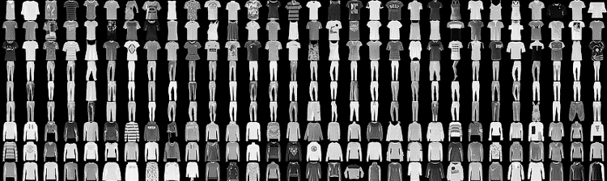
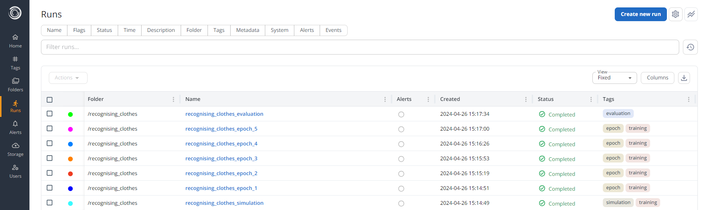
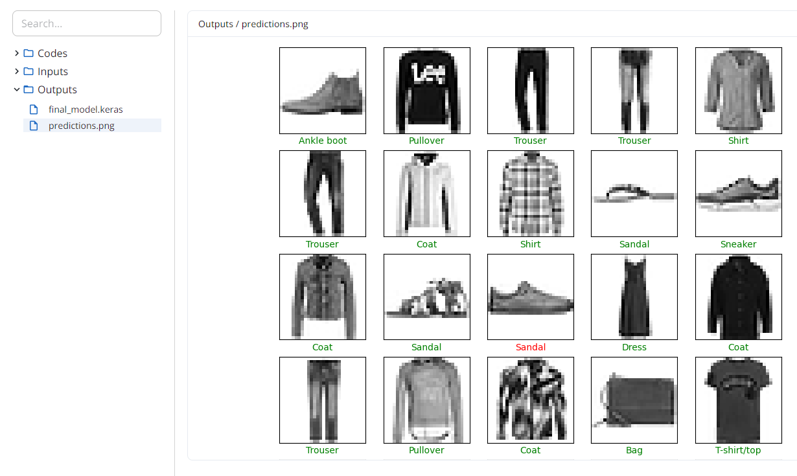

# Tensorflow
This example demonstrates how you can use Simvue to track the training and optimisation of Tensorflow machine learning models.

## Specifying the Problem
Let us say that we want to build a machine learning algorithm using Tensorflow, which can recognise images of different pieces of clothing. The dataset which we will use is the [^^fashion-mnist dataset^^](https://github.com/zalandoresearch/fashion-mnist), which consists of 60,000 training images and 10,000 validation images of different items of clothing, examples of which are seen below:
<figure markdown>
  { width="1000" }
</figure>

!!! info
    This tutorial is based on the Tensorflow tutorials - if you would like to learn more about using Tensorflow to build a neural network, [^^see this tutorial for building a basic classifier with Keras^^](https://www.tensorflow.org/tutorials/keras/classification). If you would like to learn more about using the Keras Tuner to improve your models, [^^you can view a Tuner tutorial here^^](https://www.tensorflow.org/tutorials/keras/keras_tuner).

## Building the Machine Learning Model
We first need to build our machine learning model. To do this, we start by importing and processing the dataset into the training and test batches:
```py
import tensorflow as tf
from tensorflow import keras
import numpy
import matplotlib.pyplot as plt

(img_train, label_train), (img_test, label_test) = keras.datasets.fashion_mnist.load_data()

# Normalize pixel values between 0 and 1
img_train = img_train.astype('float32') / 255.0
img_test = img_test.astype('float32') / 255.0
```

We can then create a basic Sequential model, made up of a `Flatten` layer and two `Dense` layers:
```py
model = keras.Sequential()

model.add(keras.layers.Flatten(input_shape=(28, 28)))
model.add(keras.layers.Dense(32, activation='relu'))
model.add(keras.layers.Dense(10))

model.compile(optimizer=keras.optimizers.Adam(learning_rate=0.01),
            loss=keras.losses.SparseCategoricalCrossentropy(from_logits=True),
            metrics=['accuracy'])
```

Next, we need to train the model. To do this, we call the `fit()` method on the model, providing our set of images to train with. We will specify that we wish to train over 5 epochs, and we will use a 20% of our training set of images for validating the model's accuracy and loss:
```py
model.fit(
    img_train,
    label_train,
    epochs=10,
    validation_split=0.2
)
```

Once training is complete, we can validate our model with the `evaluate()` method, using the test images to get a final value of the accuracy and loss of the model:
```py
results = model.evaluate(
    img_test,
    label_test
)
print(f"Validation results: Accuracy: {results[1]}. Loss: {results[0]}.")
```

And finally we can predict the results of the first 10 validation images, and compare them to the correct labels:
```py
# Map the label numbers to their corresponding human readable strings:
class_names = ['T-shirt/top', 'Trouser', 'Pullover', 'Dress', 'Coat', 'Sandal', 'Shirt', 'Sneaker', 'Bag', 'Ankle boot']

predictions = model.predict(img_test[:25])
overall_guess = numpy.argmax(predictions, axis=1)

# Change colours of labels based on whether prediction is correct / incorrect
correct_colour = ["green" if guess == label_test[i] else "red" for i, guess in enumerate(overall_guess)]

# Plot images, with the results from the neural network for each
plt.figure(figsize=(10,10))
for i in range(25):
    plt.subplot(5,5,i+1)
    plt.xticks([])
    plt.yticks([])
    plt.grid(False)
    plt.imshow(img_test[i], cmap=plt.cm.binary)
    plt.xlabel(class_names[overall_guess[i]], color=correct_colour[i])
plt.show()
```
If we run this code, we should see that the model is fitted with 5 epochs, with results printed to the command line during each. A final result for the accuracy and loss is then printed (typically around 85% accuracy), and then the first 25 images and their corresponding guesses are displayed as shown below:
<figure markdown>
  { width="1000" }
</figure>

This is great, but has the following issues:

- All of the information which is automatically printed to the command line, as well as the model itself, is lost once the program is complete.
- If you had scheduled this to run as a job on a cluster, you may not be able to access the command line output, and so may not see much of this information.
- Knowing the best values to select for model hyperparameters is difficult, usually requiring a lot of trial and error of different model configurations.
- Keeping track of different model configurations you have tried, the validation and accuracy results of each, and the model produced, is difficult.
- If each training epoch took hours instead of seconds, we would want to be able to easily monitor how the training is progressing to avoid wasting time on a machine learning model which is not improving.
- It would be good if you could be sent alerts when a model has stopped improving, so that you can check on its performance and stop it early without manually monitoring the command line output.

These can all be addressed by using Simvue!

## TensorVue
To make it simple to add Simvue functionality to your Tensorflow models, we have created the TensorVue callback class. If you are not familiar with Tensorflow Callbacks, you can [^^view the Callbacks documentation here^^](https://www.tensorflow.org/api_docs/python/tf/keras/callbacks/Callback). 

To do the section below, you will need to [^^checkout the Simvue Integrations repository^^](https://github.com/simvue-io/integrations) - either clone the repository yourself, or add it to your virtual environment. To do this, create a virtual environment if you haven't already:
```
python -m venv venv
source venv/bin/activate
```
Then install the repository using `pip`:
```
pip install git+https://github.com/simvue-io/integrations.git@main#egg=simvue-integrations[fds]
```

### Adding Basic Simvue Integration
In the simplest example, all we need to do to add Simvue functionality to our model training is import the TensorVue class:
```py
import simvue_integrations.tensorflow.tensorvue as sv_tf
```
Initialize it with a name for our current project:
```py
tensorvue = sv_tf.TensorVue("recognising_clothes")
```

And add this instance to a list of callbacks provided to the `fit()` and `evaluate()` methods:
```py
model.fit(
    img_train,
    label_train,
    epochs=10,
    validation_split=0.2,
    callbacks=[tensorvue,]
)

results = model.evaluate(
    img_test,
    label_test,
    callbacks=[tensorvue,]
)
```

That's it! If you now run your Python script again and log into the Simvue UI, you should see that runs are being automatically created as the training proceeds. Once the training is complete, you should see the following runs:
<figure markdown>
  { width="1000" }
</figure>

There are three main types of runs here:

1. Simulation run: This keeps track of the overall model training during the execution of the `fit()` method. It presents a summary of the results after each training epoch.
2. Epoch runs: This keeps track of the results of the training performed during each epoch.
3. Evaluation run: Keeps track of the results of the `evaluate()` method.

If we click on the Simulation run, we can see Simvue has kept track of the following by default:

- Metadata: Standard metadata stored by Tensorflow - Number of epochs, number of steps per epoch, and whether it is running in Verbose mode.
- Artifacts: Has stored the code which was used to create the model, the model configuration as an input, and the final model produced during training as an output (which can be downloaded and used by Tensorflow)
- Metrics: Has tracked the accuracy, loss, validation accuracy and validation loss after each epoch. This allows the user to quickly get an idea of whether the model is still improving or not, and whether it is worth continuing with the training. Also keeps track of resource usage, such as memory and CPU.
- Events: A summary of what has occured during training, including when each epoch began and finished, and the results after each epoch.

Opening the Epoch or Evaluation runs shows that similar data is stored about each of those processes. This allows the user to monitor the training of the model in real time, and store results and artifacts for reviewing later.

<figure markdown>
  { width="1000" }
</figure>

### Adding Detailed Simvue Integration
The `TensorVue` class comes with a number of other options, allowing the user to specify much more data for tracking and storage. Where we initialized the class above, let us specify some additional options:
```py
# Can use the ModelCheckpoint callback, which is built into Tensorflow, to save a model after each Epoch
# Provinding the model_checkpoint_filepath in the TensorVue callback means it will automatically upload checkpoints to the Epoch runs
from tensorflow.keras.callbacks import ModelCheckpoint

checkpoint_filepath = "/tmp/ckpt/checkpoint.model.keras"
model_checkpoint_callback = ModelCheckpoint(
    filepath=checkpoint_filepath, save_best_only=False, verbose=1
)

tensorvue = sv_tf.TensorVue(
    # Can define additional info, like the folder, description, and tags for the runs
    run_name="recognising_clothes_detailed",
    run_folder="/recognising_clothes_v2",
    run_description="A run to keep track of the training and validation of a Tensorflow model for recognising pieces of clothing.",
    run_tags=["tensorflow", "mnist_fashion"],

    # Can define alerts:
    alert_definitions={
        "accuracy_below_seventy_percent": {
            "source": "metrics",
            "rule": "is below",
            "metric": "accuracy",
            "frequency": 1,
            "window": 1,
            "threshold": 0.7,
        }
    },

    # And different alerts can be applied to the Simulation, Epoch or Validation runs
    simulation_alerts=["accuracy_below_seventy_percent"],
    epoch_alerts=["accuracy_below_seventy_percent"],
    start_alerts_from_epoch=3,

    # Saves the checkpoint model after each epoch
    model_checkpoint_filepath=checkpoint_filepath,

    # Will stop training early if the accuracy of the model exceeds 95%
    evaluation_condition=">",
    evaluation_parameter="accuracy",
    evaluation_target=0.95,
    
    # Choose where the final model is saved
    model_final_filepath="tf_fashion_model.keras"
)

model.fit(
    img_train,
    label_train,
    epochs=10,
    validation_split=0.2,
    # Specify the model callback, BEFORE the tensorvue callback in the list:
    callbacks=[model_checkpoint_callback, tensorvue,]
)
```
If we run the code with these changes, we will see that we get a similar set of runs to before, but with the following differences:

- The runs have been saved to the folder which we specified, to keep runs from one training session grouped together easily
- The runs have additional tags which we specified, for easier searching and filtering of runs
- The simulation run has our customised description
- Alerts have been created on the Simulation run, and the third epoch run afterwards, which will send us a notification if the algorithm fails to reach 70% accuracy during training
- The model is checkpointed after each epoch and saved to the epoch run, meaning that the user can easily return the model from the epoch which had the best validation accuracy if they wish
- The training will automatically stop if the overall accuracy exceeds 95%

### Customising the TensorVue callback
If you wish to store more data than the default TensorVue callback provides, you can create your own callback class which inherits from TensorVue. For detailed information on creating your own custom callbacks, [^^see this guide^^](https://www.tensorflow.org/guide/keras/writing_your_own_callbacks).

As a simple example, we will say that we want to create the image of the first 25 results and store it as an artifact in the simulation run once the training is complete. To do this we will inherit from TensorVue, but override the `on_train_end()` method to create and save the image:
```py
class MyTensorVue(sv_tf.TensorVue):
    # This method will be called whenever a training session ends
    def on_train_end(self, logs):
        predictions = self.model.predict(self.img_predict)
        overall_guess = numpy.argmax(predictions, axis=1)

        # Change colours of labels based on whether prediction is correct / incorrect
        correct_colour = ["green" if guess == self.label_predict[i] else "red" for i, guess in enumerate(overall_guess)]

        # Plot images, with the results from the neural network for each
        plt.figure(figsize=(10,10))
        for i in range(25):
            plt.subplot(5,5,i+1)
            plt.xticks([])
            plt.yticks([])
            plt.grid(False)
            plt.imshow(img_test[i], cmap=plt.cm.binary)
            plt.xlabel(self.class_names[overall_guess[i]], color=correct_colour[i])
        plt.savefig("predictions.png")

        # Upload as artifact to simulation run
        self.simulation_run.save_file("predictions.png", "output")

        # Don't forget to then call the base TensorVue method!
        super().on_train_end(logs)
```
Then we will assign our prediction images, labels and class names to the tensorvue instance (in reality, you should assign these in `__init__` of your custom class):

```py
tensorvue = MyTensorVue(
    "recognising_clothes_predictions",
    # And any other details you want to provide...
)
tensorvue.img_predict = img_test[:25]
tensorvue.label_predict = label_test[:25]
tensorvue.class_names = ['T-shirt/top', 'Trouser', 'Pullover', 'Dress', 'Coat', 'Sandal', 'Shirt', 'Sneaker', 'Bag', 'Ankle boot']
```

And when we now run our script, once training is complete we should see that our new custom method is called, it generates a PNG of the predicted results, and uploads it to the simulation run:
<figure markdown>
  { width="1000" }
</figure>

## Optimising the Model
Simvue allows you to easily optimise your Tensorflow models, keep track of how the optimisation is progressing, define alerts so that you can be made aware of situations where the optimisation is failing to sufficiently improve the model and terminate runs early, and build your optimised model into wider workflows which can all also be tracked using Simvue!

To do the section below, you will need to [^^checkout the Simvue Optimisation repository^^](https://github.com/simvue-io/simvue-optim) - either clone the repository yourself, or add it to your virtual environment. Eg if you are using poetry, add the following to your `pyproject.toml`:
```
simvue-optimisation = {git = "https://github.com/simvue-io/simvue-optim.git", rev="main"}
```

### Using Tensorflow Tuner
To optimise our machine learning model, we may want to tweak the hyperparameters which we set earlier to obtain a more accurate model. If we look back at our model creation, we just guessed the correct values for the units of our Dense layers, and the learning rate of our model compilation. To improve this, we would want to try lots of different values of these parameters in some logical way, and keep track of the results so that we know which values were best. Simvue comes with a built in optimisation framework to help with this, which can use the Keras Tuner top optimise hyperparameters.

To use this, we firstly must define the variables which we want to optimise over. We can provide this as a dictionary like so:
```py
tuning_variables = {
    "first_dense_units": (32, 512, 32),
    "learning_rate": [1e-2, 1e-3, 1e-4]
}
```

This has defined the possible values of each variable as follows:

- The units of the first dense layer will be between 32 and 512, and the Tuner will search in steps of size 32
- The learning rate will be set to either 1e-2, 1e-3 or 1e-4 (since it is provided as a list of possible arguments, not a tuple as above)

We then define a function to build our model, which accepts a dictionary of variable values to use for each optimisation trial:
```py
def model_builder(parameters):
    model = keras.Sequential()

    model.add(keras.layers.Flatten(input_shape=(28, 28)))
    model.add(keras.layers.Dense(parameters["first_dense_units"], activation='relu'))
    model.add(keras.layers.Dense(10))

    model.compile(optimizer=keras.optimizers.Adam(learning_rate=parameters["learning_rate"]),
                loss=keras.losses.SparseCategoricalCrossentropy(from_logits=True),
                metrics=['accuracy'])
    
    return model
```
We then choose the type of tuner which we want to use ([^^see here for details on the five tuner classes available^^](https://keras.io/api/keras_tuner/tuners/), we will use Gridsearch), and initialize our Simvue Tuner class as so:

```py
import simvue_optimisation.adapters.tensorflow_tuner as sv_tuner
import keras_tuner

simvue_tuner = sv_tuner.SimvueTuner(
    name="recognising_clothes_tuner",
    variables=tuning_variables,
    simulation_method=model_builder,
    tuner=keras_tuner.BayesianOptimization,
    # Pass in any variables which you would typically instantiate the GridSearch class with here
    tuner_params={
        "directory": "testing_tuning",
    },
    # Determine which variable you want the tuner to base its evaluations on
    evaluation_observable="val_accuracy",
    # And define how many trials you want the tuner to execute (available for GridSearch, RandomSearch and BayesianOptimization)
    max_trials=10,
    # Pass in your sets of training and testing images
    training_images=img_train,
    training_labels=label_train,
    testing_images=img_test,
    testing_labels=label_test,
    # And then pass in the arguments which we passed into the fit() method before
    epochs=10,
    validation_split=0.2,
    # You can also pass in any arguments which you passed into the TensorVue class above, such as:
    run_folder="/recognising_clothes_v3",
    run_description="Runs to keep track of the optimisation of a Tensorflow model for recognising pieces of clothing.",
    run_tags=["tensorflow", "mnist_fashion"],
    alert_definitions={
        "accuracy_below_seventy_percent": {
            "source": "metrics",
            "rule": "is below",
            "metric": "accuracy",
            "frequency": 1,
            "window": 1,
            "threshold": 0.7,
        }
    },
    simulation_alerts=["accuracy_below_seventy_percent"],
    epoch_alerts=["accuracy_below_seventy_percent"],
)

# Then create the model by running .launch() on the class above:
optimised_model = simvue_tuner.launch()
```

Upon running this, we will see that the tuner will start using a bayesian optimisation technique to find the optimal values of our hyperparameters, retrain the model at the end with the full training dataset and validate it with the test dataset, and return this optimal model. Looking at the Simvue UI, we can see that there is now another type of run - the 'manifest' run. This keeps track of the final results from each individual trial with the different hyperparameters. Looking at this run, we can see that it has kept track of a number of important things, such as:

- Metadata detailing the optimisation algorithm used and information about the hyperparameters being tuned
- An events log which details the major steps in the optimisation process, the values being tested in each trial, and the results after each trial
- Metrics showing the accuracy and loss after each trial, so that you can quickly see how the algorithm is performing
- The final, optimised model stored as an artifact

<figure markdown>
  { width="1000" }
</figure>

### Using Simvue Optimisation Adapters
Instead of using Tensorflow Tuner, you can also use any of our Adapter classes which are built into the Simvue Optimisation framework. In our case, we will use the DiscreteParameters adapter to choose the best possible combination of dense layer units and learning rates from a list of possible options. Similarly to when using Tuner, we need to define the variables which we will be optimising over:
```py
import simvue

optimisation_variables = {
    "first_dense_units": [128, 256, 384, 512],
    "learning_rate": [1e-2, 1e-3, 1e-4]
}
```
We then define our simulation function - this will be called on each trial, with new values for each parameter. In our case, we need it to build the model with the new number of dense layer units and learning rates, define our TensorVue integration, and fit the model:
```py
# Train (and validate) the model in this simulation function, which the ML Opt framework will call for each trial
def run_simulation(sim_run, parameters: dict[str, int]):
    # Build the model:
    model = keras.Sequential()

    model.add(keras.layers.Flatten(input_shape=(28, 28)))
    model.add(keras.layers.Dense(32, activation='relu'))
    model.add(keras.layers.Dense(10))

    model.compile(optimizer=keras.optimizers.Adam(learning_rate=0.01),
                loss=keras.losses.SparseCategoricalCrossentropy(from_logits=True),
                metrics=['accuracy'])

    # Define the tensorvue monitoring:
    tensorvue = sv_tf.TensorVue(
        # Don't define a run name, as this will be set by the workspace
        # Can define additional info, like the folder, description, and tags for the runs
        run_folder="/recognising_clothes_v4",
        run_description="Runs to keep track of the optimisation of a Tensorflow model for recognising pieces of clothing.",
        run_tags=["tensorflow", "mnist_fashion"],

        # Can define alerts, save model checkpoints etc as above...

        # Enable the optimisation framework, and pass in the simulation run for this trial
        optimisation_framework=True,
        simulation_run=sim_run,
    )
    # Fit the model
    model.fit(
        img_train,
        label_train,
        epochs=10,
        validation_split=0.2,
        callbacks=[tensorvue,]
    )
    # Don't need to return anything here, since the TensorVue integration will already log everything
    return {}
```
We then create an evaluation function - this returns the parameter which the optimisation framework will use to decide how the current trial has performed. In our case, we would want the optimisation framework to use the validation accuracy of the newly trained model:
```py
def run_evaluation(_, parameters):
    # Since we do validation as part of the model fitting above, we can just return the val_accuracy parameter as the evaluation metric
    # Since this parameter is logged by TensorVue, it is automatically added to the dictionary of parameters by the opt framework
    return {"evaluation": parameters["val_accuracy"]}
```
We can then also define a completion callback function - this is a function which is executed once the optimisation process is complete. In our case, let's say that we want to get the best performing model from the server and return it:
```py
from tensorflow.keras.models import load_model

def completion_callback(manifest_run: simvue.Run, data, constants, model):
    # Find the ID of the run which stores data about the most successful trial
    _best_index = data["evaluation"].index(data["best_evaluation"])
    _best_data_run = data["data_run_ids"][_best_index]

    # Use the client to retrieve the final model file for the best trial, which was saved as an artifact
    client = simvue.Client()
    client.get_artifact_as_file(_best_data_run, "final_model.keras", path="/tmp/simvue")

    # Save the best model from all trials as an output in the Manifest run for easy access
    manifest_run.save(
        "/tmp/simvue/final_model.keras", "output", name="best_model.keras"
    )
    manifest_run.update_metadata(
        {
            "best_data_run": f"https://dev02.simvue.io/dashboard/runs/run/{_best_data_run}"
        }
    )

    # Load the model from the file, and return it as the output to workspace.launch()
    best_model = load_model(
        "/tmp/simvue/final_model.keras",
        custom_objects=None,
        compile=True,
        safe_mode=True,
    )
    return best_model
```
Now we are ready to set up the adapter's workspace! Import the adapter, and pass in the information which we defined above:
```py
import simvue_optimisation.adapters.discrete_parameters as disc_params

with disc_params.DiscreteParameters(
    name="recognising_clothes_optimiser",
    variables=optimisation_variables,
    observables=[
        "val_accuracy",
    ],
    simulation_method=run_simulation,
    evaluation_function=run_evaluation,
    reduction_method="maximum",
    completion_callback=completion_callback,
) as workspace:
    best_model = workspace.launch()
```
We can then continue to use the optimised model in the rest of our workflow! For example, we could validate it with the set of test images:
```py
results = best_model.evaluate(
    img_test,
    label_test
)
print(f"Validation results: Accuracy: {results[1]}. Loss: {results[0]}.")
```
You can also easily swap to a different adapter. For example, if we instead wanted to use the ParameterSweep adapter, we would simply need to change the format of the optimisation variables:
```py
optimisation_variables = {
    "first_dense_units": (32, 512),
    "learning_rate": (1e-4, 1e-2)
}
n_points_per_dimension={"first_dense_units": 5, "learning_rate": 5}
```
And then call the new adapter:
```py
import simvue_optimisation.adapters.parameter_sweep as param_sweep

with param_sweep.ParameterSweep(
    name="recognising_clothes_sweep",
    variables=optimisation_variables,
    n_points_per_dimension=n_points_per_dimension,
    observables=[
        "val_accuracy",
    ],
    simulation_method=run_simulation,
    evaluation_function=run_evaluation,
    reduction_method="maximum",
    completion_callback=completion_callback,
) as workspace:
    best_model = workspace.launch()
```
