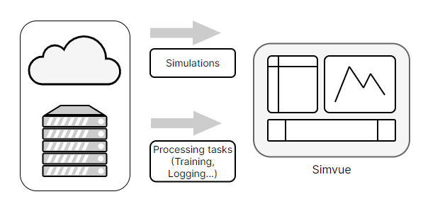

# Welcome

Instead of keeping track of simulations, processing tasks and AI/ML training manually using notebooks and spreadsheets, Simvue helps to automate this
and provide a single view of all your work, no matter where in the world the jobs are running.

<figure markdown>
  { width="400" }
</figure>

Simvue can track and organise metadata and files, collect metrics and logs from running
simulations or any processing tasks, as well as maintain connections between different simulations and tasks and is even inter-operable between different platforms.

Simvue consists of:

* a Python client that can be used to collect information from applications,
* a web UI providing a dashboard for exploring, comparisons and visualisation.
