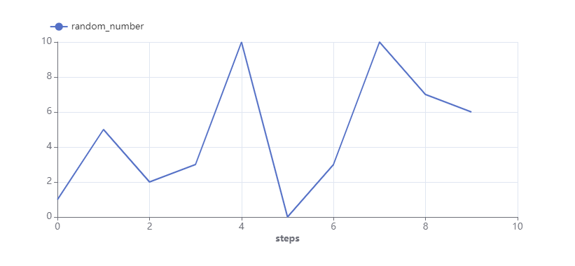
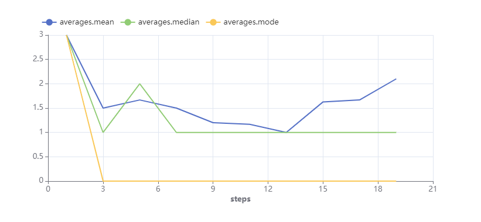
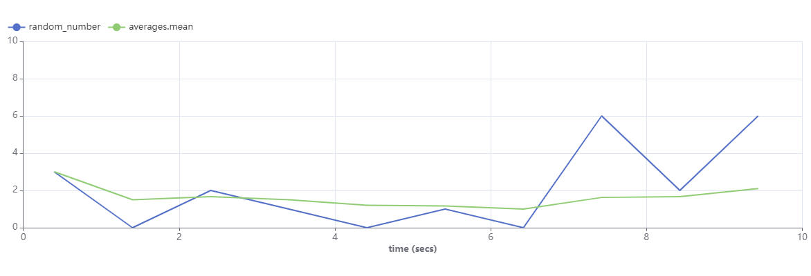

# Tracking & Monitoring
This section of the tutorial introduces how Simvue can be used to create a new run, define metrics and use them to track the progress of the run in the Simvue UI, save metadata and artifacts from the run, log events which occur during completion of the run, and set up alerts which can tell the user if things go wrong. The topics covered in this section (and more) are described in the [Tracking & Monitoring](/python-client/getting-started/) section of the documentation, so it may be useful to have that section of the docs open alongside this part of the tutorial.

## Creating a Program to Monitor

Next we need to create our initial program which we may want to monitor with Simvue. In our case, we will make a simple script which generates a random integer between 0 and 10 each second for 10 seconds. Create a file called `test.py` which contains the following code:

```  py
import random
import time

if __name__ == "__main__":

    # Generate 10 random numbers, one per second
    for count in range(0, 10):
        random_number = random.randint(0, 10)
        print(random_number)
        time.sleep(1)
```

If you run this file using the command `python3 test.py` in the console, you should see it print an integer every second for 10 seconds.

## Creating a Simvue Run

### Initialising the Run

To create a Run which we can see in the Simvue UI, we first need to import the `Run()` object from the `simvue` module. We then call the `run.init()` method to set up the run:

```  py
import random
import time
from simvue import Run

if __name__ == "__main__":

    with Run() as run:
        # Initialise the run
        run.init(name='random-numbers-%d' % time.time(),
                description='Monitoring of the generation of random integers between 0 and 10.'
                tags=['random-numbers', 'WIP'],
                folder='/rand_nums')


        # Generate 10 random numbers, one per second
        for count in range(0, 10):
            random_number = random.randint(0, 10)
            print(random_number)
            time.sleep(1)
```

In our case above, we have specified the name of this run and the folder to store it in on the Simvue server. We have also given it a couple of tags, including `random-numbers` to reflect the script which the run is monitoring, and `WIP` to show that the code is still a work in progress. If you run this code and then log into the Simvue UI, you should be able to see that in the `Runs` tab a new run has appeared. Clicking on this run will show you some information about the run, such as the time at which it was ran, the time it took to execute, information about the system which it was ran on and the description of the run which we supplied above.

### Configuring the Run

Next, we can use the `config()` method to change some configuration options about the run. This must be set before the run is initialised. For example, we could set `suppress_errors` to `False` so that if we setup part of our run incorrectly, the script will fail instead of continuing to run:

```  py
import random
import time
from simvue import Run

if __name__ == "__main__":

    with Run() as run:
        # Configure the run
        run.config(suppress_errors=False)

        # Initialise the run
        run.init(name='random-numbers-%d' % time.time(),
                description='Monitoring of the generation of random integers between 0 and 10.',
                tags=['random-numbers', 'WIP'],
                folder='/rand_nums')

        # Generate 10 random numbers, one per second
        for count in range(0, 10):
            random_number = random.randint(0, 10)
            print(random_number)
            time.sleep(1)
```

### Add Information for Folders
Since in our `init` method we created a new folder called `/rand_nums` to store all of our runs in, we can see this in the `Folders` tab of the Simvue UI. However folders can also have metadata, tags and descriptions which can be seen in the UI, that we can set in our run using the `set_folder_details()` method:

```  py
import random
import time
from simvue import Run

if __name__ == "__main__":

    with Run() as run:
        # Configure the run
        run.config(suppress_errors=False)

        # Initialise the run
        run.init(name='random-numbers-%d' % time.time(),
                description='Monitoring of the generation of random integers between 0 and 10.',
                tags=['random-numbers', 'WIP'],
                folder='/rand_nums')

        # Set details about the folder which we have created to store our runs:
        run.set_folder_details('/rand_nums',
                       metadata={'environment': 'testing'},
                        tags=['random-numbers',],
                       description='Stores all runs which monitor the function to create random integers between 0 and 10.')

        # Generate 10 random numbers, one per second
        for count in range(0, 10):
            random_number = random.randint(0, 10)
            print(random_number)
            time.sleep(1)
```
Running the script again and checking the `Folders` tab of the Simvue UI should show this information has correctly updated. 

## Creating Metrics

### Random Numbers
Next, we need to create our metrics. These are measures of the performance or results of the code which we can monitor in the UI in real time. To do this, we use the `log_metrics()` method, which we call at the point in the code at which we want to evaluate the metric. For example, let us create a metric which simply records the random number which is generated on each iteration of the loop. To do this, we simply pass in a dictionary which contains the metric name as the key, and the argument to store as the value:

```  py
import random
import time
from simvue import Run

if __name__ == "__main__":

    with Run() as run:
        # Configure the run
        run.config(suppress_errors=False)

        # Initialise the run
        run.init(name='random-numbers-%d' % time.time(),
                description='Monitoring of the generation of random integers between 0 and 10.',
                tags=['random-numbers', 'WIP'],
                folder='/rand_nums')

        # Set details about the folder which we have created to store our runs:
        run.set_folder_details('/rand_nums',
                       metadata={'environment': 'testing'},
                        tags=['random-numbers',],
                       description='Stores all runs which monitor the function to create random integers between 0 and 10.')

        # Generate 10 random numbers, one per second
        for count in range(0, 10):
            random_number = random.randint(0, 10)
            print(random_number)

            # Log the metrics, so that they can be seen in the Simvue UI in real time
            run.log_metrics({'random_number': random_number})
            time.sleep(1)
```
When we run this code again, we should now see that under the `Metrics` tab of the run in the UI, a line graph is updated in real time as the code runs, showing the random number generated with each iteration of the code. You should see that the numbers plotted on this line graph match those being printed to the console. The `step` parameter along the x axis corresponds to the iteration at which that number was generated. The graph should look something like this:


### Averages
Next, let us add some more metrics which calcuate the averages of the random numbers generated so far after each iteration. To do this, we will create a `numpy` array and append the random number generated to it after each iteration. We will then use the `numpy.average()` function to calculate the mean, the `numpy.median()` function to calculate the median, and `numpy.bincount().argmax()` to calculate the mode.

Firstly, ensure that `numpy` is installed with your python installation. If it is not, add it using:
```
pip install numpy
```
Then change your script to calculate these averages like so:
``` py
        # Initialise an empty array which expects integers
        all_numbers = numpy.array([], dtype=numpy.int64)        

        # Generate 10 random numbers, one per second
        for count in range(0, 10):
            random_number = random.randint(0, 10)
            all_numbers = numpy.append(all_numbers, random_number)

            # Calculate averages
            mean = float(numpy.average(all_numbers))
            median = int(numpy.median(all_numbers))
            mode = int(numpy.bincount(all_numbers).argmax())
```

Finally, we want to log each of these metrics. Again we call the `log_metrics` method, passing in a dictionary of the three names of the metrics and their values. However so that they all plot on the same graph in the UI for easier comparison, we will give them names in dot notation (`averages.mean`, `averages.median`, `averages.mode`):
```  py
import random
import time
import numpy
from simvue import Run

if __name__ == "__main__":

    with Run() as run:
        # Configure the run
        run.config(suppress_errors=False)

        # Initialise the run
        run.init(name='random-numbers-%d' % time.time(),
                description='Monitoring of the generation of random integers between 0 and 10.',
                tags=['random-numbers', 'WIP'],
                folder='/rand_nums')

        # Set details about the folder which we have created to store our runs:
        run.set_folder_details('/rand_nums',
                       metadata={'environment': 'testing'},
                        tags=['random-numbers',],
                       description='Stores all runs which monitor the function to create random integers between 0 and 10.')

        # Initialise an empty array which expects integers
        all_numbers = numpy.array([], dtype=numpy.int64)        

        # Generate 10 random numbers, one per second
        for count in range(0, 10):
            random_number = random.randint(0, 10)
            all_numbers = numpy.append(all_numbers, random_number)
            mean = float(numpy.average(all_numbers))
            median = int(numpy.median(all_numbers))
            mode = int(numpy.bincount(all_numbers).argmax())

            # Log the metrics, so that they can be seen in the Simvue UI in real time
            run.log_metrics({'random_number': random_number})

            run.log_metrics({
                'averages.mean': mean,
                'averages.median': median,
                'averages.mode': mode
            })
            time.sleep(1)
```
Upon running the script again and checking the UI, you should now see a new graph in the `Metrics` tab which shows three lines, one for each metric:



 However you may have spotted something weird is happening - whereas before the `step` parameter on the x axis corresponded to the iteration at which the metric was sampled, the x axis now goes up to 20 instead of 10! This is because we have called `log_metrics` twice in the above code, and so each time it is called it adds one to the value of `step`. We could fix this by evaluating all of the metrics in the same call, ie:
``` py
run.log_metrics({
    'random_number': random_number
    'averages.mean': mean,
    'averages.median': median,
    'averages.mode': mode
})
```
In a situation where this was not possible, you could instead manually define what the `step` parameter should be. In our case, we could set it equal to the value of `count` for this iteration of the loop:
``` py
run.log_metrics({'random_number': random_number}, step=count)

run.log_metrics({
    'averages.mean': mean,
    'averages.median': median,
    'averages.mode': mode
}, step=count)
```
Rerunning the code with either of these solutions should show the the two graphs of the metrics in the UI go back to using the number of the iteration for the `step` parameter on the x axis.

You can also customise these plots from within the UI. From the `Metrics` tab of your run, disable `Display All Metrics` using the toggle in the top left of the screen. You can now add any metrics you wish to the plot, and define the `x` and `y` axis which you wish to look at. As an example, let us plot the metrics `random_number` and `averages.mean` on a single plot. We can than also change the `x` axis to show units of `time` instead of `step`,  and set the `y` axis to be between zero and ten. Doing this gives us a plot which looks something like this:



You should be able to see that the random number generated has a direct effect on the value of the mean - if the random number generated at any given time is below the mean, then the mean is dragged downwards, and if the random number is above the mean then the mean is pushed upwards.

### Resource Usage Metrics
Resource usage metrics are collected automatically from the Python client, and displayed under the `Resources` tab of the run in the UI. So far we have not been able to see them, since they are collected every thirty seconds be default, and our program has only ran for 10 seconds at a time. To fix this, we will update our run config to sample the resource metrics every 10 seconds using the `resources_metrics_interval` argument, and we will increase our number of iterations in the loop to 30:

```  py
import random
import time
import numpy
from simvue import Run

if __name__ == "__main__":

    with Run() as run:
        # Configure the run
        run.config(suppress_errors=False,
            resources_metrics_interval=10)

        # Initialise the run
        run.init(name='random-numbers-%d' % time.time(),
                description='Monitoring of the generation of random integers between 0 and 10.',
                tags=['random-numbers', 'WIP'],
                folder='/rand_nums')

        # Set details about the folder which we have created to store our runs:
        run.set_folder_details('/rand_nums',
                       metadata={'environment': 'testing'},
                        tags=['random-numbers',],
                       description='Stores all runs which monitor the function to create random integers between 0 and 10.')

        # Initialise an empty array which expects integers
        all_numbers = numpy.array([], dtype=numpy.int64)        

        # Generate 10 random numbers, one per second
        for count in range(0, 30):
            random_number = random.randint(0, 10)
            all_numbers = numpy.append(all_numbers, random_number)
            mean = float(numpy.average(all_numbers))
            median = int(numpy.median(all_numbers))
            mode = int(numpy.bincount(all_numbers).argmax())

            # Log the metrics, so that they can be seen in the Simvue UI in real time
            run.log_metrics({'random_number': random_number}, step=count)

            run.log_metrics({
                'averages.mean': mean,
                'averages.median': median,
                'averages.mode': mode
            }, step=count)
            time.sleep(1)
```
Rerunning the script should now allow you to see your computer's CPU and RAM usage over time as it runs the script in the `Resources` tab in the UI. Note that the CPU metric is measured in percentage usage, while the memory usage metric is measured in Megabytes.

## Events
### Logging
During a run, any arbitrary text can be logged using the `log_event()` method, and will show up in the `Events` tab of the run in the UI. For example, let's say that we simply want to add a log of the time at which the code began running, and when all of the iterations completed. To do this, we just need to add the following line before the for loop:
``` py
run.log_event('Random number generation started!')
```
And the following line after the for loop:
``` py
run.log_event('Random number generation completed!')
```
If we then rerun the code and look in the `Events` tab of the run, we should see these two timestamped log entries, which are roughly 30 seconds apart.
### Catching Exceptions
We can also use the `log_event` method to catch Exceptions which are thrown during code execution. For example, let's say that we want to calculate a new metric, which gives us the value of the mean divided by the difference between the median and the mode. To calculate and log this metric, we will add the following into the for loop:
``` py
new_stat = mean / abs(median - mode)
run.log_metrics({
    'new_stat': new_stat
}, step=count)
```
However, the issue with this code is that in the case where the median is equal to the mode, we will get a division by zero error. To prevent this, we can wrap these lines inside a try/except block. However we may want to know when we encounter this error, so we will also add a message to the Events logger. The full code may look something like this:
```  py
import random
import time
import numpy
from simvue import Run

if __name__ == "__main__":

    with Run() as run:
        # Configure the run
        run.config(suppress_errors=False,
            resources_metrics_interval=10)

        # Initialise the run
        run.init(name='random-numbers-%d' % time.time(),
                description='Monitoring of the generation of random integers between 0 and 10.',
                tags=['random-numbers', 'WIP'],
                folder='/rand_nums')

        # Set details about the folder which we have created to store our runs:
        run.set_folder_details('/rand_nums',
                       metadata={'environment': 'testing'},
                        tags=['random-numbers',],
                       description='Stores all runs which monitor the function to create random integers between 0 and 10.')

        # Initialise an empty array which expects integers
        all_numbers = numpy.array([], dtype=numpy.int64)        

        run.log_event("Random Number Generation Started!")
        # Generate 10 random numbers, one per second
        for count in range(0, 30):
            random_number = random.randint(0, 10)
            all_numbers = numpy.append(all_numbers, random_number)
            mean = float(numpy.average(all_numbers))
            median = int(numpy.median(all_numbers))
            mode = int(numpy.bincount(all_numbers).argmax())

            # Log the metrics, so that they can be seen in the Simvue UI in real time
            run.log_metrics({'random_number': random_number}, step=count)

            run.log_metrics({
                'averages.mean': mean,
                'averages.median': median,
                'averages.mode': mode
            }, step=count)

            # Catch any Exception throws from this calculation:
            try:
                # Calculate and log our new metric
                new_stat = mean / abs(median - mode)
                run.log_metrics({'new_stat': new_stat}, step=count)
            # Log event if divide by zero encountered during calculation
            except ZeroDivisionError:
                run.log_event(f"Division by Zero Error encountered in calculation of new_stat on iteration {count}") 

            time.sleep(1)

        run.log_event("Random Number Generation Completed!")
```
Running this script should now show at least one entry in the Events log, corresponding to the first iteration where the median must be equal to the mode. However you should see that the logging of our new metric will still continue as we expect for subsequent iterations, just missing data points where a divide by zero was encountered.

## Artifacts
### Saving Files
Files can be saved as artifacts and viewed in the UI by using the `save` method. Any files can be saved - for example, we could save our whole script. Firstly import the `os` module, and then add the following line at any point after the run is initialised:
``` py
run.save(os.path.abspath(__file__), 'code')
```
We could also save the final values of each of the averages in a dictionary and store them in a JSON file, and then upload that JSON file as an artifact. Firstly import the `json` and `pathlib` modules (installing it using pip if it is not in your python package already). Then after the for loop is complete, add the following code:
``` py
averages_out = {
    'mean': mean,
    'median': median,
    'mode': mode
}
with open(os.path.join(pathlib.Path(__file__).parent, "averages_out.json"), "w") as out_file:
    json.dump(averages_out, out_file)

run.save(os.path.join(pathlib.Path(__file__).parent, "averages_out.json"), 'output')
```
Running the code with these additions should mean that in the `Artifacts` tab of the run in the UI, the full script is saved under the `Code` tab, and the JSON file containing the final values of the averages is saved under the `Outputs` tab.

### Saving Python Objects
It is not only files which can be saved - Python objects, such as Numpy arrays, Pandas dataframes, or Matplotlib figures can also be saved directly as artifacts. For example, say that we want to also save our Numpy array of all of the random numbers which we generated. We can easily do this by adding this line of code after the for loop:
``` py
run.save(all_numbers, 'output', name='all_random_numbers')
```
Similarly to the files saved above, this array should now be visible in the `Outputs` section of the `Artifacts` tab of the run. The full code to save these artifacts can be seen here:
```  py
import random
import time
import numpy
import os
import pathlib
import json
from simvue import Run

if __name__ == "__main__":

    with Run() as run:
        # Configure the run
        run.config(suppress_errors=False,
            resources_metrics_interval=10)

        # Initialise the run
        run.init(name='random-numbers-%d' % time.time(),
                description='Monitoring of the generation of random integers between 0 and 10.',
                tags=['random-numbers', 'WIP'],
                folder='/rand_nums')

        # Save the code as an artifact
        run.save(os.path.abspath(__file__), 'code')

        # Set details about the folder which we have created to store our runs:
        run.set_folder_details('/rand_nums',
                       metadata={'environment': 'testing'},
                        tags=['random-numbers',],
                       description='Stores all runs which monitor the function to create random integers between 0 and 10.')

        # Initialise an empty array which expects integers
        all_numbers = numpy.array([], dtype=numpy.int64)        

        run.log_event("Random Number Generation Started!")
        # Generate 10 random numbers, one per second
        for count in range(0, 30):
            random_number = random.randint(0, 10)
            all_numbers = numpy.append(all_numbers, random_number)
            mean = float(numpy.average(all_numbers))
            median = int(numpy.median(all_numbers))
            mode = int(numpy.bincount(all_numbers).argmax())

            # Log the metrics, so that they can be seen in the Simvue UI in real time
            run.log_metrics({'random_number': random_number}, step=count)

            run.log_metrics({
                'averages.mean': mean,
                'averages.median': median,
                'averages.mode': mode
            }, step=count)

            # Catch any Exception throws from this calculation:
            try:
                # Calculate and log our new metric
                new_stat = mean / abs(median - mode)
                run.log_metrics({'new_stat': new_stat}, step=count)
            # Log event if divide by zero encountered during calculation
            except ZeroDivisionError:
                run.log_event(f"Division by Zero Error encountered in calculation of new_stat on iteration {count}") 

            time.sleep(1)

        run.log_event("Random Number Generation Completed!")

        # Save the final values of the averages to a JSON file and store as an artifact
        averages_out = {
            'mean': mean,
            'median': median,
            'mode': mode
        }
        with open(os.path.join(pathlib.Path(__file__).parent, "averages_out.json"), "w") as out_file:
            json.dump(averages_out, out_file)

        run.save(os.path.join(pathlib.Path(__file__).parent, "averages_out.json"), 'output')

        # Store the array of random numbers as an artifact
        run.save(all_numbers, 'output', name='all_random_numbers')
```
## Metadata and Tags
### Initialising Metadata
Simvue can also be used to store metadata for a run which is available to view in the UI. Metadata can be generated when initialising a run, by specifying the `metadata` parameter and passing in a dictionary of key/value pairs. For example, say we wanted to include the number of iterations which the code will run as metadata in the run. We could define a variable called `num_iterations` which we set at the very top of our code which we can use in the for loop, and then pass that argument into the run initialisation as metadata as so:
``` py
# Create a variable to store the number of runs
num_iterations = 30
# Initialise the run
run.init(name='random-numbers-%d' % time.time(),
        description='Monitoring of the generation of random integers between 0 and 10.',
        tags=['random-numbers', 'WIP'],
        folder='/rand_nums',
        metadata={'number_of_iterations': num_iterations})

...

for count in range(0, num_iterations):
    ...
```
Rerunning the code with this added in should now show the relevant values in the `Metadata` tab of the run in the UI.
### Updating Metadata
We can also update metadata, or add entirely new pieces of metadata, to the run as it proceeds. For example, we could save the final value of the mean calculated by the code as a piece of metadata - where we save the artifacts of the JSON file, we simply add the following line:

``` py
run.update_metadata({'mean': mean})
```

This will create a new piece of metadata, since the parameter 'mean' did not already exist. We can also update existing pieces of metadata with the same command. As an example, we could also add a piece of metadata to track if the result has converged - in our case, we will say that our result 'converged' if the mean value is around 5 (say, between 4.9 and 5.1). When we initialise the run, we will add an initial piece of metadata saying that the result has not converged:
``` py
run.init(name='random-numbers-%d' % time.time(),
        description='Monitoring of the generation of random integers between 0 and 10.',
        tags=['random-numbers', 'WIP'],
        folder='/rand_nums',
        metadata={
            'number_of_iterations': num_iterations,
            'result_converged': False
        })
```
Then once our all of our iterations are complete, we can add the following if statement:
``` py
if 4.9 < mean < 5.1:
    run.update_metadata({'result_converged': True})
```

If we rerun our code now, we should see that the `Metadata` tab of the run's UI shows the initial metadata which contains the number of iterations and that the run has not converged. Once the run is complete, we should also see the mean value of the numbers, and if this number is between 4.9 and 5.1 it should update the value of `result_converged` to True.

### Updating Tags
In a similar way, we can update the tags of a run at any point. Let us say that we want to keep track of which runs have been completed, and which were interrupted / crashed before they could finish. To do this, we will add a new tag to our run initialisation when the code is complete, by adding the following line to the end of our code:

``` py
run.update_tags(['completed'])
```

Now running our code and allowing the run to complete should show that a new tag is added to the run in the `Runs` tab of the UI. If the code is ran and stopped mid way through its iterations, then the run should not have the new tag. You can then use the filters in the UI to only show runs which fully completed - in our case, this should only show the one run which we just allowed to be fully completed.

The full code after completing the above section is as follows:
```  py
import random
import time
import numpy
import os
import pathlib
import json
from simvue import Run

if __name__ == "__main__":

    with Run() as run:
        # Configure the run
        run.config(suppress_errors=False,
            resources_metrics_interval=10)

        # Create a variable to store the number of runs
        num_iterations = 30

        # Initialise the run
        run.init(name='random-numbers-%d' % time.time(),
                description='Monitoring of the generation of random integers between 0 and 10.',
                tags=['random-numbers', 'WIP'],
                folder='/rand_nums',
                metadata={
                    'number_of_iterations': num_iterations,
                    'result_converged': False
                })

        # Save the code as an artifact
        run.save(os.path.abspath(__file__), 'code')

        # Set details about the folder which we have created to store our runs:
        run.set_folder_details('/rand_nums',
                       metadata={'environment': 'testing'},
                        tags=['random-numbers',],
                       description='Stores all runs which monitor the function to create random integers between 0 and 10.')

        # Initialise an empty array which expects integers
        all_numbers = numpy.array([], dtype=numpy.int64)        

        run.log_event("Random Number Generation Started!")
        # Generate 10 random numbers, one per second
        for count in range(0, num_iterations):
            random_number = random.randint(0, 10)
            all_numbers = numpy.append(all_numbers, random_number)
            mean = float(numpy.average(all_numbers))
            median = int(numpy.median(all_numbers))
            mode = int(numpy.bincount(all_numbers).argmax())

            # Log the metrics, so that they can be seen in the Simvue UI in real time
            run.log_metrics({'random_number': random_number}, step=count)

            run.log_metrics({
                'averages.mean': mean,
                'averages.median': median,
                'averages.mode': mode
            }, step=count)

            # Catch any Exception throws from this calculation:
            try:
                # Calculate and log our new metric
                new_stat = mean / abs(median - mode)
                run.log_metrics({'new_stat': new_stat}, step=count)
            # Log event if divide by zero encountered during calculation
            except ZeroDivisionError:
                run.log_event(f"Division by Zero Error encountered in calculation of new_stat on iteration {count}") 

            time.sleep(1)

        run.log_event("Random Number Generation Completed!")

        # Save the final values of the averages to a JSON file and store as an artifact
        averages_out = {
            'mean': mean,
            'median': median,
            'mode': mode
        }
        with open(os.path.join(pathlib.Path(__file__).parent, "averages_out.json"), "w") as out_file:
            json.dump(averages_out, out_file)

        run.save(os.path.join(pathlib.Path(__file__).parent, "averages_out.json"), 'output')

        # Store the array of random numbers as an artifact
        run.save(all_numbers, 'output', name='all_random_numbers')

        # Update metadata and tags once the run is completed
        run.update_metadata({'mean': mean})

        if 4.9 < mean < 5.1:
            run.update_metadata({'result_converged': True})

        run.update_tags(['completed'])

```

## Alerts
Alerts are a feature of Simvue which allows the program to monitor the progress of code in real time, and alert the user (either via the UI or by email) if the code exceeds a given set of parameters. This is particularly useful for code which is computationally expensive or code which is running on a HPC cluster - it allows the user to terminate the given run in good time if a poor result is guaranteed, saving time and money.

!!! warning

    This section of the tutorial does not currently behave as expected. Please skip to the next section.

### Alerts based on Metrics
Alerts can be triggered based on the values of metrics being monitored by Simvue. As an example, say that we want to trigger an alert if the mean is outside a range of values for a given period of time. Let's say that if the mean value is not between the values of 4 and 6 for more than two minutes, we want to trigger an alert. To do this, we will need to define an alert after the run is initialised, but before the iterations begin. We could add the following code:

``` py
run.add_alert(
    name='mean_outside_acceptable_range',
    source='metrics',
    frequency=1,
    rule='is outside range',
    range_low=4,
    range_high=6,
    metric='averages.mean',
    window=2

)
```
This will evaluate the value of the `averages.mean` metric once per minute. IF it is outside the acceptable range (not between 4 and 6) for 2 or more consecutive evaluations, it will raise an alert on the run's UI. If we wanted it to also email us, we could set the parameter `notification='email'`. If we increase the number of iterations which the code performs, say to 300, running this code should show us that this alert shows up in the `Alerts` tab of the run's UI. If you want to check that the alert activates as expected, you could change the range to be `range_low=9` and `range_high=10` - you should then see the alert trigger after 2 minutes.

### Alerts based on Events
Alerts can also be triggered based on logged events. These alerts will scan the event log for a given string, and if this string is spotted it will raise the alert. For example, say we want to raise an error if we get a division by zero error during the calculation of our `mean / (median - mode)` statistic which we created earlier. To do this, we will add an alert which looks for the string `"Division by Zero Error"` as follows:
``` py
run.add_alert(name='zero_division_error',
              source='events',
              frequency=1,
              pattern='Division by Zero Error',
              )
```

Running the code again should show that this alert is immediately triggered for every run (since on the first iteration, `median == mode`). The alert should show up in the `Alerts` tab of the run UI.

The full code is as follows:
```  py
import random
import time
import numpy
import os
import pathlib
import json
from simvue import Run

if __name__ == "__main__":

    with Run() as run:
        # Configure the run
        run.config(suppress_errors=False,
            resources_metrics_interval=10)

        # Create a variable to store the number of runs
        num_iterations = 300

        # Initialise the run
        run.init(name='random-numbers-%d' % time.time(),
                description='Monitoring of the generation of random integers between 0 and 10.',
                tags=['random-numbers', 'WIP'],
                folder='/rand_nums',
                metadata={
                    'number_of_iterations': num_iterations,
                    'result_converged': False
                })

        # Save the code as an artifact
        run.save(os.path.abspath(__file__), 'code')

        # Set details about the folder which we have created to store our runs:
        run.set_folder_details('/rand_nums',
                       metadata={'environment': 'testing'},
                        tags=['random-numbers',],
                       description='Stores all runs which monitor the function to create random integers between 0 and 10.')

        # Add an alert to monitor the value of the mean
        run.add_alert(
            name='mean_outside_acceptable_range',
            source='metrics',
            frequency=1,
            rule='is outside range',
            range_low=4,
            range_high=6,
            metric='averages.mean',
            window=2
        )

        # And another alert to check the log for division by zero errors
        run.add_alert(
            name='zero_division_error',
            source='events',
            frequency=1,
            pattern='Division by Zero Error',
            )

        # Initialise an empty array which expects integers
        all_numbers = numpy.array([], dtype=numpy.int64)        

        run.log_event("Random Number Generation Started!")
        # Generate 10 random numbers, one per second
        for count in range(0, num_iterations):
            random_number = random.randint(0, 10)
            all_numbers = numpy.append(all_numbers, random_number)
            mean = float(numpy.average(all_numbers))
            median = int(numpy.median(all_numbers))
            mode = int(numpy.bincount(all_numbers).argmax())

            # Log the metrics, so that they can be seen in the Simvue UI in real time
            run.log_metrics({'random_number': random_number}, step=count)

            run.log_metrics({
                'averages.mean': mean,
                'averages.median': median,
                'averages.mode': mode
            }, step=count)

            # Catch any Exception throws from this calculation:
            try:
                # Calculate and log our new metric
                new_stat = mean / abs(median - mode)
                run.log_metrics({'new_stat': new_stat}, step=count)
            # Log event if divide by zero encountered during calculation
            except ZeroDivisionError:
                run.log_event(f"Division by Zero Error encountered in calculation of new_stat on iteration {count}") 

            time.sleep(1)

        run.log_event("Random Number Generation Completed!")

        # Save the final values of the averages to a JSON file and store as an artifact
        averages_out = {
            'mean': mean,
            'median': median,
            'mode': mode
        }
        with open(os.path.join(pathlib.Path(__file__).parent, "averages_out.json"), "w") as out_file:
            json.dump(averages_out, out_file)

        run.save(os.path.join(pathlib.Path(__file__).parent, "averages_out.json"), 'output')

        # Store the array of random numbers as an artifact
        run.save(all_numbers, 'output', name='all_random_numbers')

        # Update metadata and tags once the run is completed
        run.update_metadata({'mean': mean})

        if 4.9 < mean < 5.1:
            run.update_metadata({'result_converged': True})

        run.update_tags(['completed'])

```

## Logging handler
In the `Events` section, we spoke about using the `run.log_event()` method to add messages to a log, which is available to view in the Simvue UI. However for more complicated programs, we may want to use a proper logging tool which allows us more functionality, such as setting the level of each log (info, debug etc). To enable this, Simvue can be added as a Handler for the default Python logger. To do this, we import the `logging` module at the top of our code, the `Handler` from Simvue, and then add the following code after our run initialisation:
``` py
import logging
from simvue import Run, Handler
with Run() as run:
    run.init(...)
    logger = logging.getLogger(__name__)
    logger.setLevel(logging.DEBUG)
    logger.addHandler(Handler(run))
```
Now, any log messages which we add using the logger will also show up in our Simvue `Events` log. Note that above we have set the logging level to `DEBUG` - this means that the `Events` tab in the Simvue UI will show events of all severities. If you only wanted to have more severe log entries printed to the `Events` tab, you can change the level at this point.

As an example, let us say that we want to use the Python logger to add `DEBUG` log messages for each iteration, printing the percentage change in the mean value after each iteration of the code. Inside the for loop, we can add the following code:

``` py
mean = 0
for count in range(0, num_iterations):
    random_number = random.randint(0, 10)
    all_numbers = numpy.append(all_numbers, random_number)

    # Record the previous iteration's value of the mean
    previous_mean = mean

    mean = float(numpy.average(all_numbers))
    median = int(numpy.median(all_numbers))
    mode = int(numpy.bincount(all_numbers).argmax())

    # To avoid division by zero in the case where mean = 0, manually set percentage change to zero
    if mean == 0:
        percentage_change = 0
    else:
        # Calculate the percentage change in the mean from this iteration
        percentage_change = ((mean - previous_mean) / mean) * 100

    # Add a debug log message containing this percentage change
    logger.debug(f"Mean has changed by {percentage_change} in iteration {count}.")

```
Now if we run this code again, we should see that these log messages are also recorded in the Events log in the UI, along with the events which we previously added. 

We are also going to save this data into a Numpy array, and store it as an artifact, similarly to the method which we used to save the array of random numbers. See if you can do this on your own - see the solution in the 'full code' in the next section.

## Full Code
This completes our step by step guide of how to use Simvue to monitor your scripts in real time! Now that our script is complete, we can remove the 'WIP' tag from the `run.init()` method, and replace it with the tag 'v1'. The full code is shown below:
```  py
import random
import time
import numpy
import os
import pathlib
import json
import logging
from simvue import Run, Handler

if __name__ == "__main__":

    with Run() as run:
        # Configure the run
        run.config(suppress_errors=False,
            resources_metrics_interval=10)

        # Create a variable to store the number of runs
        num_iterations = 300

        # Initialise the run
        run.init(name='random-numbers-%d' % time.time(),
                description='Monitoring of the generation of random integers between 0 and 10.',
                tags=['random-numbers', 'v1'],
                folder='/rand_nums',
                metadata={
                    'number_of_iterations': num_iterations,
                    'result_converged': False
                })

        # Create a logger, add the Simvue Handler so that log messages are shown in the UI
        logger = logging.getLogger(__name__)
        logger.setLevel(logging.DEBUG)
        logger.addHandler(Handler(run))

        # Save the code as an artifact
        run.save(os.path.abspath(__file__), 'code')

        # Set details about the folder which we have created to store our runs:
        run.set_folder_details('/rand_nums',
                       metadata={'environment': 'testing'},
                        tags=['random-numbers',],
                       description='Stores all runs which monitor the function to create random integers between 0 and 10.')

        # Add an alert to monitor the value of the mean
        run.add_alert(
            name='mean_outside_acceptable_range',
            source='metrics',
            frequency=1,
            rule='is outside range',
            range_low=4,
            range_high=6,
            metric='averages.mean',
            window=2
        )

        # And another alert to check the log for division by zero errors
        run.add_alert(
            name='zero_division_error',
            source='events',
            frequency=1,
            pattern='Division by Zero Error',
            )

        # Initialise an empty array which expects integers to store the random numbers
        all_numbers = numpy.array([], dtype=numpy.int64)     

        # Initialise an empty array which expects floats to store the percentage changes in the mean
        percentage_changes_in_mean = numpy.array([], dtype=numpy.float64)

        run.log_event("Random Number Generation Started!")
        
        mean = 0
        # Generate 10 random numbers, one per second
        for count in range(0, num_iterations):
            random_number = random.randint(0, 10)
            all_numbers = numpy.append(all_numbers, random_number)

            # Record the previous iteration's value of the mean
            previous_mean = mean

            mean = float(numpy.average(all_numbers))
            median = int(numpy.median(all_numbers))
            mode = int(numpy.bincount(all_numbers).argmax())

            # To avoid division by zero in the case where mean = 0, manually set percentage change to zero
            if mean == 0:
                percentage_change = 0
            else:
                # Calculate the percentage change in the mean from this iteration
                percentage_change = ((mean - previous_mean) / mean) * 100

            percentage_changes_in_mean = numpy.append(percentage_changes_in_mean, percentage_change)

            # Add a debug log message containing this percentage change
            logger.debug(f"Mean has changed by {percentage_change} in iteration {count}.")

            # Log the metrics, so that they can be seen in the Simvue UI in real time
            run.log_metrics({'random_number': random_number}, step=count)

            run.log_metrics({
                'averages.mean': mean,
                'averages.median': median,
                'averages.mode': mode
            }, step=count)

            # Catch any Exception throws from this calculation:
            try:
                # Calculate and log our new metric
                new_stat = mean / abs(median - mode)
                run.log_metrics({'new_stat': new_stat}, step=count)
            # Log event if divide by zero encountered during calculation
            except ZeroDivisionError:
                run.log_event(f"Division by Zero Error encountered in calculation of new_stat on iteration {count}") 

            time.sleep(1)

        run.log_event("Random Number Generation Completed!")

        # Save the final values of the averages to a JSON file and store as an artifact
        averages_out = {
            'mean': mean,
            'median': median,
            'mode': mode
        }
        with open(os.path.join(pathlib.Path(__file__).parent, "averages_out.json"), "w") as out_file:
            json.dump(averages_out, out_file)

        run.save(os.path.join(pathlib.Path(__file__).parent, "averages_out.json"), 'output')

        # Store the array of random numbers and percentage changes as artifacts
        run.save(all_numbers, 'output', name='all_random_numbers')
        run.save(percentage_changes_in_mean, 'output', name='percentage_changes_in_mean')

        # Update metadata and tags once the run is completed
        run.update_metadata({'mean': mean})

        if 4.9 < mean < 5.1:
            run.update_metadata({'result_converged': True})

        run.update_tags(['completed'])
```

After running your full script, you can now move on to the [Analysis](/tutorial/analysis) section of the tutorial to learn about how we can retrieve data from a run and use it to perform some data analysis.