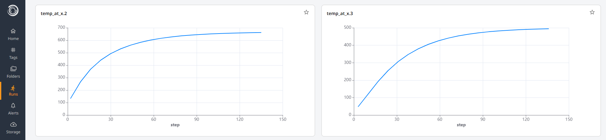
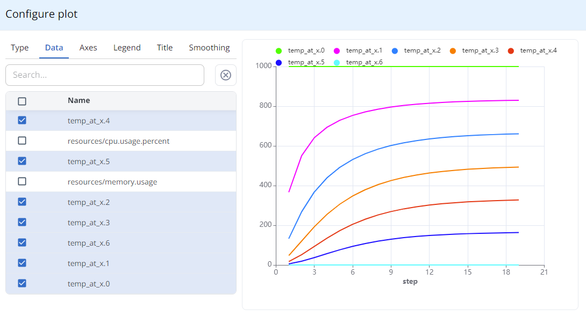

# Tracking Results
In this section, we will update our MOOSE file to allow us to track the temperature of given points in the metal rod over time. We will then parse the output files which this produces to extract the data, and add it as a Metric to our Simvue run. 

## Updating our MOOSE file
Firstly, we need to update our MOOSE input file to allow us to take measurements of the temperature at different points along the bar. To do this, we will add a new block called `VectorPostProcessors`, which allows us to specify positions in the system as (x,y,z) coordinates, along with a function which we want to calculate at each time in the simulation at these points. In our case, we will evaluate the temperature at the centre of the bar for every metre along the bar.

Add the following block to your MOOSE input file:
```ini
[VectorPostprocessors]
  [temps]
    type = PointValueSampler
    variable = 'T'
    points = '0 0.5 0.5  1 0.5 0.5  2 0.5 0.5  3 0.5 0.5  4 0.5 0.5  5 0.5 0.5  6 0.5 0.5'
    sort_by = 'x'
  []
[]
```

We then also need to specify the format which we would like our outputs to be in. In our case we will use CSV files, where a new CSV file will be created for each timestep containing the value of the temperature at each point. So can add a new section to the `Outputs` block:

```ini
[csv]
  type = CSV
[]
```

And finally we will change the end time for the simulation to 20 seconds, so that the simulation can complete again without hitting non-convergence errors.
```ini
[Executioner]
  type = Transient
  end_time = 20
  dt = 1
  solve_type = NEWTON
[]
```

If we run this simulation now, we should see a number of CSV files being created as the simulation proceeds, with names such as `simvue_thermal_temps_0001.csv`. These files each contain data similar to the following:
```
T,id,x,y,z
1000,0,0,0.5,0.5
366.34464934153,1,1,0.5,0.5
132.94639304264,2,2,0.5,0.5
47.622473361857,3,3,0.5,0.5
17.1837001014,4,4,0.5,0.5
5.5129057661661,5,5,0.5,0.5
0,6,6,0.5,0.5
```
!!! docker "Run in Docker Container"

    To run this updated MOOSE script in the Docker container:
    ```sh
    app/moose_tutorial-opt -i tutorial/step_7/simvue_thermal.i
    ```
    View an example of the results being produced by doing:
    ```sh
    cat tutorial/step_7/results/simvue_thermal_temps_0001.csv
    ```
## Parsing values and adding Metrics
To be able to extract the data from these CSVs for adding to the Simvue run, we will again need to use Multiparser. Since all of the data is written to the file at once when it is created, we can use the `track()` method, similarly to how we used it for the Metadata above. 

Firstly we want to create our callback function, which will run each time a new CSV file is found. This function will be executed once for each line in the CSV file, and can expect a dictionary of key value pairs similar to the following:
```json
{
  "T": 363.08473814564,
  "id": 0,
  "x": 1,
  "y": 0.5,
  "z": 0.5,
}
```
We want to create a separate metric for each `x` position, which tracks the temperature at this point over time. We will use the `log_metrics` method to do this, which expects a dictionary of key value pairs, where the key is the metric name (which we will set as something like `temp_at_x.1` for `x=1`, `temp_at_x.2` for `x=2`, etc). We will create a callback method called `per_metric()` and add the following code:

```py
def per_metric(csv_data, sim_metadata):
  run.log_metrics(
    {
      f"temp_at_x.{csv_data['x']}": csv_data['T']
    }
  )
```
!!! further-docs "Further Documentation"

    For more information on how to create Metrics with Simvue, [^^information on how to define Metrics can be found here^^](/tracking-monitoring/metrics/), and [^^detailed examples of Metrics can be viewed in the first tutorial.^^](/tutorial_basic/tracking-and-monitoring/#creating-metrics)

We can then add our call to the `track()` method. We can use a globular expression here to search for any CSV files which match our naming convention, and set it to call our callback function when one is found:

```py
with multiparser.FileMonitor() as file_monitor:
  ...
  file_monitor.track(
    path_glob_exprs = "MOOSE/results/simvue_thermal_temps_*.csv", 
    callback = per_metric,
    static=True
  )
  file_monitor.run()
```

If we run our Python script now, we should see that our metrics are being updated live as the run progresses in the UI!

!!! docker "Run in Docker Container"
    If running within the Docker container, use the following command to see our results being added as metrics:
    ```sh
    python tutorial/step_7/moose_monitoring_wrong_steps.py
    ```

However, you may notice something strange - the `step` parameter in the graphs looks odd, and does not correspond to the step which we are at in our simulation:
<figure markdown>
  { width="1000" }
</figure>

This is because the callback function is called multiple times for each CSV file, and therefore the `log_metrics()` method is called multiple times for each step of the simulation. Each time this method is called it increments the `step` parameter by one, meaning that this parameter will not represent the step the simulation is on. 

To solve this, we can note that the names of the CSV files contain the step at which the temperature was evaluated, eg `simvue_thermal_temps_0001.csv` represents the temperature data at the first step in the simulation. So to our callback function, we will add a line to extract this data from the file name, and then manually set the `step` parameter to this value. The filename is included in the metadata dictionary which is passed to the callback function (along with the timestamp, which we can also add to the metric if we wish):

```py
def per_metric(csv_data, sim_metadata):
  step_num = sim_metadata['file_name'].split('_')[-1].split('.')[0]
  run.log_metrics(
    {
      f"temp_at_x.{csv_data['x']}": csv_data['T']
    },
    step = int(step_num),
    timestamp = sim_metadata['timestamp']
  )
```

If we now run our Python script, we should see that the run UI shows all of the metrics updating live again, but with the step parameter correctly corresponding to the step in the simulation which the temperature was measured at. 

!!! docker "Run in Docker Container"
    If running within the Docker container, use the following command to see our results being added as metrics, with the corrected `step` parameter:
    ```sh
    python tutorial/step_7/moose_monitoring.py
    ```

We can also now plot all of these metrics on the same graph to compare them - on the left hand side of the Metrics tab, click on the 'View' dropdown and select 'Single'. you can then click the three dots on the right hand side, and select 'Edit'. This should bring up a popup window which allows you to configure a custom graph. Go to data and select each of our metrics, and then click off of the popup to see the graph:
<figure markdown>
  { width="1000" }
</figure>

## Adding Alerts
Now that we have metrics which are monitoring the temperatures of certain points along the bar, we can set up alerts which automatically stop the simulation if certain conditions have been breached. for example, let's say that instead of the rod being a fixed temperature at both ends, the temperature of both ends begins at zero, but one end has a temperature which increases linearly with time as the simulation progresses.

Now imagine that we have a system where we cannot allow the temperature at the centre of the bar to exceed 400 degrees, this being the point where the material will become too weak and the bar will begin to collapse in the middle. For this system, we can add an alert based on the metric for the temperature at the centre of the bar, `x=3`. 

Firstly, lets update our MOOSE input file so that we have a few more data points to play with. In the executioner block, change the time step to be `0.5` and the end time to be `100`:
```
[Executioner]
  type = Transient
  end_time = 100
  dt = 0.5
  solve_type = NEWTON
[]
```

We can then edit our boundary conditions block to support a function of temperature for the hot boundary, instead of a fixed value. Say we want a simple function where the temperature increases by 50 degrees per second:
```
[BCs]
  [hot]
    type = ADFunctionDirichletBC
    variable = T
    boundary = left
    function = 50*t
  []
```

We can then add a new alert to our run: Let us use it to track the temperature at `x=3`, and alert us when the value is above 400 degrees for more than 1 minute (to ensure it isn't just an outlier). To do this we will use the `is above` alert, with the threshold set to 400. After the alert which we have added to monitor non convergence, we can add the following:
```py
run.create_alert(
  name='temperature_exceeds_maximum',
  source='metrics',
  metric='temp_at_x.3',
  rule='is above',
  threshold=400,
  frequency=1,
  window=1,
  )
```
!!! docker Run in Docker Container
    See these updated metrics by running the following:
    ```
    python tutorial/step_8/moose_monitoring.py
    ```
If we run our script, we should see now see in the run UI that the temperatures at each point no longer converge, but instead begin to increase linearly as the temperature at the end of the bar increases linearly. We should get an alert which is triggered after a few minutes of the simulation running, which can be viewed in the Alerts tab.

## Using Firing Alerts to Terminate a Run
So our alert above will trigger when the centre of the bar reaches 400 degrees, alerting the user that they may want to check how the simulation is proceeding and whether it is worth continuing or aborting the run early. However let's say that we have another alert where we are certain that the run has failed - for example, let's say that we are sure that if the centre of the bar has reached 600 degrees, the material will have fully melted and the bar will have collapsed. When this alert fires, we will want to stop the execution of the script, since further simulations are pointless and a waste of computing resource if our scenario has already failed. To do this, we can specify the `trigger_abort` parameter in our alert definition:
```py
run.create_alert(
  name='temperature_exceeds_melting_point',
  source='metrics',
  metric='temp_at_x.3',
  rule='is above',
  threshold=600,
  frequency=1,
  window=1,
  trigger_abort=True
  )
```
If we run our script with this new alert in place, we should see the 400 degree alert which we defined above trigger first and be visible in the UI. A short time later, we should see our new 600 degree alert fire, and the simulation should automatically stop.
## Monitoring Alerts using the Client

Say that we wanted to keep track of which alerts are firing at regular intervals as the run proceeds, so that we can review these later. To monitor the status of an alert, we will use the `Client` class from Simvue. This class allows you to retrieve a number of different aspects of ongoing or past runs, including metrics, events, artifacts and alerts.

To be able to regularly monitor the status of our alert as the run proceeds, we will create a new Python script. This script will then create a CSV file which contains the status of the alert at regular time intervals, which can be monitored using Multiparser. Create a new file called `moose_alerter.py`, and use the `argparse` Python module to create a script which accepts the name of the run to monitor, the time interval between checks of the alert status, and the maximum time which the script will run for:

```py
import argparse

parser = argparse.ArgumentParser(description='Monitor alerts from a Simvue run.')
parser.add_argument(
  '--run-name', 
  type=str,
  help='The name of the run to monitor alerts for.'
  )
parser.add_argument(
  '--time-interval', 
  type=int,
  help='The interval between queries to the alert status, in seconds.'
  )
parser.add_argument(
  '--max-time', 
  type=int,
  help='The maximum time which this script will run for.'
  )
args = parser.parse_args()
```
We then want the script to create a new CSV file, which contains the time interval at which the alert was queried, and the status of our alerts at that time. Import the `csv` module at the top of the script, and then do:
```py
with open('MOOSE/results/alert_status.csv', 'w', newline='') as csvfile: 
    csvwriter = csv.writer(csvfile) 
    csvwriter.writerow(['time', 'step_not_converged', 'temperature_exceeds_maximum', 'temperature_exceeds_melting_point'])
```
We then want to create a loop which performs the check for firing alerts, appends a line to the CSV file, and then waits for the given time interval. The methods which we will need from the Client class are `get_run_id_from_name()` and `get_alerts()`, which returns a list of the names of firing alerts:
```py
time_elapsed = 0
client = simvue.Client()
run_id = client.get_run_id_from_name(args.run_name)

while time_elapsed < args.max_time:
    alerts = client.get_alerts(run_id)
    with open('MOOSE/results/alert_status.csv', 'a', newline='') as csvfile: 
        csvwriter = csv.writer(csvfile) 
        csvwriter.writerow(
            [
                time_elapsed, 
                ('Firing' if 'step_not_converged' in alerts else 'Normal'), 
                ('Firing' if 'temperature_exceeds_maximum' in alerts else 'Normal')
                ('Firing' if 'temperature_exceeds_melting_point' in alerts else 'Normal')
            ]
          )
    
    time.sleep(args.time_interval)
    time_elapsed += args.time_interval
```

So our new script will periodically check whether there are any firing alerts for our run, and record any firing alerts in a CSV file. We will want this script to run whenever we are running a MOOSE simulation, and therefore can add it as another process for Simvue to handle. In `moose_multiparser.py`, we can add a new process under where we defined our alert:
```py
run.add_process(
    identifier='alert_monitor', 
    executable="python", 
    script="MOOSE/moose_alerter.py", 
    run_name=run_name,
    time_interval="10", 
    max_time="1000"
  )
```
You can create a similar script for any parameter which you want to retrieve from the Simvue run as it proceeds.

!!! docker "Run in Docker Container"

    Since our alerting script has also been added as a Simvue process, we can still run our whole simulation with just one command:
    ```
    python tutorial/step_9/moose_monitoring.py
    ```
    You can view the CSV file produced with the following command:
    ```
    cat tutorial/step_9/results/alert_status.csv

Once our monitoring script has finished, we can view the CSV file which has been produced in our results directory called `alert_status.csv`. We should see that our 400 degree alert is triggered first, and then some time later our 600 degree alert is triggered. While this 600 degree alert will abort the run, it may take up to a minute for the run to actually abort since the signal to do this is sent as part of the heartbeat.

