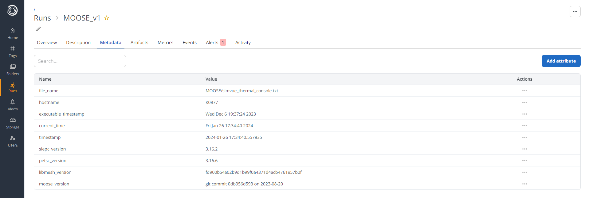

# Tracking the Console Log with Simvue
As the simulation which we ran in the previous step was progressing, you should have seen a series of messages being printed to the log. These have also been stored in a log file, called `simvue_thermal.txt`. If we look at the most recent lines in this file by running `tail simvue_thermal.txt -n 100` in the terminal, we should see something like this:
```
...
Time Step 10, time = 10, dt = 1
 0 Nonlinear |R| = 4.974806e-01
      0 Linear |R| = 4.974806e-01
      1 Linear |R| = 4.951657e-01
      ...
 1 Nonlinear |R| = 4.817842e-06
      0 Linear |R| = 4.817842e-06
      1 Linear |R| = 3.563368e-06
      ...
 2 Nonlinear |R| = 4.023366e-11
 Solve Converged!
Finished Executing
```
For each time step, MOOSE is attempting to minimise the error function as far as possible, until it is within some acceptable parameters which indicates that the solver has converged to some acceptable value. This console log is one of the things which we may want to keep track of using Simvue as the simulation progresses.

## Adding Events
The console log contains a lot of information, including the values of the error function in every iteration, which makes it quite difficult for the user to read at a glance. Lets say that we wanted to add a trimmed down version of this log to the Events log of a Simvue run, so that we can monitor it effectively.

### Initializing the Simvue Run
To do this, we will need to install the modules `simvue` and `multiparser`, either with a virtual environment manager such as Poetry, or by doing `pip install <module name>`. We then create a python file called `moose_monitoring.py`, and import those modules:
```py
import simvue
import multiparser
```
The next thing which we need to do is initialize a Simvue run. To do this, we first need to import the Run() object from the simvue module, and then we call the run.init() method to set up the run:
```py
import time
import shutil
import os

if os.path.exists('./MOOSE/results'):
    shutil.rmtree('./MOOSE/results')

run_name = 'thermal-diffusion-monitoring-%d' % time.time()

with simvue.Run() as run:
  run.init(
    name=run_name,
    description="A simulation to model the diffusion of heat across a metal bar",
    folder='/moose'
    )
```
In the case above, we have specified a name for the run (with a timestamp), and that the run should be placed in a folder called `/moose` so that we can group all of our runs together. We also remove any existing results from previous runs, so that logs and results from previous runs aren't automatically added to new ones.

### Initializing the File Monitor
Next, we can create our File Monitor object, which is the class which will track our output file for us. For now we won't pass in any arguments to the file monitor, as we will add these later. 
```py
with multiparser.FileMonitor() as file_monitor:
  pass
```

### Tracking Files with the File Monitor
We then need to define which way the file monitor should keep track of the files. There are two main options:

- `FileMonitor.track()`: The contents of the whole file are read at once. This should be used for cases where the full output is written in one go, when the file is created.
- `FileMonitor.tail()`: The initial contents of the file are read, and then any additional lines added after this point are read on a line by line bases. This is useful for live updating files, such as log files, where new lines are being appended to the end of the file during execution of the program.

For our console output file, new lines are being constantly appended to the file as the simulation progresses, and we want an event to be logged as soon as one of these lines is written. Therefore we will chose the `tail()` method of file tracking. To allow this function to start tracking our file, we need to provide it with three main arguments:

- `path_glob_exprs`: This specifies the path at which to look for the files which we want monitored. This can be provided in the form of an absolute or relative path to a single file, a list of absolute or relative paths, or globular expressions for locating desired files. In our case, we will simply pass in the relative path to our console output file as a string, `MOOSE/results/simvue_thermal.txt`.
- `tracked_values`: This is a list of values to look out for in the tracked file. These can be provided as literal strings, or regular expressions. When one of these values is seen in the file, a callback to a user defined function is triggered (in our case to add an event to Simvue, which we will see later).
- `labels`: Labels to assign to each of the tracked values. If one of the tracked values above is found in the file, the callback function will be passed a dictionary of key value pairs, where the key is the label given here, and the value is the value from the file which is matching the tracked value.

If we [take a look at the console output](#tracking-the-console-log-with-simvue), we can see that most of the log is taken up by values of the error function at each step, which makes the log difficult to read and which aren't particularly informative for the user. The more useful information contained within the log is which step the simulation is on, and whether that step did or did not converge. So we can set the FileMonitor to look out for these phrases: 

- For the time step, we can use a simple regular expression which matches the phrase 'Time Step' and then the rest of the characters on that line as follows: `r"Time Step (.*)"`. We must compile this expression using `re.compile()` before passing to Multiparser. 
- For whether the solve converged at that step, we can look out for the literal phrases `" Solve Converged!"` and `" Solve Did NOT Converge!"` (note the space at the front). 

So we pass these in as the `tracked_values`, along with some appropriate labels. We then run the `file_monitor`, so that when this Python script is executed it begins tracking our file:
```py
with multiparser.FileMonitor() as file_monitor:
  file_monitor.tail(
    path_glob_exprs = "MOOSE/results/simvue_thermal.txt", 
    tracked_values = [re.compile(r"Time Step (.*)"), " Solve Converged!", " Solve Did NOT Converge!"], 
    labels = ["time_step", "converged", "non_converged"]
  )
  file_monitor.run()
```

### Adding a Callback Function

This code will now recognise when it sees one of our tracked phrases in the MOOSE log, and can trigger a callback function when this happens. We next need to define what we want that callback function to do. In our case, we simply want it to add the seen phrase to the Simvue Events log, which we can do using the `run.log_event()` method. Above where we have instantiated the File Monitor, create a new function called `per_event`, which accepts the dictionary which will be returned from the file monitor:
```py
def per_event(log_data):
  if any(key in ("time_step", "converged", "non_converged") for key in log_data.keys()):
    run.log_event(list(log_data.values())[0])
```
!!! further-docs "Further Documentation"

    For more information on how to log Events with Simvue, [^^the concept of Events is introduced here^^](/tracking-monitoring/events/), and [^^a detailed example can be viewed in the first tutorial.^^](/tutorial_basic/tracking-and-monitoring/#events)

We then need to pass this function to our FileMonitor instance. Where we instantiate our `file_monitor` object:
```py
with multiparser.FileMonitor(
    per_thread_callback=per_event, 
) as file_monitor:
```

The `file_monitor` will now execute that function every time it recognises one of our tracked phrases in the MOOSE log.

### Testing our Events Log
Now we can test whether our code is working! We can start our file monitoring script by running `python MOOSE/moose_monitoring.py`, and we can run our MOOSE simulation by running `/path/to/MOOSE/application/file -i MOOSE/simvue_thermal.i --color off`.

!!! docker "Run in Docker Container"
    If running this tutorial inside the Docker Container, you can run the following commands:
    ```
    python3.9 tutorial/step_2/moose_monitoring.py
    
    app/moose_tutorial-opt tutorial/step_2/simvue_thermal.i --color off
    ```

If you then log into the Simvue UI, you should see that a new run has been created in the `/moose` folder, with the expected `thermal-diffusion-monitoring` name. If you open this run and go to the Events tab, you should see that the Events log is updating live as the simulation progresses:

## Adding Alerts
With the MOOSE script which we ran above, all of the steps converged to a result successfully. However if we allowed the simulation to continue for a longer time, then as the system reached a steady state where the temperature gradient was uniform across the bar, the steps would begin to fail to converge. When this happens, MOOSE will incrementally decrease the time delta which is used betrween steps, to attempt to find a converging solution. It will continue to do this until it either finds a converging solution, or the time delta is below some minimum specified within MOOSE. This process can continue for a very long time, and even if it does eventually find a time delta with a converging solution, the simulation is not giving us any further useful information (since the system is pretty much in a steady state already). So instead of waiting for MOOSE to do this process, we may want to trigger an alert as soon as there is a non converged step, and stop execution of the MOOSE simulation.

As an example, take your MOOSE script, and change the details in the Executioner block to have `end_time = 50`. If you were to run the simulation now, you would see that you get non convergence at around step 40. Waiting for the simulation to fully complete will take around 6 minutes on a standard office laptop, but most of this time was taken up by the code reducing the time step and retrying.

!!! docker "Run in Docker Container"
    If you would like to see what the MOOSE script does when failing to converge, you can run:
    ```
    app/moose_tutorial-opt tutorial/step_3/simvue_thermal.i
    ```
    And wait for a few minutes until the problem begins approaching a steady state. Once it fails to converge, you can see the results with:
    ```
    paraview tutorial/step_3/results/simvue_thermal.e
    ```
    And you will see that for the last 15-20 steps, the problem has already been in a roughly steady state, with heat uniformly distributed across the bar.

### Adding an Alert

Let us create a Simvue alert for this case. After we have defined our run, let us add an alert which is looking for the phrase " Solve Did NOT Converge!" in our Events log:
```py
with simvue.Run() as run:
  run.init(
    name='thermal-diffusion-monitoring-%d' % time.time(),
    folder='/moose'
    )
  run.add_alert(
    name='step_not_converged',
    source='events',
    frequency=1,
    pattern=' Solve Did NOT Converge!',
    notification='email'
    )
```
!!! further-docs "Further Documentation"

    For more information on how to create Alerts with Simvue, [^^information on how to define Alerts can be found here^^](/tracking-monitoring/alerts/), and [^^detailed examples of Alerts can be viewed in the first tutorial.^^](/tutorial_basic/tracking-and-monitoring/#alerts)

Now that this alert is set up, it will send us an alert if a step has failed to converge, and so can act as a trigger for a user to manually come back and check how the simulation is doing. They can then determine if it is worth continuing with the simulation, or whether the job should be terminated to save computational time and cost. If we run our monitoring script, and then run our MOOSE script with `end_time = 50`, we should see a new run appear in the Simvue UI. After around 1 minute, the Alerts tab should show that a step has failed to converge:
<figure markdown>
  { width="1000" }
</figure>

You should also receive an email, since you set that as your notification policy above. Note that this only took around one minute, whereas waiting for the MOOSE simulation to fully complete would take around 6 minutes. However in both situations the result is the same, with an almost perfectly linear distribution of heat across the length of the bar.

### Creating Simvue Processes
When we reach this steady state, it would be good if Simvue could automatically abort the MOOSE simulation without any human intervention. To allow this to happen, we must define our MOOSE simulation as a Process in Simvue. This means that Simvue is able to automatically kick off the execution of this script, and can terminate it if things go wrong.

To do this, we use the method `add_process()` on our run. This method can essentially be used to convert any command which you would run in the terminal to a process which Simvue runs automatically. It can take certain default arguments, such as:

- `identifier`: String used to identify this process
- `executable`: The executable to run for this process. This can either be the absolute or relative path to an executable on your system, or the shorthand command for an executable (such as `bash` or `python`).
- `script`: The script for this executable to run, as either an absolute or relative path
- `input_file`: The path to an input file for this program

It can also accept any number of keyword arguments, which it will simply pass in as arguments to the command when it is executed. In our case, the command which we would run on the command line is something like:

```
$: /path/to/MOOSE/application/file -i MOOSE/simvue_thermal.i --color off
```

To convert this to a process, we give it an identifier like `'thermal_diffusion_simulation'`, and we assign the `executable` to be the path to our MOOSE application. We can then pass in the other two command line arguments as kwargs, like so:
```py
run.add_process(
    identifier='thermal_diffusion_simulation',
    executable='/path/to/MOOSE/application/file',
    i='MOOSE/simvue_thermal.i',
    color='off',
    )
```
Add this line to your script, after the run is initialised. Now when we run our script, the MOOSE simulation should automatically begin without us having to run any commands on the command line!  To check the simulation is correctly running, open the Simvue UI and check that there is an active run, and check that the Events log is being updated live. Note that you will no longer see the MOOSE output being printed to the console, but log files should have been created in your working directory which contains all of `stdout` and `stderr` messages generated by the process.

### Terminating Processes
As well as running processes automatically, we can also stop Simvue processes from running at any point, using the `kill_all_processes()` method. In our case, we want to stop the MOOSE simulation from proceeding if it has reached a non converging step. In our `per_event()` callback function, we can add a check for whether the message being added to the log is for a non converging step, and if so kill the process:
```py
def per_event(log_data):
  if any(key in ("time_step", "converged", "non_converged") for key in log_data.keys()):
    run.log_event(list(log_data.values())[0])
    if "non_converged" in log_data.keys():
        run.kill_all_processes()
``` 

In this situation we could also upload the Exodus file as an output artifact for storage on the Simvue server. To do this, we use the `save()` method of the run class, passing in the path to the file:
```py
def per_event(log_data):
    ...
    if "non_converged" in log_data.keys():
        run.kill_all_processes()
        run.save("MOOSE/results/simvue_thermal.e", "output")
```

### Terminating Multiparser Threads
If we are terminating the MOOSE simulation as above, we will also want to terminate or file monitoring processes (as there will be nothing left to monitor). To do this, we can use multiprocessing events, which act as a trigger to terminate the File Monitor. At the top of our script, we can add the following:
```py
import multiprocessing

trigger = multiprocessing.Event()
...
```
This acts as a boolean variable which is shared between all active threads, which can act as a trigger to stop the file monitoring. In our File Monitor initialisation, we can specify this event as a `termination_trigger`, which means that the file monitor will terminate all of its threads upon receiving this signal:

```py
with multiparser.FileMonitor(
    per_thread_callback=per_event,
    termination_trigger=trigger, 
) as file_monitor:
```

We can then set this trigger when our MOOSE simulation is terminated:
```py
def per_event(log_data):
  if any(key in ("time_step", "converged", "non_converged") for key in log_data.keys()):
    run.log_event(list(log_data.values())[0])
    if "non_converged" in log_data.keys():
        run.kill_all_processes()
        run.save("MOOSE/results/simvue_thermal.e", "output")
        trigger.set()
        print("Simulation Terminated due to Non Convergence!")
```
Now if we run our script again, we should see that after a few minutes of running, the MOOSE simulation and the monitoring script automatically terminate. If we check the Events log in the run UI, there should hopefully only be one 'Non Converging' message printed before the simulation was stopped.

!!! docker Run in Docker Container
    To run this in the Docker container, we now only need to run the monitoring script:
    ```
    python3.9 tutorial/step_3/moose_monitoring.py
    ```

## Adding Metadata
To allow us to keep track of how a particular run has been performed, we may want to add metadata to the Simvue run. As an example, in the console log, important information about the MOOSE environment and simulation parameters are included at the very top. This can be seen by running `head results/simvue_thermal.txt -n 40`:
```
Framework Information:
MOOSE Version:           git commit 0db956d593 on 2023-08-20
LibMesh Version:         fd900b54a02b9d1b99f0a4371d4acb4761e57b0f
PETSc Version:           3.16.6
SLEPc Version:           3.16.2
Current Time:            Fri Jan 26 15:27:26 2024
Executable Timestamp:    Wed Dec  6 19:37:24 2023
...
```

### Creating a Custom Parser
Lets say that we want to add information about the Framework which MOOSE is running on to the metadata of the Simvue run. To do this, we can add a custom parser for Multiparser to use.

Firstly, we need to consider whether we would want to use the `tail()` or `track()` method. Since the MOOSE log file is initialized by printing all of this configuration information at once, we can just read it from the file at once, and so will use `track()`. 

We then want to build our own custom parser function on top of the file parser built into Multiparser. We can import the existing parser, and use it as a decorator to our custom function:
```py
import multiparser.parsing.file as mp_file_parser

@mp_file_parser.file_parser
def moose_header_parser(input_file, **_):
  return
```
This means that all of the metadata which is produced by the Multiparser by default, such as the filename and timestamp, are also returned by our custom parser. Our custom parser then takes an input file path, and an unknown number of other arguments. We then need to open and read the information from the file as a list of lines, filter out any blank lines which may exist, and then slice the list so that only the framework information which we want to consider is included:
```py
@mp_file_parser.file_parser
def moose_header_parser(input_file, **_):
    with open(input_file) as file:
        file_lines = file.readlines()
    file_lines = list(filter(None, file_lines))
    header_lines = file_lines[1:7]
```
We then need to take these lines, which will look something like `PETSc Version:           3.16.6`, and convert them to a dictionary of key:value pairs. To do this, we will simply split the string at the first colon, so that anything to the left of the colon is the key, and anything to the right of the colon is the value. We can then do some formatting to the key to make it more Pythonic, and strip the value of any whitespace:
```py
    ...
    header_data = {}
    for line in header_lines:
        key, value = line.split(":", 1)
        key = key.replace(" ","_").lower()
        value = value.strip()
        header_data[key] = value
```
Finally, we must return a pair of arguments: the first argument is a dictionary of metadata, and the second argument is the dictionary of data which the parser has found in the file. In our case, we return an empty dictionary for the metadata which allows the default parser to add its metadata, and return our `header_data` dictionary as the parsed data:
```py
    @mp_file_parser.file_parser
    def moose_header_parser(input_file, **_):
        with open(input_file) as file:
            file_lines = file.readlines()
        file_lines = list(filter(None, file_lines))
        header_lines = file_lines[1:7]
        header_data = {}
        for line in header_lines:
            key, value = line.split(":", 1)
            key = key.replace(" ","_").lower()
            value = value.strip()
            header_data[key] = value

        return {}, header_data
```

### Obtaining Metadata
Where we instantiate our `file_monitor` object, we can tell the file monitor to track the console file again, but using the custom parser. We can also set different callbacks for each file we are tracking - so we remove `per_thread_callback` from the function arguments, and instead define it in each call to `tail()` and `track()`. 

To add metadata to a Simvue run, we simply need to pass our dictionary of metadata to the `run.update_metadata()` method. In our case we will do this using a lambda function, where we combine the `header_data` produced by our custom parser, and `metadata` produced by the default parser, into a single dictionary and pass it to the method:
```py
with multiparser.FileMonitor() as file_monitor:
  file_monitor.tail(
    path_glob_exprs = "MOOSE/results/simvue_thermal.txt", 
    tracked_values = [re.compile(r"Time Step (.*)"), " Solve Converged!", " Solve Did NOT Converge!"], 
    labels = ["time_step", "converged", "non_converged"],
    callback = per_event
  )
  file_monitor.track(
    path_glob_exprs = "MOOSE/results/simvue_thermal.txt", 
    callback = lambda header_data, metadata: run.update_metadata({**header_data, **metadata}), 
    parser_func = moose_header_parser, 
    static = True
  )
  file_monitor.run()
```

Note that in our call to `.track()`, we specify `static = True`. This means that once the file has been read once by this call, it won't be read again. This is what we want, since this metadata at the top of the file will not change as the simulation proceeds.

Now, let's run our script again to see if the metadata loads correctly. Running `python MOOSE/moose_monitoring.py` should now also start our MOOSE process automatically due to the step above. Looking in the Metadata tab of the run in the UI, we should now see all of the information from the header, and the metadata which Multiparser collects:
<figure markdown>
  { width="1000" }
</figure>