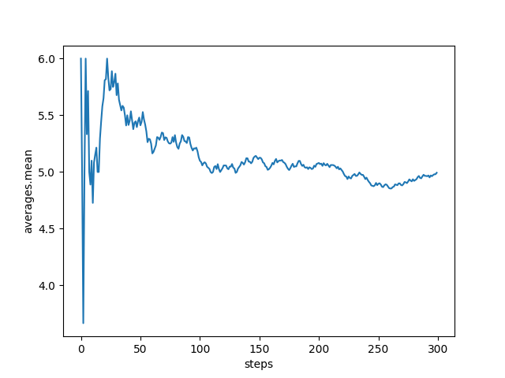
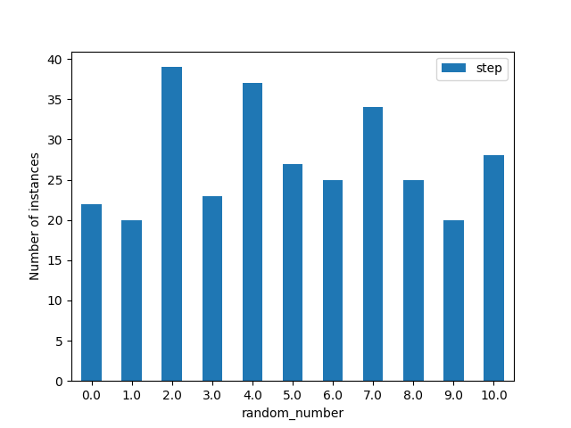
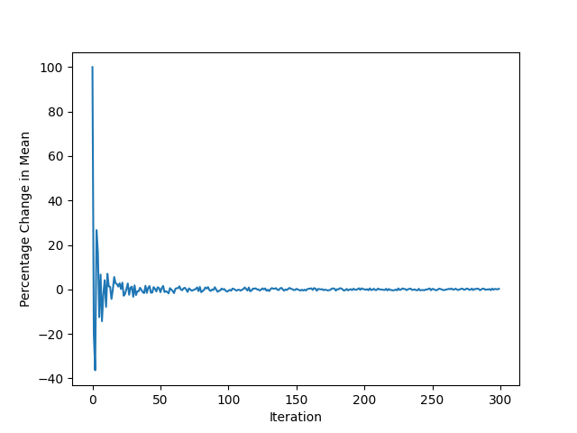

# Analysis
This section of the tutorial introduces how Simvue can be used to retrieve information about a run such as metadata, metrics or artifacts, and use these to perform more in depth data analysis or create plots of important data. The topics covered in this section (and more) are described in the [^^Analysis^^](/analysis/retrieving-runs/) section of the documentation, so it may be useful to have that section of the docs open alongside this part of the tutorial.

## Simvue Client
Results and artifacts from runs can be collected using the Simvue Client for further analysis. We will demonstrate this in a new file, called `analysis.py`. Create this new file in the same location as your `test.py` script from the previous section, and create an instance of the `Client` class:
``` py
from simvue import Client

client = Client()
```
For the next part of the tutorial to make sense, make sure that you have run the full code example given in the final part of the `Tracking & Monitoring` section of the tutorial at least once.

## Retrieving Runs
To retrieve a single run which we know the name of, we can use the method `get_run()` of the Client class. If you log into the UI and choose one of your recent runs,  find its ID (from the URL of the run) and simply execute `client.get_run(<run ID>)`, you will see that you get a dictionary of information returned to you such as the run's name, status, folder, and more. You can also enable optional parameters such as `metadata=True` to retrieve additional information asociated with the run.

However what if we don't know the exact name or ID of our run, or we want to retrieve multiple runs at once? We can instead use the `get_runs()` method, which allows us to apply filters to find our set of runs. In our case, we will want to look for any runs stored in the `/rand_nums` folder, which have the tags `completed` and `v1`:

``` py
from simvue import Client

client = Client()
my_runs = client.get_runs(['folder.path == /rand_nums', 'has tag.completed', 'has tag.v1'], metadata=True)
print(my_runs)
```
If you then run the analysis script using `python3 analysis.py` on the command line, you should hopefully see a list of dictionaries printed, similar to the following:
```py
[
    {
        'name': 'random-numbers-1717575492',
        'description': 'Monitoring of the generation of random integers between 0 and 10.', 
        'id': 'abCDefGHijKL1234',
        'created': '2024-06-05 08:18:12.323370',
        'status': 'completed', 
        'metadata': {
            'number_of_iterations': 300, 
            'result_converged': 0, 
            'mean': 5.246666666666667
        }, 
        'tags': ['completed', 'random-numbers', 'v1'],  
        ...,
    },
    ...,
]
```
This should show you a list of all of the runs which you have ran using the final code in the `Tracking & Monitoring` section of the tutorial. You can also apply filters in the UI by going to the 'Runs' tab on the UI, adding filters to the top by pressing the `Folder` and `Tags` buttons and selecting the correct values. Check that the runs listed in the UI match those in the list of dictionaries printed to the command line.

We will store the name of the first run which fits our criteria in a variable, for use in the rest of the code:
``` py
from simvue import Client

client = Client()
# Get data about all of the runs which fit our filters
my_runs = client.get_runs(['folder.path == /rand_nums', 'has tag.completed', 'has tag.v1'], metadata=True)

# Save the name of the first run in the list
run_id = my_runs[0]['id']

```
## Retrieving Metrics

You can retrieve the names of all of the metrics for a given run using the `get_metrics_names()` method:
``` py
from simvue import Client

client = Client()
# Get data about all of the runs which fit our filters
my_runs = client.get_runs(['folder.path == /rand_nums', 'has tag.completed', 'has tag.v1'], metadata=True)

# Save the name of the first run in the list
run_id = my_runs[0]['id']

# Get metric names and summaries for the run selected above
metrics_names = client.get_metrics_names(run_id)
print(metrics_names)
```

You can also directly plot different metrics. Firstly, install the Simvue module with the `plot` extra packages to be able to display the plots (installing the module using `pip install simvue -e plot`). You can then use the `.plot_metrics()` method to plot any metrics as a line graph. For example, if we wanted to plot the `averages.mean` metric:
``` py
import matplotlib.pyplot as plt

# Plot a line graph of the averages.mean metric
mean_plot = client.plot_metrics([run_id,], ['averages.mean',], 'step')
plt.show()
```
Note that `plot_metrics()` can be used on multiple runs and/or metrics at a time, so expects lists as inputs to the `runs` and `metrics` parameters. We should see that this plot matches the one seen in the UI for this metric, looking something like this:


Simvue can also output the data from the metric as a Pandas dataframe, which allows us to do more advanced analysis. For example, lets say we want to get our random numbers metric as a dataframe:
``` py
rand_nums_df = client.get_metric_values(run_ids=[run_id,], metric_names=['random_number',], xaxis='step', output_format='dataframe')
```
We can then get the values of the random numbers at each step as a Numpy array using the `.value` method, and then get an array of each unique value and the number of times it appears using Numpy's `unique()` function. Finally, we can plot that as a bar graph:
``` py
rand_nums = rand_nums_df["random_number"].values
values, counts = numpy.unique(rand_nums, return_counts=True)
fig = plt.figure()
plt.bar(values, counts)
plt.xlabel("random_number")
plt.ylabel("Number of instances")
plt.show()
```
We should then see a bar graph of the number of occurances of each random number - it should be a roughly even distribution between each of the random numbers, which looks like this:


The full code so far can be seen below:
``` py
import matplotlib.pyplot as plt
from simvue import Client

client = Client()
# Get data about all of the runs which fit our filters
my_runs = client.get_runs(['folder.path == /rand_nums', 'has tag.completed', 'has tag.v1'], metadata=True)

# Save the name of the first run in the list
run_id = my_runs[0]['id']

# Get metric names for the run selected above
metrics_names = client.get_metrics_names(run_id)
print(f"metrics_names")

# Plot a line graph of the averages.mean metric
mean_plot = client.plot_metrics(run_id, 'averages.mean', 'step')

# Plot a bar graph of the number of occrances of each random number
rand_nums_df = client.get_metric_values(run_ids=[run_id,], metric_names=['random_number',], xaxis='step', output_format='dataframe')
rand_nums = rand_nums_df["random_number"].values
values, counts = numpy.unique(rand_nums, return_counts=True)
fig = plt.figure()
plt.bar(values, counts)
plt.xlabel("random_number")
plt.ylabel("Number of Instances")
plt.show()

# Show the plots in window
plt.show()
```

## Retrieving Events
We can also retrieve Events from the log using the method `get_events()`, which will return a list of dictionaries which each give the timestamp and message of an event. This allows us to either retrieve the whole events log, a select number of events from a given line using the `start` and `num` arguments, or to filter events which contain a specific word or phrase using the `filter` argument. For example, say we want to find the number of division by zero errors we encountered during a run when calculating our `mean / (median - mode)` value. To do this, we will retrieve all events which contain the string 'Division by Zero Error':

``` py
num_div_by_zeros = len(client.get_events(run_id, message_contains='Division by Zero Error'))
print("Number of Division by Zero Errors encountered during execution:", num_div_by_zeros)
```

## Retrieving Artifacts
Finally, named artifacts can be retrieved from the run using the `get_artifact()` method. This will download the artifact, and return its contents. For example, if we wanted to retrieve our artifact of the array of percentage changes of the mean between each iteration, we can do:

``` py
percentage_changes_in_mean = client.get_artifact(run_id, 'percentage_changes_in_mean')
```

We may then want to create a plot of this, showing how the percentage change to the mean progressed across all of the iterations. To do this, we will need to create an array of x data, which is the iteration number. We will create this by retrieving the number of iterations from the metadata and using `numpy.arange()` to create our array. Firstly import `numpy` at the top of your script, and then do:
``` py
# Create an array of iteration values, by retrieving the total number of iterations from the run's metadata
num_iterations = my_runs[0]['metadata']['number_of_iterations']
iterations_arr = numpy.arange(num_iterations)

# Plot the percentage change in the mean at each iteration
fig, ax = plt.subplots()
ax.plot(iterations_arr, percentage_changes_in_mean)
ax.set_xlabel('Iteration')
ax.set_ylabel('Percentage Change in Mean')
plt.show()
```
This graph should look like a kind of damped oscillation - as the number of iterations progresses, each individual random number added to the mean makes less and less impact, and so the line should begin to flatten and remain at around zero after a large number of iterations:



You can also retrieve artifacts as files and save them to your local system using `get_artifact_as_file()`. Say we want to retrieve our JSON file which contains the final values of our three averages - to do this, we simply pass in the name of the artifact and the path where we would like it to be saved. In our case, we will leave the path blank, as it will save the file to our current working directory by default:

``` py
client.get_artifact_as_file(run_id, 'averages_out.json')
```
You should then see this file be saved in your working directory, and opening it should show the dictionary of the three averages which we expect.

## Full Code

That completes our tutorial of how to use the Analysis functionality in Simvue! The full code is below:

``` py
import matplotlib.pyplot as plt
import numpy
from simvue import Client

client = Client()

# Get data about all of the runs which fit our filters
my_runs = client.get_runs(['folder.path == /rand_nums', 'has tag.completed', 'has tag.v1'], metadata=True)

# Save the name of the first run in the list
run_id = my_runs[0]['id']

# Get metric names for the run selected above
metrics_names = client.get_metrics_names(run_id)
print(f"metrics_names")

# Plot a line graph of the averages.mean metric
mean_plot = client.plot_metrics([run_id,], ['averages.mean',], 'step')

# Plot a bar graph of the number of occrances of each random number
rand_nums_df = client.get_metric_values(run_ids=[run_id,], metric_names=['random_number',], xaxis='step', output_format='dataframe')
rand_nums = rand_nums_df["random_number"].values
values, counts = numpy.unique(rand_nums, return_counts=True)
fig = plt.figure()
plt.bar(values, counts)
plt.xlabel("random_number")
plt.ylabel("Number of Instances")

# Find and print the total number of Division by Zero events in the log:
num_div_by_zeros = len(client.get_events(run_id, message_contains='Division by Zero Error'))
print("Number of Division by Zero Errors encountered during execution:", num_div_by_zeros)

# Retrieve the artifact containing a Numpy array of the percentage changes in the mean for each iteration
percentage_changes_in_mean = client.get_artifact(run_id, 'percentage_changes_in_mean')

# Create an array of iteration values, by retrieving the total number of iterations from the run's metadata
num_iterations = my_runs[0]['metadata']['number_of_iterations']
iterations_arr = numpy.arange(num_iterations)

# Plot the percentage change in the mean at each iteration
fig, ax = plt.subplots()
ax.plot(iterations_arr, percentage_changes_in_mean)
ax.set_xlabel('Iteration')
ax.set_ylabel('Percentage Change in Mean')

# Retrieve and save the JSON file containing the final values of the three averages
client.get_artifact_as_file(run_id, 'averages_out.json')

# Show the plots in window
plt.show()
```