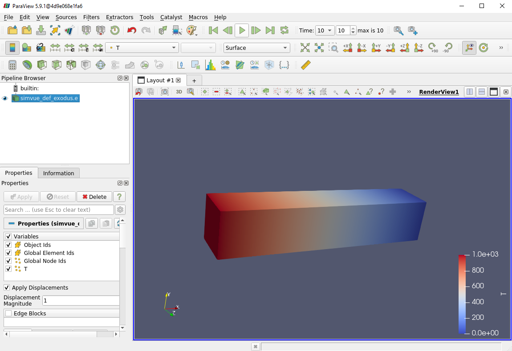

# Defining the problem
For the purposes of this example, we will consider a very simple problem. Let us consider a simplified heat diffusion problem, where we have a long rod of metal which is initially held at different temperatures at both ends. We will then allow the heat to diffuse from one side of the material to the other over time, and are looking for the amount of time which it takes to reach a steady state. This is governed by the heat equation:

$$
\frac{\partial T}{\partial t} = \alpha \nabla^2 T
$$

Where $\alpha$ is the thermal diffusivity of the material.

## Creating the MOOSE input file
MOOSE uses a custom input file to define and run a simulation. While this is not a tutorial on how to use MOOSE, we will provide a brief description of how we setup the problem stated above in MOOSE. If you are completely new to MOOSE, [^^you can find tutorials on how to use MOOSE here^^](https://mooseframework.inl.gov/getting_started/examples_and_tutorials/index.html). If you are experienced at MOOSE and have your own MOOSE files which you are trying to use you may not need to read through the following steps, but pay attention to the [outputs block](#specify-outputs). See the full file we will be using in the [final step of this section](#run-the-simulation).

Create a file called `simvue_thermal.i`, and follow the following steps:

### Create the mesh
Firstly, we need to create a mesh which will represent our sheet of metal. Say that we want to make a 3D rod which has a square cross section, and has dimensions 6m x 1m x 1m. To do this, we will use the `GeneratedMesh` to create a uniform rectangular mesh, with the following properties:
```
[Mesh]
  [generated]
    type = GeneratedMeshGenerator
    dim = 3
    nx = 20
    ny = 20
    nz = 20
    xmax = 6
    ymax = 1
    zmax = 1
  []
[]
```

### Define variables and kernels
Next we need to define the variable which we wish to study, and the Kernels in the problem. The Kernels essentially represent each of the terms in the partial differential equation which we are solving, and use solvers which are built into MOOSE. We define our variable as the temperature, $T$:
```
[Variables]
  [T]
  []
[]
```
We can then add the Kernel which represents our time derivative $\frac{\partial T}{\partial t}$, for which we choose [the ADTimeDerivative kernel](https://mooseframework.inl.gov/source/kernels/ADTimeDerivative.html):
```
[Kernels]
  [time-derivative]
    type = ADTimeDerivative
    variable = T
  []
```
Next, we add a kernel which can solve the diffusivity term, $\alpha \nabla^2 T$. For this we use [the ADMatDiffusion kernel](https://mooseframework.inl.gov/source/kernels/ADMatDiffusion.html), which accepts the diffusivity parameter $\alpha$ as a material property.
```
[Kernels]
  [time-derivative]
    type = ADTimeDerivative
    variable = T
  []
  [diffusion-kernel]
    type = ADMatDiffusion    
    variable = T
    diffusivity = diffusivity-property
  []
[]
[Materials]
  [mat-diffusivity]
    type = ADGenericConstantMaterial
    prop_names = 'diffusivity-property'
    prop_values = '0.98'
  []
[]
```

### Define boundary conditions
Next we must define our boundary conditions, which define the initial state that the system is in. In our case, we will say that the left side of the sheet is kept 'hot' at 1000 degrees, while the right side is kept 'cold' at 0 degrees:
```
[BCs]
  [hot]
    type = DirichletBC
    variable = T
    boundary = left
    value = 1000
  []
  [cold]
    type = DirichletBC
    variable = T
    boundary = right
    value = 0
  []
[]
```

### Specify Problem and Executioner
Next we define the type of problem which we are solving, which in our case is just a standard Finite Element problem, and we can define the executioner for this MOOSE file. This tells the solver whether the problem is static or transient. If it is transient, it defines how long the simulation runs for, and in which time steps. In our case, let us define this as a transient problem for 10 seconds, with time steps every 0.1 seconds:
```
[Problem]
  type = FEProblem
[]
[Executioner]
  type = Transient
  end_time = 10
  dt = 1
  solve_type = NEWTON
[] 
```

### Specify Outputs
Finally, we need to specify the types of outputs which we want our simulation to create. This is important, since we are going to use the Simvue Multiparser to track our simulation, which reads from any provided file to find useful Metrics and Events. Initially, lets say that we want to create an Exodus file (which can be viewed in CAD software like Paraview), and we want to direct the console output to a file:
```
[Outputs]
  file_base = ./results/
  [exodus]
    type = Exodus
  []
  [console]
    type = Console
    output_file = true
  []
[]
```

### Run the Simulation
To check that the input file is configured correctly, run the file and check the output in Paraview. The full file is given below:
```
[Mesh]
  [generated]
    type = GeneratedMeshGenerator
    dim = 3
    nx = 20
    ny = 20
    nz = 20
    xmax = 5
    ymax = 1
    zmax = 1
  []
[]
[Variables]
  [T]
  []
[]
[Kernels]
  [time-derivative]
    type = ADTimeDerivative
    variable = T
  []
  [diffusion-kernel]
    type = ADMatDiffusion    
    variable = T
    diffusivity = diffusivity-property
  []
[]
[Materials]
  [mat-diffusivity]
    type = ADGenericConstantMaterial
    prop_names = 'diffusivity-property'
    prop_values = '0.98'
  []
[]
[BCs]
  [hot]
    type = DirichletBC
    variable = T
    boundary = left
    value = 1000
  []
  [cold]
    type = DirichletBC
    variable = T
    boundary = right
    value = 0
  []
[]
[Problem]
  type = FEProblem
[]
[Executioner]
  type = Transient
  end_time = 10
  dt = 1
  solve_type = NEWTON
[]
[Outputs]
  file_base = ./results/simvue_thermal
  [exodus]
    type = Exodus
  []
  [console]
    type = Console
    output_file = true
  []
[]
```
This should be in your `simvue_thermal.i` file. Next, locate where your MOOSE application file is, and run the following command:
```cmd
/path/to/MOOSE/application/file -i /path/to/simvue_thermal.i --color off
```
You should see some debug being printed to the console, and the simulation should finish in a few seconds. It should produce two output files: `simvue_thermal_exodus.e` and `simvue_thermal_console.txt`. You can open the Exodus file in your CAD software, if using paraview this is done using the command `paraview simvue_thermal_exodus.e`. Once Paraview is opened, follow these steps to see the heat diffuse across the bar:

- In the Properties panel in the left hand side, in the Variables tab, tick the box next to $T$. Press Apply
- In the second bar of icons at the top of the window, click the 'vtkBlockColours' dropdown and change this to $T$
- Next to this dropdown, find the button with an arrow and the letter 't'. Click this to rescale the data range over all timestamps
- Press the green play button in the top bar of the window

You should see something like this:
<figure markdown>
  { width="1000" }
</figure>

So that works as expected! We see heat diffuse from the hot side of the bar towards the cold side, and the simulation is tending towards a steady state solution where there is a common temperature gradient across the bar.